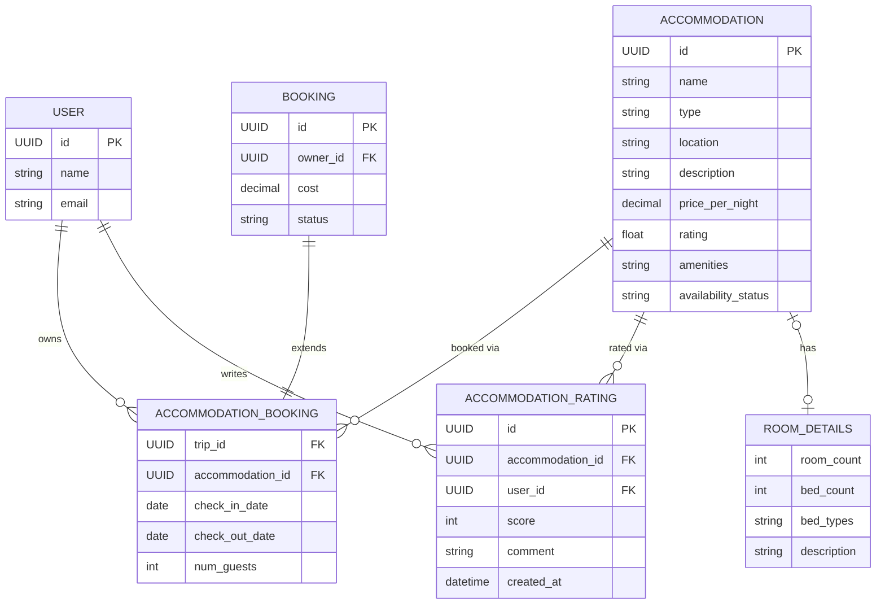

Back to [README.md](../../README.md)

# TripGenie Object Model

## General Entities

### User
The person doing the booking/rating. Kept minimal — full profile/auth is
likely owned by a shared identity service; this is just enough to satisfy FKs
here.

| Field | Type | Notes |
|---|---|---|
| id | UUID/int | PK |
| name | str | |
| email | str | |

### Booking
Base for any per-service booking (accommodation, transport, activity, ...).
Each microservice's booking entity extends this.

| Field | Type | Notes |
|---|---|---|
| id | UUID/int | PK |
| owner_id | FK → User | who made the booking |
| cost | Decimal | |
| status | BookingStatus | enum: PENDING, CONFIRMED, CANCELLED, COMPLETED |

## Accommodation Microservice Entities

**Owner**: Student 2 (Mark Ureta).

### Accommodation
The bookable listing (hotel, hostel, Airbnb, etc.).

| Field | Type | Notes |
|---|---|---|
| id | UUID/int | PK |
| name | str | |
| type | AccommodationType | enum: HOTEL, HOSTEL, APARTMENT, RESORT, GUESTHOUSE, CAMPING |
| location | str | address/city; own class only if geo search is needed later |
| description | str | |
| price_per_night | Decimal | |
| rating | float | derived/cached avg of AccommodationRating |
| amenities | list[str] | plain list until amenities need filtering at scale |
| availability_status | AvailabilityStatus | enum: AVAILABLE, UNAVAILABLE, SOLD_OUT |
| room_details | RoomDetails \| None | composed, not subclassed — see below |

### RoomDetails
Room-specific attributes, kept as a composed value on `Accommodation` rather
than type subclasses (e.g. `Hotel`, `Campsite`) — one concrete class stays
queryable/filterable without `isinstance` branching. `None` for types where
room counts don't apply (e.g. camping).

| Field | Type | Notes |
|---|---|---|
| room_count | int | filterable, e.g. "at least 3 rooms" |
| bed_count | int | |
| bed_types | list[BedType] | enum: SINGLE, DOUBLE, QUEEN, KING, BUNK, SOFA_BED |
| description | str | free-text extra details, optional |

### AccommodationBooking
A reservation made against an Accommodation for a trip. Extends [Booking](#booking)
(`id`, `owner_id`, `cost`, `status`).

| Field | Type | Notes |
|---|---|---|
| trip_id | FK (external) | owned by Student 1's Trip service |
| accommodation_id | FK → Accommodation | |
| check_in_date | date | |
| check_out_date | date | |
| num_guests | int | |

### AccommodationRating
A user's rating/review of an Accommodation.

| Field | Type | Notes |
|---|---|---|
| id | UUID/int | PK |
| accommodation_id | FK → Accommodation | |
| user_id | FK → User | |
| score | int | e.g. 1–5 |
| comment | str | optional |
| created_at | datetime | |

## ERD

