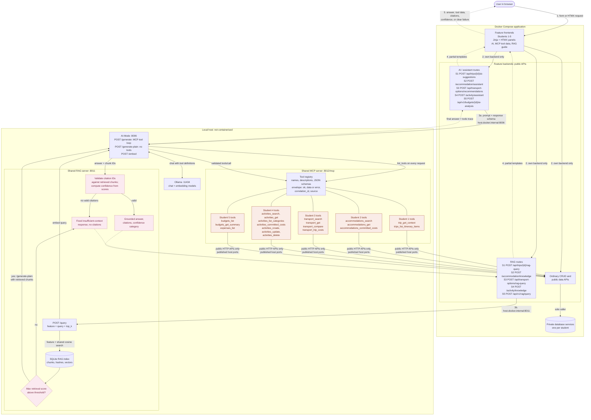
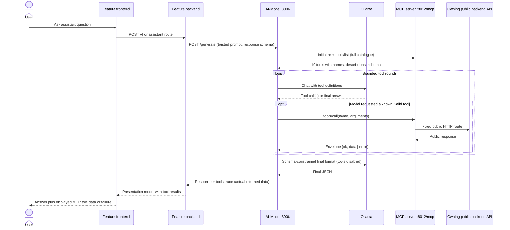

# Release 1 AI, RAG, and MCP Interaction Flow

Related documents:

- [Release 1 shared RAG architecture](./release-1-shared-rag-architecture.md)
- [Release 1 shared RAG contract](./release-1-rag-contract.md)
- [ADR 0004: Shared model-directed MCP generation](./decisions/0004-shared-mcp-generation.md)
- [Shared MCP server README](../../ai-services/mcp-server/README.md)
- [Local host services runbook](../reports/release-1/local-host-services-runbook.md)

These diagrams show the target Release 1 flow. Every MCP tool call is made by
the model through AI-Mode `/generate`. Feature backends do not call the MCP
server directly. The Student 1, 3, and 5 slices are being brought in line with
this before submission.

## 1. End-to-end flow

Plain boxes are modules or services. Coral boxes are MCP tools registered on
the shared MCP server, not separate services. Pink dashed boxes are logic
steps inside the RAG server, not separate modules. Solid arrows are requests.
Dotted arrows are responses. Every connection from
Compose to a host process uses the `host.docker.internal:host-gateway`
mapping, because container `localhost` is not the host.

## 2. Model-directed MCP generation sequence

## 3. Explanation

### Frontend and backend/API interactions

Each feature frontend renders server-side Jinja templates and uses HTMX for
focused partial updates. It only calls its own backend. The backend exposes
two kinds of AI-related route next to its ordinary CRUD:

- **AI or assistant routes** send a trusted system prompt and a response schema
  to AI-Mode `/generate`. The model fetches the data it needs by calling MCP
  tools, and the UI shows the returned `tools` trace as evidence that the tools
  ran. The backend shapes the result for display. It does not call the MCP
  server itself, parse natural-language constraints, or define its own tools.
- **RAG routes** send a feature-scoped question to the shared RAG server's
  `/query` and display the answer, citations, and confidence category.

The browser never reaches AI-Mode, MCP, RAG, Ollama, or a database directly.
If any host AI service is disabled or unavailable, the AI panel reports a
clear failure. Ordinary CRUD keeps working.

### MCP tool layer

The shared MCP server is a host process that serves Streamable HTTP at
`:8012/mcp`. It owns every tool name, description, and input schema, and is
the only place tools are defined. Each tool:

1. validates its arguments against the advertised schema;
2. calls one fixed route on the owning student's **public** backend API, never
   a database service or an AI orchestration endpoint;
3. bounds the result (`limit` 1–50, 64 KiB provider body, 32 KiB tool data);
4. returns a structured envelope: `{"ok": true, "data": ...}`, or
   `{"ok": false, "error": {"code", "message", "retryable"}}` with MCP
   `isError: true`.

Callers cannot choose a URL, HTTP method, raw body, or provider route.
Provider error bodies are never forwarded.

### Registered tools

| Owner | Tools | Kind |
| --- | --- | --- |
| Student 1: trips and itinerary | `trip_get_context`, `trips_list_itinerary_items` | Read |
| Student 2: accommodation | `accommodations_search`, `accommodations_get`, `accommodations_committed_costs` | Read |
| Student 3: transport | `transport_search`, `transport_get`, `transport_compare`, `transport_trip_costs` | Read |
| Student 4: activities | `activities_search`, `activities_get`, `activities_list_categories`, `activities_committed_costs` | Read |
| Student 4: activities | `activities_create`, `activities_update`, `activities_delete` (needs `confirm: true`) | Write |
| Student 5: budgets and expenses | `budgets_list`, `budgets_get_summary`, `expenses_list` | Read |

AI-Mode discovers the full catalogue of 19 tools on every `/generate` request,
including the write tools. Trusted prompts tell the model to write only when the
user explicitly asks. This is guidance, not a hard authorisation guarantee.
Writes make exactly one provider request. An ambiguous write outcome returns
`WRITE_OUTCOME_UNKNOWN` with `retryable: false` and is never retried
automatically.

### Model-directed generation loop

AI-Mode is the only process that talks to Ollama. For `/generate` it:

1. lists the MCP tools;
2. sends the tool definitions to the model;
3. validates each requested tool call and runs only known tools with valid
   arguments, with duplicate-call protection and request deadlines;
4. feeds the real tool results back to the model;
5. makes a final schema-constrained formatting call with tools disabled.

The response includes an additive `tools` trace of the data that was actually
returned. Feature UIs display this trace, because an AI narrative alone is not
evidence that a tool ran. A failed run keeps its partial trace, and any writes
already completed are not rolled back.

### RAG retrieval and grounded responses

The RAG server indexes an allowlisted manifest of Markdown and text sources,
tagged by feature, into a local SQLite index. For each `/query` it:

1. embeds the question through AI-Mode `/embed`;
2. runs a cosine search over chunks tagged with the requested feature plus
   `shared`, bounded by `top_k` (at most 10) and 12,000 characters of context;
3. returns the fixed **insufficient-context** response if the best score is
   below the calibrated threshold, without calling the model;
4. otherwise calls AI-Mode `/generate-plain` with the retrieved chunks. This
   call has no MCP tools, so tool data can never become a RAG citation;
5. rejects any citation ID that was not among the retrieved chunks and
   resolves citation metadata (path, title, section, excerpt) from the index;
6. calculates the confidence category from retrieval scores and ignores any
   confidence the model reports. If the model cites nothing, its prose is
   discarded and the insufficient-context response is returned.

The feature backend maps the result into its own presentation model. The UI
shows the answer, the citations, and the confidence category, or the
insufficient-context message.

### Failure handling

| Layer | Failure surfaced to the UI |
| --- | --- |
| MCP tool | Envelope error code: `VALIDATION_ERROR`, `NOT_FOUND`, `PROVIDER_UNAVAILABLE`, `PROVIDER_TIMEOUT`, `INVALID_RESPONSE`, `CONFLICT`, or `WRITE_OUTCOME_UNKNOWN` |
| AI-Mode `/generate` | Explicit MCP or model failure with the partial tools trace |
| RAG `/query` | `VALIDATION_ERROR` (422), `BAD_GATEWAY` (502), `DEPENDENCY_UNAVAILABLE` or `INDEX_NOT_READY` (503), `DEPENDENCY_TIMEOUT` (504) |
| Feature backend | Translates the error into the slice's own error types, never exposing raw dependency exceptions, and leaves CRUD unaffected |
