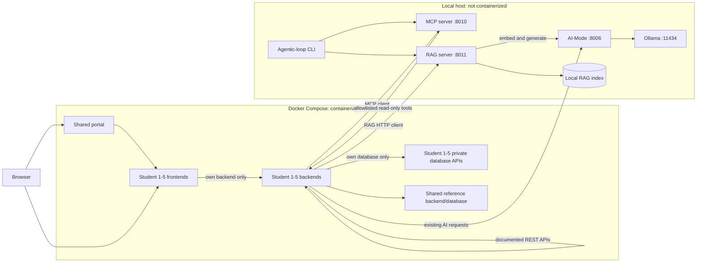

# Release 1 Integrated Architecture

Related issue: [#121](https://github.com/JulianKirk/TripGenie/issues/121)

MCP and RAG contracts: [Release 1 MCP and RAG flow](./release-1-mcp-rag-flow.md)

Student 1 design: [Student 1 Release 1 architecture](./student-1-release-1-architecture.md)

Delivery plan: [Student 1 Release 1 plan](../reports/release-1/student-1-release-1-plan.md)

## 1. Decision and scope

The Release 1 assessment brief is the controlling requirement for this release.
It is more specific than the older project specification:

- each student's frontend, backend/API, and database microservices remain
  containerized;
- AI-Mode, the MCP server, the RAG server, Ollama, and the shared agentic loop
  run directly on the local host;
- those host processes must not be defined as Docker Compose services; and
- every feature reaches MCP and RAG through its own backend/API.

Release 1 adds a bounded, single-agent tool and retrieval workflow. Planner,
Worker, and Reviewer agents belong to Release 2 and are not part of this design.

## 2. Current baseline

Release 0 already provides:

- five containerized student feature slices;
- one frontend, public backend, and private database service per student;
- the shared portal and shared location/currency reference services;
- Student 1 Trip and Itinerary CRUD plus advisory AI suggestions;
- direct backend-to-backend enrichment between feature services; and
- a shared AI-Mode gateway that is the only application component permitted to
  communicate with Ollama.

Release 1 retains these ownership boundaries. It moves AI-Mode to the host and
adds one host MCP server, one host RAG server, and MCP/RAG validation modes to
the existing host agentic-loop harness.

## 3. Runtime topology

The MCP server may call public feature backends only. It must not access a
student database API, SQLite file, persistence model, or private Compose
endpoint. Because the host cannot resolve Compose service names, Release 1
publishes each public feature backend on a loopback-only host port for MCP
access. Database services remain internal.

## 4. Service ownership

| Component | Owner | Release 1 responsibility | Must not do |
| --- | --- | --- | --- |
| Feature frontend | Feature student | Offer feature-specific MCP and RAG actions and render structured results. | Call MCP, RAG, AI-Mode, another feature, or a database directly. |
| Feature backend | Feature student | Validate requests, call host MCP/RAG, preserve feature rules, and translate failures. | Expose an unrestricted tool proxy or make optional AI readiness block CRUD. |
| Feature database | Feature student | Preserve Release 0 persistence and integrity. | Call MCP, RAG, AI-Mode, or another database. |
| AI-Mode | Shared | Remain the only Ollama adapter; provide bounded generation and embeddings. | Own retrieval, feature prompts, tool policy, or persistence. |
| MCP server | Shared | Register bounded tools and adapt public feature APIs to stable structured results. | Invent records, bypass public APIs, or execute unapproved writes. |
| RAG server | Shared; initial implementation by Aaditya Rai | Ingest an allowlisted corpus, retrieve context, generate grounded answers, and validate citations/confidence. | Recursively ingest the repository, call Ollama directly, or return unsupported answers. |
| Agentic loop | Shared | Validate MCP and RAG locally and retain sanitized evidence. | Become the Release 2 multi-agent runtime. |
| Student 1 planner | Aaditya Rai | Coordinate read-only tools and RAG context into reviewable itinerary drafts. | Auto-save model output or expose hidden reasoning. |

## 5. Host endpoints and configuration

The ports below avoid existing feature ports and are the Release 1 contract.

| Host process | Port | Container URL | Native host URL |
| --- | ---: | --- | --- |
| Ollama | `11434` | Not called by feature containers | `http://127.0.0.1:11434` |
| AI-Mode | `8006` | `http://host.docker.internal:8006` | `http://127.0.0.1:8006` |
| MCP server | `8010` | `http://host.docker.internal:8010` | `http://127.0.0.1:8010` |
| RAG server | `8011` | `http://host.docker.internal:8011` | `http://127.0.0.1:8011` |

Linux Compose configuration must map `host.docker.internal` to `host-gateway`.
Host processes bind to an address reachable from Docker only when local
integration is enabled. Firewall rules must keep these ports off untrusted
networks.

The host MCP server reaches feature backends through loopback-only published
ports:

| Feature backend | MCP provider URL |
| --- | --- |
| Student 1 Trips and Itineraries | `http://127.0.0.1:8001` |
| Student 2 Accommodation | `http://127.0.0.1:9000` |
| Student 3 Transport | `http://127.0.0.1:8003` |
| Student 4 Activities | `http://127.0.0.1:8008` |
| Student 5 Budget and Expenses | `http://127.0.0.1:8005/api/v1` |

Issue #129 changes `expose` to loopback-bound `ports` only for these public
backend APIs. It does not publish any database port. Existing host-published
services should also be narrowed to `127.0.0.1` unless a documented development
requirement needs LAN access.

Shared environment-variable names:

| Variable | Meaning |
| --- | --- |
| `AI_MODE_BASE_URL` | Host AI-Mode URL used by native MCP/RAG services. |
| `MCP_ENABLED` | Explicit feature flag; `false` in CI. |
| `MCP_BASE_URL` | Host MCP endpoint visible to the calling backend. |
| `MCP_TIMEOUT_SECONDS` | Per-request MCP timeout. |
| `RAG_ENABLED` | Explicit feature flag; `false` in CI. |
| `RAG_BASE_URL` | Host RAG endpoint visible to the calling backend. |
| `RAG_TIMEOUT_SECONDS` | Per-request RAG timeout. |

Each feature prefixes these names with its existing service prefix where
required, for example `STUDENT1_BACKEND_RAG_BASE_URL`. The example environment
file documents native and Compose values; processes do not load it
automatically.

## 6. Health, readiness, and degraded operation

- `/health` reports that a process is serving and includes bounded dependency
  diagnostics.
- `/ready` reports whether that process can perform its primary operation.
- MCP readiness may depend on registry initialization, but not on every feature
  backend being available.
- RAG readiness requires a compatible, non-empty index and reachable embedding
  and generation operations through AI-Mode.
- Feature backend readiness continues to depend only on its required database
  path. Optional AI-Mode, MCP, and RAG outages appear as degraded dependency
  states and fail only the requested optional operation.
- Disabled mode is a deliberate configuration state, not a connection failure.

## 7. Shared error contract

Feature backends translate host-service failures into their established public
error envelope. Shared services use stable codes:

| HTTP | Code | Meaning |
| ---: | --- | --- |
| `400` or `422` | `VALIDATION_ERROR` | The caller supplied invalid or unsupported input. |
| `404` | `NOT_FOUND` | An authoritative record or source does not exist. |
| `409` | `CONFLICT` | A valid request conflicts with authoritative state. |
| `502` | `BAD_GATEWAY` | A dependency returned malformed or contract-incompatible data. |
| `503` | `DEPENDENCY_UNAVAILABLE` | A required dependency is disabled or unreachable. |
| `503` | `INDEX_NOT_READY` | The RAG index is missing, empty, or incompatible. |
| `504` | `DEPENDENCY_TIMEOUT` | A bounded downstream request timed out. |

Errors include a safe message, correlation ID, retryable flag, and bounded field
details. They never include prompts, retrieved source bodies, model output,
credentials, or raw dependency exceptions.

## 8. Non-functional requirements

| Quality | Measurable Release 1 requirement |
| --- | --- |
| Security | Only allowlisted MCP tools and allowlisted RAG source paths are accepted. No caller can supply an arbitrary URL, file path, SQL statement, model name, or write operation. |
| Grounding | Every supported RAG answer includes source citations resolved from retrieved chunk IDs. Below-threshold retrieval skips generation and returns `insufficient_context`. |
| Traceability | MCP/RAG responses carry a correlation ID and stable tool/source identifiers; logs retain IDs, timings, counts, and terminal status only. |
| Reliability | Feature CRUD and database readiness continue to pass with AI-Mode, MCP, and RAG disabled or stopped. |
| Performance | MCP provider calls default to 5 seconds and return no more than 20 candidates. Retrieval before generation targets 2 seconds for the course corpus. A complete local RAG request is bounded to 120 seconds. |
| Usability | Frontends distinguish loading, disabled, unavailable, timeout, insufficient-context, partial-result, and success states and preserve accessible labels/status announcements. |
| Maintainability | Every public contract has typed models and fake-transport tests for success, validation, timeout, unavailable, and malformed-response paths. |
| Interoperability | Tools normalize provider-specific envelopes, UUID/string identifiers, nullable values, and exact money/pricing bases without changing authoritative meaning. |
| Availability | Host services expose health/readiness checks and fail independently; no optional service is a Compose startup dependency. |

## 9. Startup and shutdown order

1. Start host Ollama and confirm the approved chat and embedding models.
2. Start host AI-Mode and verify `/health` and `/ready`.
3. Build or validate the local RAG index, then start the host RAG server.
4. Start the host MCP server.
5. Start the containerized application with the Release 0 Compose file updated
   only for host connection configuration.
6. Verify each feature's CRUD path before testing its MCP and RAG actions.
7. Run the host agentic loop in MCP and RAG validation modes.

Stopping a host AI service must not require destroying Compose volumes.

## 10. Delivery decision

The contract gate is delivered as one documentation PR for issue #121.

The shared RAG implementation is delivered as **one coherent PR** from a branch
based on the merged contract gate. That PR closes issues #122, #123, #124, and
#125 together because the AI-Mode embedding boundary, server foundation,
ingestion/index, and grounded query contract must remain compatible.

The single RAG PR must still keep commits reviewable and run focused validation
for AI-Mode and RAG. MCP, Student 1 feature integration, Compose, CI, and
evidence remain separate dependent changes so the RAG diff does not absorb
unrelated ownership.
