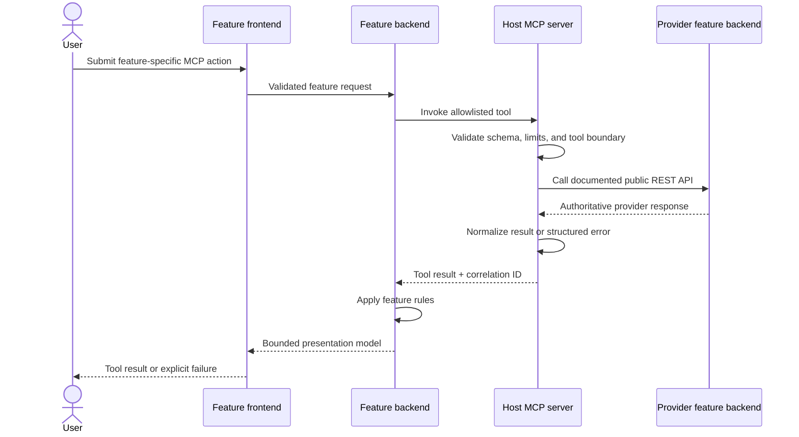
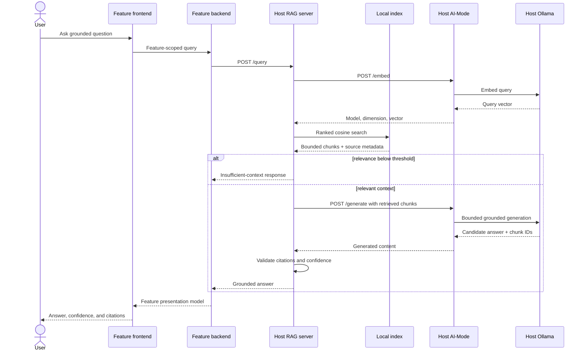

# Release 1 MCP and RAG Contracts

Related architecture: [Release 1 integrated architecture](./release-1-integrated-architecture.md)

Student 1 consumer: [Student 1 Release 1 architecture](./student-1-release-1-architecture.md)

## 1. MCP request flow



The browser never chooses an arbitrary MCP tool. Each feature backend maps a
feature-specific operation to an allowlisted tool and validates the returned
result before use.

## 2. MCP result contract

Successful tools return structured content equivalent to:

```json
{
  "schema_version": "1",
  "tool": "activity_search",
  "correlation_id": "student1-plan-123",
  "data": {},
  "source": {
    "service": "student-4-backend",
    "authoritative": true
  },
  "partial": false,
  "warnings": []
}
```

Tool failures use MCP's error result mechanism with structured content:

```json
{
  "schema_version": "1",
  "tool": "activity_search",
  "correlation_id": "student1-plan-123",
  "error": {
    "code": "DEPENDENCY_UNAVAILABLE",
    "message": "The activity service is unavailable.",
    "retryable": true,
    "details": []
  }
}
```

The MCP server may expose `/health` and `/ready` as diagnostics alongside its
standard MCP transport. Tool discovery and invocation still use the selected
MCP SDK and protocol rather than a custom REST tool endpoint.

## 3. Read-only tool catalogue

All calls target a public feature backend. Default provider timeout is 5
seconds. Search tools default to 10 results and cap at 20 unless the provider's
documented maximum is lower.

| Tool | Owner/API | Inputs | Normalized output | Special rules |
| --- | --- | --- | --- | --- |
| `trip_get` | Student 1 `GET /api/trips/{trip_id}` | `trip_id` | Trip dates, destination, travellers, status, notes | Does not include hidden database fields. |
| `trip_itinerary_list` | Student 1 `GET /api/trips/{trip_id}/itinerary-items` | `trip_id`, optional date/category | Ordered itinerary items | Used for collision checks; read only. |
| `accommodation_search` | Student 2 `QUERY /accommodation` | Country/city, type, price/rating, rooms, amenities, limit | Candidate summaries and total | MCP hides the unusual HTTP `QUERY` method. Unknown location is an empty result. |
| `accommodation_get` | Student 2 `GET /accommodation/{id}` | Accommodation UUID from a prior result | Accommodation details | Never synthesize or hard-code seed UUIDs. |
| `accommodation_costs` | Student 2 committed-cost endpoint | `trip_id` | Exact committed accommodation costs | Preserve provider currency/unknown state. |
| `transport_search` | Student 3 `GET /api/transport-options` | Type, route, provider, departure window, price/status, limit | Candidate options | Preserve local timestamps, offsets, capacity nullability, and pricing basis. |
| `transport_get` | Student 3 `GET /api/transport-options/{id}` | Transport ID from a prior result | Transport details | ID must match the authoritative `transport_...` format. |
| `transport_compare` | Student 3 compare endpoint | One to four authoritative IDs | Comparable options | Reject duplicates and more than four IDs. |
| `activity_search` | Student 4 `QUERY /activity` | Text, location, category, date/time, duration, party, accessibility, price, limit | Candidate summaries and total | Preserve exact decimal strings and nullable accessibility. |
| `activity_get` | Student 4 `GET /activity/{id}` | Activity UUID from a prior result | Activity details | Never fabricate availability or accessibility. |
| `activity_categories` | Student 4 `GET /activity/categories` | None | Authoritative category list | Used to constrain planning inputs. |
| `activity_costs` | Student 4 committed-cost endpoint | `trip_id` | Exact committed activity costs | Preserve `PER_PERSON` or `FLAT_ADMISSION`. |
| `budget_list` | Student 5 `GET /api/v1/budgets` | Optional `trip_id` | Budget summaries | Compose's `/api/v1` prefix is authoritative. |
| `budget_summary` | Student 5 `GET /api/v1/budgets/{id}/summary` | Budget UUID from `budget_list` | Planned, committed, actual, remaining, provider states | Invoke outside Student 1 write transactions to avoid a synchronous call cycle. |
| `expense_list` | Student 5 `GET /api/v1/expenses` | Trip/category/date filters, limit | Expense summaries | Preserve exact two-decimal strings and three-letter currencies. |

### Tool boundary rules

- Release 1 planner tools are read only.
- IDs in a subsequent detail/compare request must originate from a successful
  discovery result or authoritative trip association.
- The MCP server rejects unknown tools, unsupported filters, excessive limits,
  malformed identifiers, arbitrary URLs, and write-shaped payloads.
- Provider itinerary-association endpoints are not planner tools because they
  call back into Student 1 and create unnecessary circular writes.
- `null`, omitted enrichment, and unavailable providers mean unknown, not zero
  or false.
- One provider failure may produce a partial planner observation, but it is
  never silently converted to an empty successful result.

## 4. RAG retrieval and response flow



## 5. RAG source and index contract

The RAG server ingests only UTF-8 Markdown and plain-text sources listed in a
versioned manifest. Each source has:

- stable source ID;
- repository-relative path;
- title;
- owning feature or `shared` tag; and
- optional description.

The ingestion command is host-only. There is no remote ingestion endpoint.
Paths must resolve inside the repository. Environment files, credentials,
SQLite files, generated indexes, logs, evidence containing personal data, and
arbitrary user trip content are rejected.

Chunks preserve source ID, path, title, heading, ordinal, content hash, and
feature tags. The index records schema version, embedding model, vector
dimension, and source-manifest hash. Rebuilds are atomic, skip unchanged
content, and remove stale sources.

For the course-sized corpus, SQLite storage plus deterministic linear cosine
search is sufficient. A separate vector database is deferred until measured
corpus size or latency demonstrates a need.

## 6. RAG HTTP contract

### `POST /query`

```json
{
  "query": "What constraints apply when adding an activity to this itinerary?",
  "feature": "student-1",
  "top_k": 5,
  "correlation_id": "student1-rag-123"
}
```

The query is bounded to 2,000 characters. `top_k` defaults to 5 and is capped
at 10. Retrieved context is capped by both chunk count and total characters.

Successful grounded response:

```json
{
  "data": {
    "schema_version": "1",
    "run_id": "rag_01",
    "correlation_id": "student1-rag-123",
    "answer": "The activity must fit the trip date and avoid an existing timed item.",
    "confidence_category": "high",
    "insufficient_context": false,
    "citations": [
      {
        "source_id": "student-1-architecture",
        "path": "docs/architecture/student-1-release-1-architecture.md",
        "title": "Student 1 Release 1 Architecture",
        "section": "Planner validation",
        "chunk_id": "student-1-architecture:planner-validation:1",
        "excerpt": "A bounded excerpt from the retrieved chunk."
      }
    ],
    "retrieval": {
      "requested_top_k": 5,
      "returned_chunks": 3,
      "maximum_score": 0.84
    }
  }
}
```

Insufficient-context response:

```json
{
  "data": {
    "schema_version": "1",
    "run_id": "rag_02",
    "correlation_id": "student1-rag-124",
    "answer": "There is not enough indexed context to answer this question.",
    "confidence_category": "insufficient_context",
    "insufficient_context": true,
    "citations": [],
    "retrieval": {
      "requested_top_k": 5,
      "returned_chunks": 0,
      "maximum_score": null
    }
  }
}
```

## 7. Citation and confidence policy

- The model may select only chunk IDs supplied in the generation request.
- The server resolves citation metadata from its index; model-supplied paths,
  titles, sections, excerpts, and scores are ignored.
- An unknown citation ID makes the model output invalid. It is never published
  as a citation.
- The server calculates confidence from retrieval scores and citation coverage;
  it never accepts a model-provided confidence label.
- The implementation PR must calibrate and commit the high/medium/low relevance
  thresholds against a small versioned query set for the selected embedding
  model. Changing the model invalidates that calibration and the index.
- Retrieval below the configured minimum skips generation and returns the fixed
  insufficient-context response.

## 8. RAG limits and failures

| Boundary | Release 1 limit |
| --- | --- |
| Query | 2,000 characters |
| `top_k` | Default 5, maximum 10 |
| Generated answer | 4,000 characters |
| Retrieved context | 12,000 characters |
| Retrieval stage | Target 2 seconds for the course corpus |
| Complete RAG request | Maximum 120 seconds |
| Citation excerpt | Bounded display excerpt, never the full source |

The RAG server does not log queries, chunks, prompts, vectors, or answers by
default. It logs run/correlation IDs, lengths, counts, selected source IDs,
model identity, timings, and terminal error classes.
