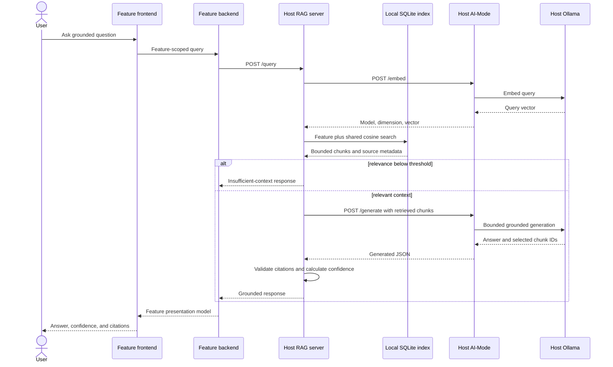

# Release 1 Shared RAG Contract

Related architecture:
[Release 1 shared RAG architecture](./release-1-shared-rag-architecture.md)

## 1. Retrieval and response flow



## 2. AI-Mode embedding boundary

Only AI-Mode communicates with Ollama. The RAG server calls AI-Mode `/embed`
with bounded text inputs and an allowlisted embedding model.

Request:

```json
{
  "inputs": ["First bounded source chunk", "Second bounded source chunk"],
  "model": "nomic-embed-text",
  "correlation_id": "rag-ingest-123",
  "metadata": {
    "feature": "shared-rag"
  }
}
```

Response:

```json
{
  "data": {
    "run_id": "aimode_01",
    "correlation_id": "rag-ingest-123",
    "model": "nomic-embed-text",
    "provider": "ollama",
    "dimension": 768,
    "embeddings": [[0.1, 0.2], [0.3, 0.4]]
  }
}
```

AI-Mode validates the model allowlist, input count and length, returned vector
count, consistent dimension, finite values, provider timeout, and missing
model errors. Chat and embedding model allowlists remain separate.

## 3. Source manifest and ingestion

The host-only ingestion command is:

```text
python -m rag_service ingest --rebuild
```

There is no remote ingestion endpoint. The manifest contract is:

```json
{
  "schema_version": "1",
  "sources": [
    {
      "source_id": "student-1-data-models",
      "path": "docs/architecture/student-1-data-models.md",
      "title": "Student 1 Data Models",
      "feature": "student-1"
    }
  ]
}
```

Ingestion validates the manifest and every resolved path before replacing the
current index. Any validation, embedding, or write failure leaves the previous
index intact.

## 4. RAG HTTP contract

### `GET /health`

Returns `200` while the process is serving and reports bounded AI-Mode and
index diagnostics. Overall status is `ok` only when both dependencies are
ready; otherwise it is `degraded`.

### `GET /ready`

Returns `200` when AI-Mode is ready and the index is compatible and non-empty.
Returns `503` with `status=not_ready` otherwise.

### `POST /query`

Request:

```json
{
  "query": "What constraints apply when adding an activity to an itinerary?",
  "feature": "student-1",
  "top_k": 5,
  "correlation_id": "student1-rag-123"
}
```

The server searches chunks tagged with the requested feature plus `shared`.
The query is bounded to 2,000 characters. `top_k` defaults to 5 and is capped
at 10. Retrieved context is capped by both chunk count and total characters.

Successful response:

```json
{
  "data": {
    "schema_version": "1",
    "run_id": "rag_01",
    "correlation_id": "student1-rag-123",
    "answer": "The item must fall within the trip dates.",
    "confidence_category": "high",
    "insufficient_context": false,
    "citations": [
      {
        "source_id": "student-1-data-models",
        "path": "docs/architecture/student-1-data-models.md",
        "title": "Student 1 Data Models",
        "section": "Validation",
        "chunk_id": "student-1-data-models:0:abc123",
        "excerpt": "A bounded excerpt from the retrieved chunk."
      }
    ],
    "retrieval": {
      "requested_top_k": 5,
      "returned_chunks": 1,
      "maximum_score": 0.84
    }
  }
}
```

Insufficient-context response:

```json
{
  "data": {
    "schema_version": "1",
    "run_id": "rag_02",
    "correlation_id": "student1-rag-124",
    "answer": "There is not enough indexed context to answer this question.",
    "confidence_category": "insufficient_context",
    "insufficient_context": true,
    "citations": [],
    "retrieval": {
      "requested_top_k": 5,
      "returned_chunks": 0,
      "maximum_score": null
    }
  }
}
```

## 5. Citation and confidence policy

- The model may select only chunk IDs supplied in the generation request.
- Citation paths, titles, sections, excerpts, and scores are resolved from the
  index rather than accepted from model output.
- An unknown citation ID makes the model output invalid.
- Confidence is calculated server-side from retrieval scores; model-provided
  confidence is ignored.
- Thresholds are boundary-tested and evaluated against
  [`config/calibration-queries.json`](../../ai-services/rag-server/config/calibration-queries.json)
  for the chosen embedding model. Changing that model invalidates the
  calibration evidence and index.
- Retrieval below the configured minimum skips generation and returns the
  fixed insufficient-context response.

## 6. Limits and failure contract

| Boundary | Release 1 limit |
| --- | --- |
| Query | 2,000 characters |
| `top_k` | Default 5, maximum 10 |
| Source file | 1,000,000 characters |
| Chunk | 1,200 characters with 150-character overlap |
| Embedding batch | 16 chunks |
| Generated answer | 4,000 characters |
| Retrieved context | 12,000 characters |
| Complete downstream request | 120 seconds |
| Citation excerpt | 240 characters |

Stable errors:

| HTTP | Code | Meaning |
| ---: | --- | --- |
| `422` | `VALIDATION_ERROR` | Query, manifest, path, or configured limit is invalid. |
| `502` | `BAD_GATEWAY` | AI-Mode returned malformed or contract-incompatible data. |
| `503` | `DEPENDENCY_UNAVAILABLE` | AI-Mode is unavailable. |
| `503` | `INDEX_NOT_READY` | The index is missing, empty, corrupt, or incompatible. |
| `504` | `DEPENDENCY_TIMEOUT` | AI-Mode exceeded the configured timeout. |

Errors contain a safe message, retryability, and bounded field details. They
do not expose prompts, retrieved source bodies, model output, vectors,
credentials, filesystem details, or raw exceptions.

## 7. Required automated coverage

- configuration and threshold validation;
- manifest validation and path traversal rejection;
- deterministic heading-aware chunking and overlap;
- atomic rebuild, unchanged-source reuse, and stale-source removal;
- missing, empty, corrupt, and model-incompatible index readiness;
- deterministic cosine ordering and feature/shared filtering;
- valid grounded answers and resolved citations;
- high, medium, low, and insufficient-context outcomes;
- fabricated citation rejection and prompt-injection resistance;
- AI-Mode timeout, unavailable, malformed, and mismatched responses;
- public health, readiness, query, and stable error envelopes; and
- safe logging that excludes query and source content.
