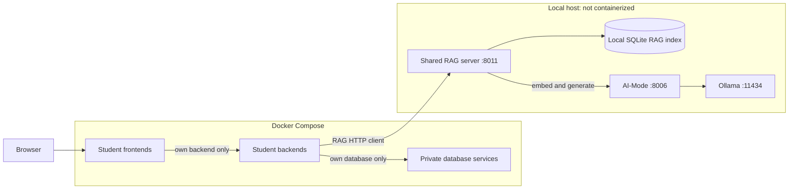

# Release 1 Shared RAG Architecture

Related issue: [#121](https://github.com/JulianKirk/TripGenie/issues/121)

RAG contract: [Release 1 shared RAG contract](./release-1-rag-contract.md)

Delivery plan: [Student 1 shared RAG plan](../reports/release-1/student-1-release-1-plan.md)

## 1. Decision and scope

Aaditya Rai owns the initial shared Retrieval-Augmented Generation (RAG)
server for Release 1. The Release 1 assessment brief is the controlling
deployment requirement:

- the RAG server, AI-Mode, and Ollama run directly on the local host;
- the RAG server must not be added to Docker Compose;
- only AI-Mode communicates with Ollama;
- feature frontends reach RAG only through their own backend APIs; and
- the shared RAG server provides retrieval and grounded-answer capabilities,
  not feature persistence or business orchestration.

Tool-server implementation and tool-backed itinerary planning are owned
separately and are outside this plan.

## 2. Existing baseline

Release 0 already provides:

- five containerized student feature slices;
- Student 1 Trip and Itinerary CRUD and advisory AI suggestions;
- shared service and API ownership boundaries; and
- AI-Mode as the sole Ollama adapter.

The RAG implementation extends this baseline without changing data ownership.
It indexes curated project knowledge and exposes a shared query contract. It
does not read feature databases or persist generated content.

## 3. Runtime topology

The browser never calls the RAG server directly. A feature backend validates
its request, selects the feature scope, calls the shared RAG API, and maps the
result into its own presentation contract.

## 4. Component responsibilities

| Component | Responsibility | Must not do |
| --- | --- | --- |
| Feature frontend | Submit feature-specific questions and render answers, confidence, citations, and failures. | Call RAG, AI-Mode, Ollama, or a database directly. |
| Feature backend | Validate requests, call host RAG, and preserve feature-specific authorization and behavior. | Accept arbitrary dependency URLs, source paths, or model names from the browser. |
| Shared RAG server | Ingest allowlisted knowledge, retrieve relevant chunks, request grounded generation, validate citations, and calculate confidence. | Call Ollama directly, crawl the repository, read feature databases, or persist generated output. |
| AI-Mode | Provide bounded chat generation and embeddings as the only Ollama adapter. | Own source ingestion, retrieval, citations, or feature logic. |
| Ollama | Host the approved chat and embedding models locally. | Be exposed as an application API. |
| SQLite RAG index | Store source metadata, chunks, hashes, and vectors for deterministic local retrieval. | Store credentials, personal trip data, prompts, or generated answers. |

## 5. Host endpoints and configuration

| Host process | Native URL | Container-visible URL |
| --- | --- | --- |
| Ollama | `http://127.0.0.1:11434` | Not called by feature containers |
| AI-Mode | `http://127.0.0.1:8006` | Not called by RAG through Compose |
| RAG server | `http://127.0.0.1:8011` | `http://host.docker.internal:8011` |

The RAG server binds to loopback by default. Local integration may use a
host binding reachable from Docker, but firewall rules must keep it off
untrusted networks.

Core RAG configuration:

| Variable | Default | Meaning |
| --- | --- | --- |
| `RAG_BIND_HOST` | `127.0.0.1` | Host interface for the RAG HTTP server. |
| `RAG_PORT` | `8011` | Host RAG port. |
| `RAG_AI_MODE_BASE_URL` | `http://127.0.0.1:8006` | Native AI-Mode endpoint. |
| `RAG_AI_MODE_TIMEOUT_SECONDS` | `120` | Complete downstream request timeout. |
| `RAG_EMBEDDING_MODEL` | `nomic-embed-text` | Approved embedding model requested through AI-Mode. |
| `RAG_SOURCE_MANIFEST` | service default | Explicit source allowlist. |
| `RAG_INDEX_PATH` | service default | Local SQLite index path. |

Consumer backends use their own enable flag, base URL, and timeout. For
Student 1 these are `STUDENT1_BACKEND_RAG_ENABLED`,
`STUDENT1_BACKEND_RAG_BASE_URL`, and
`STUDENT1_BACKEND_RAG_TIMEOUT_SECONDS`.

## 6. Source and storage design

The ingestion command accepts one versioned JSON manifest. Each entry contains
a stable source ID, repository-relative path, title, and feature tag.

Only UTF-8 Markdown and plain-text files are accepted. Paths must resolve
inside the repository. Environment files, databases, logs, generated indexes,
credentials, personal trip data, and arbitrary directory traversal are
rejected.

Chunks retain:

- source ID, path, title, and feature;
- heading or section;
- deterministic ordinal and chunk ID;
- content hash; and
- embedding generated through AI-Mode.

The SQLite index stores its schema version, embedding model, vector dimension,
and manifest hash. Rebuilds are atomic, reuse unchanged embeddings, and remove
sources no longer present in the manifest.

For the course-sized corpus, deterministic linear cosine search over SQLite
vectors is sufficient. A separate vector database is deferred until measured
corpus size or latency demonstrates a need.

## 7. Availability and security boundaries

- `/health` reports process and dependency state.
- `/ready` succeeds only when AI-Mode is ready and a compatible, non-empty
  index exists.
- Missing, empty, corrupt, or model-incompatible indexes return an explicit
  not-ready state.
- RAG failure must not make ordinary feature CRUD unavailable.
- Callers cannot supply a filesystem path, dependency URL, provider name, or
  model name.
- Retrieved text is untrusted reference data, never executable instructions.
- Model-selected citation IDs must match retrieved chunk IDs; all displayed
  citation metadata is resolved from the index.
- Queries, chunks, prompts, vectors, answers, credentials, and raw dependency
  exceptions are not logged.

## 8. Startup and verification order

1. Start host Ollama and pull the approved chat and embedding models.
2. Start host AI-Mode and verify `/health` and `/ready`.
3. Run the RAG ingestion command and verify the index summary.
4. Start the host RAG server and verify `/health` and `/ready`.
5. Start the containerized application only when consumer integration is
   required.
6. Exercise grounded, insufficient-context, timeout, and unavailable cases.

Tests use injected HTTP transports and deterministic vectors. CI does not
install Ollama, download models, or require a live host process.

## 9. Delivery decision

Issues [#122](https://github.com/JulianKirk/TripGenie/issues/122) through
[#125](https://github.com/JulianKirk/TripGenie/issues/125) are delivered in
one coherent Shared RAG implementation PR. The embedding boundary, host
service, ingestion/index, query contract, tests, and documentation must remain
compatible, while commits may stay separated for review.
