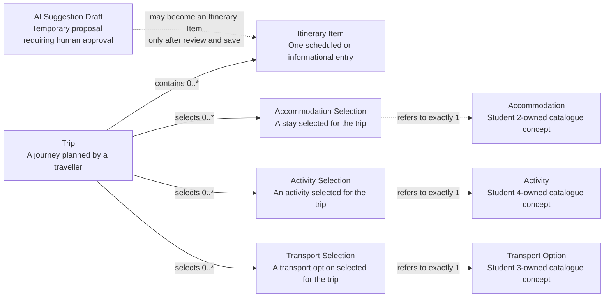
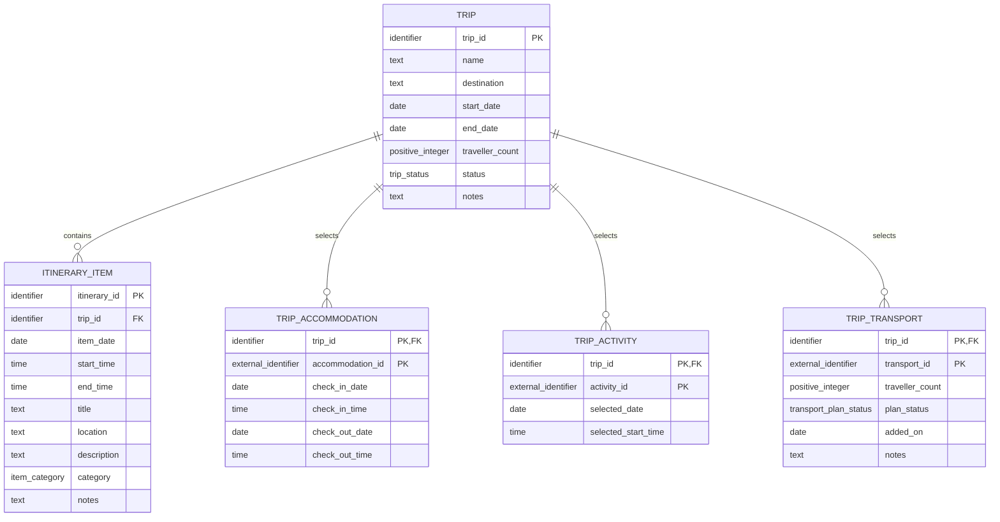
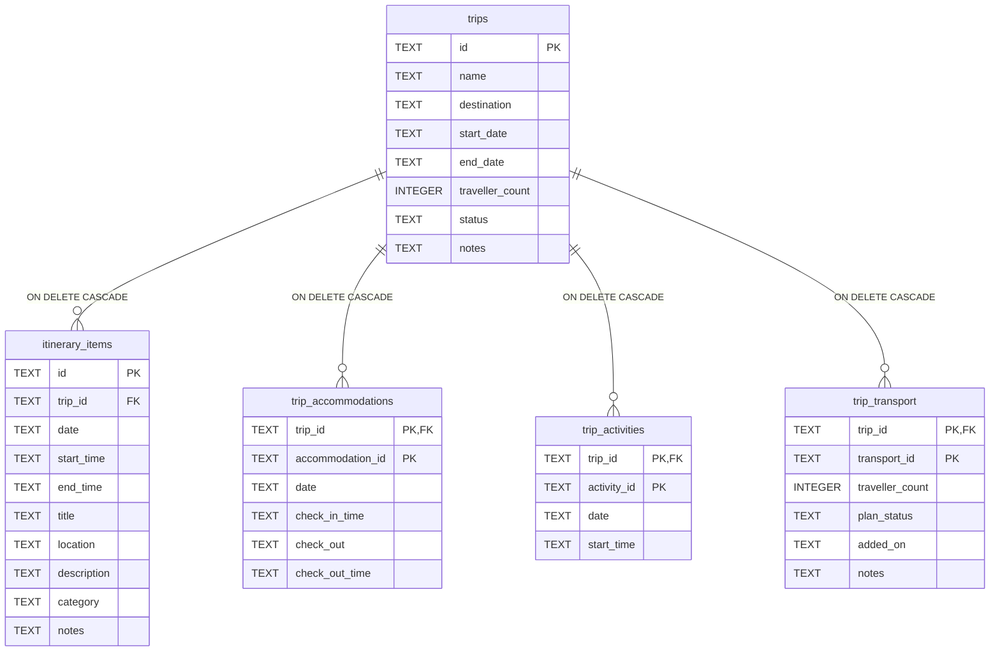

# Student 1 Conceptual, Logical, and Physical Data Models

This document defines the data design for **Student 1: Trip & Itinerary
Management**. It addresses the Release 0 requirement for conceptual, ERD,
logical, and physical data design and reflects the implemented Student 1
SQLite Database Microservice.

Related documents:

- [Student 1 Release 0 architecture](student-1-release-0-architecture.md)
- [Student 1 runtime AI-Mode contract](student-1-runtime-ai-mode.md)
- [Student 1 report contribution](../reports/release-0/student-1-report-contribution.md)
- [Implemented SQLite schema](../../student-1/database/database_service/repository.py)

## 1. Scope and notation

The assignment allocates two core data subjects to Student 1:

- **Trips** identify a journey, its destination, date range, travellers,
  lifecycle status, and planning notes.
- **Itinerary Items** form a day-by-day schedule within a Trip.

The implementation also stores three associative records so a Trip can select
accommodations, activities, and transport options owned by other students'
microservices. These records keep only the external identifier and facts that
belong to the Trip plan. They do not copy another service's catalogue.

The logical and physical ERDs use Crow's Foot cardinality. The conceptual
diagram states multiplicities in its relationship labels.

| Symbol | Meaning |
| --- | --- |
| `\|\|` | exactly one |
| `o{` | zero or many |
| `PK` | primary key |
| `FK` | local foreign key |
| `EXT` | opaque identifier whose authoritative record is owned by another service |

## 2. Conceptual data model

The conceptual model describes business concepts without implementation types,
table names, or database-specific constraints.

### 2.1 Conceptual definitions

| Concept | Definition | Ownership |
| --- | --- | --- |
| Trip | The aggregate root for one journey and its planning period. | Student 1 |
| Itinerary Item | A dated entry in a Trip, optionally scheduled with start and end times. | Student 1 |
| Accommodation Selection | A Trip-specific stay window referring to an accommodation. | Selection: Student 1; catalogue record: Student 2 |
| Activity Selection | A Trip-specific date and optional start time referring to an activity. | Selection: Student 1; catalogue record: Student 4 |
| Transport Selection | A Trip-specific allocation and planning state referring to a transport option. | Selection: Student 1; catalogue record: Student 3 |
| AI Suggestion Draft | A temporary itinerary proposal shown for human review. | Runtime only; not persisted |

### 2.2 Conceptual business rules

1. A Trip may exist without itinerary items or external selections.
2. Every Itinerary Item belongs to exactly one Trip.
3. A Trip may select many accommodations, activities, and transport options.
4. The same external record may be selected by many Trips.
5. Deleting a Trip removes its Student 1-owned items and selections.
6. External catalogue data is obtained through REST API endpoints, never by
   accessing another student's assigned SQLite schema.
7. AI-assisted itinerary suggestions remain drafts until a user reviews and
   saves one through normal itinerary CRUD.

## 3. Logical data model

The logical model resolves the concepts into normalized relations independently
of SQLite storage types.

`accommodation_id`, `activity_id`, and `transport_id` are logical references,
but they are not local foreign keys. Their target records are outside Student
1's database boundary.

### 3.1 Logical relations

| Relation | Identifier | Required attributes | Optional attributes |
| --- | --- | --- | --- |
| `TRIP` | `trip_id` | `name`, `destination`, `start_date`, `end_date`, `traveller_count`, `status` | `notes` |
| `ITINERARY_ITEM` | `itinerary_id` | `trip_id`, `item_date`, `title`, `category` | `start_time`, `end_time`, `location`, `description`, `notes` |
| `TRIP_ACCOMMODATION` | (`trip_id`, `accommodation_id`) | `check_in_date` | `check_in_time`, `check_out_date`, `check_out_time` |
| `TRIP_ACTIVITY` | (`trip_id`, `activity_id`) | `selected_date` | `selected_start_time` |
| `TRIP_TRANSPORT` | (`trip_id`, `transport_id`) | `traveller_count`, `plan_status`, `added_on` | `notes` |

### 3.2 Logical domains and validation

| Domain | Allowed values or rule |
| --- | --- |
| Trip identifier | 6-64 characters; matches `^trip_[A-Za-z0-9][A-Za-z0-9_-]{2,63}$`. |
| Itinerary identifier | 6-64 characters; matches `^item_[A-Za-z0-9][A-Za-z0-9_-]{2,63}$`. |
| `external_identifier` | 1-64 characters matching `^[A-Za-z0-9_-]+$`; supplied by the owning service. |
| Short text | 1-255 characters; used by names, destinations, titles, and optional locations. |
| Long text | At most 2,000 characters; used by notes and descriptions. |
| Traveller count | Integer from 1 to 1,000 in the typed service contract; SQLite also enforces a positive value. |
| `trip_status` | `draft`, `planned`, `active`, `completed`, `cancelled` |
| `item_category` | `accommodation`, `transport`, `activity`, `meal`, `note`, `other` |
| `transport_plan_status` | `pending`, `confirmed`, `cancelled`, `completed` |
| Trip dates | `start_date` must not follow `end_date`; the inclusive duration is limited to 366 days by the service. |
| Itinerary date | Must fall inside its Trip's date range. |
| Itinerary times | If both are supplied, `start_time` must be earlier than `end_time`. |
| Activity date | Must fall inside its Trip's date range. |
| Accommodation stay | Check-out must not precede check-in; same-day check-out time must follow check-in time. |
| Selection uniqueness | One current selection exists per Trip and external record pair. Repeating a selection replaces it. |

### 3.3 Normalization

The logical model is designed to Third Normal Form:

- each relation represents one subject or one many-to-many association;
- non-key attributes depend on the whole key;
- Trip details are not repeated on itinerary or selection records;
- external names, descriptions, routes, prices, capacities, and durations are
  not copied into Student 1 relations; and
- status and category values are bounded domains rather than duplicated
  descriptive records.

`TripDay`, enriched Trip details, accommodation totals, transport capacity
summaries, and AI suggestions are derived views or runtime objects, not logical
persistent relations.

## 4. Physical SQLite data model

The physical model maps the logical relations to the implemented SQLite schema.
Dates and times use validated ISO-8601 text (`YYYY-MM-DD` and `HH:MM`).

### 4.1 `trips`

| Column | SQLite type | Null | Key/default | Constraint or meaning |
| --- | --- | --- | --- | --- |
| `id` | `TEXT` | No by API contract | PK | Stable Trip identifier. |
| `name` | `TEXT` | No |  | Trip display name. |
| `destination` | `TEXT` | No |  | Primary destination. |
| `start_date` | `TEXT` | No |  | ISO date. |
| `end_date` | `TEXT` | No |  | ISO date; table CHECK enforces `start_date <= end_date`. |
| `traveller_count` | `INTEGER` | No |  | CHECK `traveller_count > 0`. |
| `status` | `TEXT` | No |  | CHECK against the five Trip statuses. |
| `notes` | `TEXT` | Yes | `NULL` | Optional planning notes. |

### 4.2 `itinerary_items`

| Column | SQLite type | Null | Key/default | Constraint or meaning |
| --- | --- | --- | --- | --- |
| `id` | `TEXT` | No by API contract | PK | Stable itinerary item identifier. |
| `trip_id` | `TEXT` | No | FK | References `trips(id)` with `ON DELETE CASCADE`. |
| `date` | `TEXT` | No |  | ISO date within the Trip window, enforced by the database service. |
| `start_time` | `TEXT` | Yes | `NULL` | Optional `HH:MM` start. |
| `end_time` | `TEXT` | Yes | `NULL` | Optional `HH:MM` end. |
| `title` | `TEXT` | No |  | Item title. |
| `location` | `TEXT` | Yes | `NULL` | Optional location. |
| `description` | `TEXT` | Yes | `NULL` | Optional description. |
| `category` | `TEXT` | No |  | CHECK against the six itinerary categories. |
| `notes` | `TEXT` | Yes | `NULL` | Optional notes. |

The table CHECK permits an untimed or partly timed item. When both times are
present, it enforces `start_time < end_time`.

### 4.3 `trip_accommodations`

| Column | SQLite type | Null | Key/default | Constraint or meaning |
| --- | --- | --- | --- | --- |
| `trip_id` | `TEXT` | No | PK, FK | References `trips(id)` with `ON DELETE CASCADE`. |
| `accommodation_id` | `TEXT` | No | PK, EXT | Student 2-owned identifier. |
| `date` | `TEXT` | No |  | Check-in date; historical physical name retained for compatibility. |
| `check_in_time` | `TEXT` | Yes | `NULL` | Optional check-in time. |
| `check_out` | `TEXT` | Yes | `NULL` | Optional check-out date. |
| `check_out_time` | `TEXT` | Yes | `NULL` | Optional check-out time. |

Stay ordering is enforced in typed database-service validation rather than a
SQLite CHECK so fresh and migrated databases behave consistently.
The API defaults an omitted check-in date to the Trip's start date before
storage. Accommodation stay dates are not constrained to the Trip window in
the current repository; ordering within the stay is still validated.

### 4.4 `trip_activities`

| Column | SQLite type | Null | Key/default | Constraint or meaning |
| --- | --- | --- | --- | --- |
| `trip_id` | `TEXT` | No | PK, FK | References `trips(id)` with `ON DELETE CASCADE`. |
| `activity_id` | `TEXT` | No | PK, EXT | Student 4-owned identifier. |
| `date` | `TEXT` | No |  | Selected date within the Trip window. |
| `start_time` | `TEXT` | Yes | `NULL` | Optional selected start time. |

### 4.5 `trip_transport`

| Column | SQLite type | Null | Key/default | Constraint or meaning |
| --- | --- | --- | --- | --- |
| `trip_id` | `TEXT` | No | PK, FK | References `trips(id)` with `ON DELETE CASCADE`. |
| `transport_id` | `TEXT` | No | PK, EXT | Student 3-owned identifier. |
| `traveller_count` | `INTEGER` | No |  | CHECK `traveller_count > 0`. |
| `plan_status` | `TEXT` | No |  | CHECK against the four transport planning states. |
| `added_on` | `TEXT` | No |  | ISO date on which the option was selected. |
| `notes` | `TEXT` | Yes | `NULL` | Optional Trip-specific transport notes. |

The application supplies the default planning state `pending`; the SQLite
column itself has no default.

### 4.6 Operational table: `schema_metadata`

`schema_metadata` supports seed and schema lifecycle bookkeeping. It is part of
the physical database but not part of the conceptual or logical business model.

| Column | SQLite type | Null | Key/default |
| --- | --- | --- | --- |
| `key` | `TEXT` | No by application contract | PK |
| `value` | `TEXT` | No |  |
| `updated_at` | `TEXT` | No | `CURRENT_TIMESTAMP` |

## 5. Physical indexes

| Index | Columns | Purpose |
| --- | --- | --- |
| `idx_trips_status_start_date` | `trips(status, start_date)` | Trip status and chronological filtering. |
| `idx_itinerary_items_trip_date` | `itinerary_items(trip_id, date)` | Day-by-day itinerary retrieval. |
| `idx_itinerary_items_trip_category_date` | `itinerary_items(trip_id, category, date)` | Trip/category/date filtering. |
| `idx_trip_accommodations_accommodation` | `trip_accommodations(accommodation_id)` | Reverse lookup from Student 2. |
| `idx_trip_activities_activity` | `trip_activities(activity_id)` | Reverse lookup from Student 4. |
| `idx_trip_transport_transport` | `trip_transport(transport_id)` | Reverse lookup and capacity checks from Student 3. |

SQLite also creates indexes for each simple or composite primary key.

## 6. Integrity and ownership boundaries

Integrity is deliberately split across layers:

| Layer | Responsibility |
| --- | --- |
| SQLite | Primary keys, local Trip foreign keys, cascade deletion, positive counts, enum-like CHECK constraints, Trip date ordering, and itinerary time ordering. |
| Database API | ISO date/time validation, Trip-window validation, effective update validation, uniqueness conflict handling, and transactional writes. |
| Student 1 backend | Public contracts, cross-service enrichment, bounded Trip duration, AI output validation, duplicate/overlap checks, and review-before-save. |
| Other student services | Authoritative accommodation, activity, and transport catalogue records. |

Only the Student 1 database API opens the SQLite file. Student 1's backend uses
the internal database REST API, and other features use Student 1's public REST
API. No service performs cross-database joins.

## 7. Persistence exclusions

The following information is intentionally not stored in Student 1's schema:

- accommodation names, locations, nightly rates, and provider details;
- activity names, descriptions, prices, pricing bases, and durations;
- transport routes, operators, departure/arrival details, prices, and capacity;
- enriched API projections and calculated totals;
- AI prompts, model responses, run metadata, or suggestion drafts; and
- `TripDay` groupings, which are derived from Trip dates and itinerary items.

An approved AI draft becomes persistent only when the user submits it through
the normal itinerary-item create endpoint.

## 8. Assignment traceability

| Requirement | Model response |
| --- | --- |
| Conceptual, ERD, logical, and physical data design | Sections 2, 3, and 4 provide separate abstraction levels and ERDs. |
| Trips data | `TRIP` / `trips` contains every field allocated to Student 1. |
| Itinerary Items data | `ITINERARY_ITEM` / `itinerary_items` contains every field allocated to Student 1. |
| Day-by-day itineraries | One-to-many Trip relationship plus the `(trip_id, date)` index supports day retrieval. |
| CRUD | Stable primary keys and local referential integrity support create, read, update, and delete operations. |
| SQLite Database Microservice | The physical model is implemented in Student 1's isolated SQLite database and exposed through its database API service. |
| Cross-Feature Database API Integration | Associative records store opaque IDs while details are exchanged through REST APIs. |
| AI-assisted itinerary suggestions | Drafts are transient and require human review before normal CRUD persistence. |

The seed source defines ten Trips and ten Itinerary Items for the two
assignment-mandated core tables. Runtime row counts remain execution evidence
and should be captured from the SQLite Database Microservice rather than
inferred from source definitions.
