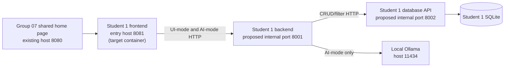

# Student 1 Release 0 Architecture, Runtime Modes, and Decision Traceability

Related planning document: [Student 1 Release 0 scope, assessed workflow, and evidence plan](../reports/release-0/student-1-release-0-plan.md)
Related ADRs: [ADR-0001](./decisions/0001-student-1-service-mapping.md), [ADR-0002](./decisions/0002-student-1-internal-api-and-observability.md)
Implemented runtime AI-mode notes: [Student 1 runtime AI-mode contract and implementation notes](./student-1-runtime-ai-mode.md)

## 1. Architecture stance

This document describes the **Student 1 Release 0 runtime target**. The course-assessed loop is the evidence-driven development/review workflow documented in the paired plan, not the end-user itinerary suggestion runtime.

Because the assignment handout is not committed in this repository snapshot, the **Assignment / Group 07 requirement** column below points to the repository artefacts that currently carry that scope: README, Docker Compose, CI, and the paired Student 1 plan.

Visible course material for this update comes from Labs 01-04 and the AI Agent Configuration Guide [CFG][L1][L2][L3][L4]. The [asd-labs README][ASD-README] references Labs 05/06, but the visible repository snapshot used here exposes only Labs 01-04 plus the AI guide and README [ASD-TREE], so later-lab requirements are treated as unavailable rather than inferred.

## 2. Traceability table

| Topic | Assignment / Group 07 requirement | Visible lab pattern/example | TripGenie Student 1 decision |
| --- | --- | --- | --- |
| Three-service Release 0 target | Student 1 Release 0 keeps a three-service slice with local Ollama, shared home page navigation, Docker Compose, and CI continuity [TG-README][TG-COMPOSE][TG-CI]. | Lab 04 shows a three-service split across `frontend-service`, `enrolment-service`, and `database-service` [L4]. | Keep the same responsibility split, but map it to Student 1 frontend/backend/database services within Group 07's repo layout. |
| Names and ports | Group 07 already exposes the shared UI on `8080` and a placeholder Student 1 entry on `8081` today [TG-COMPOSE]. | Lab 04 uses `8080`, `5001`, and `5002` in its example architecture [L4]. | Treat `8001` (backend) and `8002` (database API) as **proposed** Student 1 internal ports, with the mapping recorded in [ADR-0001](./decisions/0001-student-1-service-mapping.md). |
| UI-mode vs AI-mode | Student 1 needs both normal CRUD flows and a bounded AI-assisted suggestion flow [TG-PLAN]. | Lab 04 separates Normal UI from AI Mode in the frontend and backend routes [L4]. | Keep CRUD/filtering in UI-mode and itinerary suggestion in AI-mode, but do not describe AI-mode as the assessed subject loop. |
| Database ownership | Student 1 must keep one service as the only SQLite owner [TG-PLAN]. | Labs 01-04 keep persistence local to the data layer; Lab 04 makes `database-service` the only data owner [L1][L4]. | Student 1 database API owns `trips` and `itinerary_items`; other Student 1 services use HTTP. |
| Local Ollama and model baselines | Release 0 keeps local Ollama and avoids later-lab reasoning/runtime scope [TG-PLAN]. | The AI guide recommends local Ollama with `qwen2.5:0.5b` and `llama3.1:8b`; `deepseek-r1:8b` is later-lab reasoning support [CFG]. | Document local Ollama as the runtime integration point. Treat `qwen2.5:0.5b` and `llama3.1:8b` as subject baselines/recommendations, not hard runtime mandates. |
| Prompt assets | Student 1 must explain where prompt context and review assets live [TG-PLAN]. | Lab 03 externalises prompt files; Lab 04 adds architecture/ADR prompts [L3][L4]. | Keep runtime prompt assets distinct from service code and from report prose; exact file layout remains a project decision. |
| Internal APIs and health/logging | Student 1 may adopt internal route namespaces or health checks for implementation [TG-PLAN]. | Visible labs show browser/curl/manual evidence and stage banners, but do not visibly mandate `/internal/*`, `/ready`, exact log schemas, or retry caps [L1][L2][L3][L4]. | Keep `/internal/*`, `/health`, `/ready`, run IDs, correlation IDs, and exact stage-log schemas as explicit TripGenie proposals only, tracked in [ADR-0002](./decisions/0002-student-1-internal-api-and-observability.md). |
| Release boundary | Release 0 excludes Release 1 MCP/RAG and Release 2 multi-agent/cloud scope [TG-PLAN]. | Labs 01-04 stay local and evidence-driven; later-lab content is not visible in this snapshot [L1][L2][L3][L4][ASD-TREE]. | Keep runtime scope to trip/itinerary management plus bounded local suggestions only. |

## 3. Repository reality today versus Release 0 target

| Repository evidence today | Release 0 target described here |
| --- | --- |
| [docker-compose.yml][TG-COMPOSE] currently exposes `shared-ui`, a placeholder `student-1-service`, and `ollama`. | Decompose the placeholder Student 1 service into frontend/backend/database containers while preserving the shared home page pattern. |
| [student-1/Dockerfile][TG-STUDENT1] currently serves a placeholder container and the `student-1/` subfolders are not yet implemented. | Use this architecture doc as the target contract and responsibility split for the next implementation steps. |

## 4. Runtime service map

### 4.1 Mapping to the visible Lab 04 example

| Visible Lab 04 example | TripGenie Student 1 mapping | Status |
| --- | --- | --- |
| `frontend-service` | Student 1 frontend reached from the shared Group 07 home page | Proposed |
| `enrolment-service` | Student 1 backend/orchestration service | Proposed |
| `database-service` | Student 1 database API service | Proposed |

### 4.2 Service responsibilities

| Service | Release 0 responsibility | Must not do |
| --- | --- | --- |
| Shared home page | Provide the Group 07 landing page and navigation to Student 1. | Own Student 1 data or bypass Student 1 service boundaries. |
| Student 1 frontend | Render Student 1 UI-mode and AI-mode screens/forms and call the Student 1 backend over HTTP. | Access SQLite directly or call Ollama directly. |
| Student 1 backend | Enforce Student 1 business rules, own public endpoints, load prompt assets, call Ollama for bounded suggestion work, and orchestrate database API calls. | Read/write SQLite directly. |
| Student 1 database API | Own persistence, filtering, relational integrity, and the SQLite file. | Render frontend pages or call Ollama. |

**Framework note:** the visible course example uses a static Nginx frontend plus Flask and SQLite [L4]. TripGenie keeps that responsibility split as the reference pattern, but exact framework/server-image choices remain project decisions until implementation.

## 5. UI-mode versus AI-mode runtime design

| Runtime mode | What it does in TripGenie Release 0 | Lab alignment | Important boundary |
| --- | --- | --- | --- |
| UI-mode | Trip creation, trip editing, itinerary-item CRUD, and itinerary filtering through normal Student 1 forms/pages. | Closest visible analogue is Lab 04 Normal UI [L4]. | UI-mode is standard application behaviour, not the assessed agentic loop. |
| AI-mode | User asks for bounded itinerary suggestions for one trip/day; backend loads trip context, calls Ollama, and returns draft suggestions for human review. | Closest visible analogue is Lab 04 AI Mode plus Lab 03 prompt-asset separation [L3][L4]. | AI-mode is a project runtime feature, not proof that the assessed loop executed. |

## 6. Proposed Student 1 data and API surface

### 6.1 Data model (project design)

| Entity | Proposed fields | Key rules |
| --- | --- | --- |
| `trips` | `id`, `name`, `destination`, `start_date`, `end_date`, `traveller_count`, `status`, `notes` | `start_date <= end_date`; `traveller_count > 0`; trip is the aggregate root. |
| `itinerary_items` | `id`, `trip_id`, `date`, `start_time`, `end_time`, `title`, `location`, `description`, `category`, `notes` | `trip_id` references `trips.id`; item date stays within the parent trip window; `start_time < end_time` when both exist. |

### 6.2 Public API proposal

These are **TripGenie Release 0 proposals**, not course-mandated paths:

| Method | Path | Purpose |
| --- | --- | --- |
| `GET`, `POST` | `/api/trips` | List or create trips. |
| `GET`, `PATCH`, `DELETE` | `/api/trips/{tripId}` | View, update, or delete a trip. |
| `GET`, `POST` | `/api/trips/{tripId}/itinerary-items` | List/filter or create itinerary items for one trip. |
| `GET`, `PATCH`, `DELETE` | `/api/itinerary-items/{itemId}` | View, update, or delete one itinerary item. |
| `POST` | `/api/trips/{tripId}/ai-suggestions` | Return **draft** itinerary suggestions for human review. Implementation details now live in the dedicated runtime AI-mode notes. |

### 6.3 Optional internal and operational conventions

If Student 1 keeps project-specific conventions such as:

- `/internal/*` backend-to-database routes,
- `/health` or `/ready` endpoints,
- run IDs, correlation IDs, retry caps, or exact stage-log schemas,

then they must remain labelled as **TripGenie proposals** until implemented and validated. See [ADR-0002](./decisions/0002-student-1-internal-api-and-observability.md).

## 7. Runtime AI-mode suggestion flow (project-specific)

The bounded itinerary suggestion flow remains valid as a Release 0 runtime design:

1. user requests suggestions for one trip and one planning date;
2. backend reads the current trip and itinerary context through the Student 1 database API;
3. backend loads the relevant prompt assets and calls local Ollama;
4. backend returns draft suggestions only; and
5. a human reviews/edits them before saving through standard CRUD.

Issue #12 implements this bounded runtime flow. The detailed request/response contract, prompt asset, retry rules, privacy stance, and evidence hooks are documented in the dedicated [runtime AI-mode notes](./student-1-runtime-ai-mode.md).

### 7.1 Human approval boundary

- AI output is advisory only.
- No suggestion is persisted automatically.
- Persistence happens only through the normal CRUD path after human review.

### 7.2 Model positioning

| Concern | Visible course baseline | TripGenie Release 0 position |
| --- | --- | --- |
| Implementation-oriented local model | `qwen2.5:0.5b` [CFG][L2][L3][L4] | Reasonable default for local prompt/evidence experiments and an acceptable initial runtime suggestion model. |
| Review-oriented local model | `llama3.1:8b` [CFG][L2][L3][L4] | Recommended for implementation/review workflow and optional architecture review helpers; not a mandatory second runtime model. |
| Reasoning model | `deepseek-r1:8b` appears in later-lab/reasoning guidance [CFG] | Kept out of Release 0. |

## 8. Evidence and validation expectations

Student 1 should retain evidence in the same style as the visible labs:

| Evidence type | What to capture | Source alignment |
| --- | --- | --- |
| Browser checks | Shared home page navigation, CRUD pages/forms, and any AI-mode UI response. | Labs 01-04 all use browser checks as visible evidence [L1][L2][L3][L4]. |
| `curl` / HTTP checks | Public endpoint responses and any AI-mode endpoint response. | Labs 01-04 all pair browser evidence with direct HTTP checks [L1][L2][L3][L4]. |
| Database evidence | SQLite ownership, schema assumptions, or relevant record state. | Labs 01-04 use direct DB evidence; Lab 04 keeps DB ownership explicit [L1][L2][L3][L4]. |
| NFR timing proof | `<= 500 ms` evidence only when the relevant endpoint is implemented and timed. | Labs 01-04 use manual timing loops and Expected/Actual/Pass-Fail evidence [L1][L2][L3][L4]. |
| Prompt/review artefacts | Prompt files or excerpts, implementation output, review output, and human decision. | Labs 02-04 make these explicit [L2][L3][L4]. |
| Stage banners or structured review logs | Optional project helper output such as `[START]`, `[OBSERVE]`, `[PROMPTS]`, `[LLM]`, `[DONE]` if Student 1 builds a Lab 04-style review helper. | Lab 04 shows these as an example, not a visible assignment mandate [L4]. |

**Do not fabricate execution evidence.** Unimplemented behaviour should stay labelled as proposed.

## 9. Release boundary and limitations

- This architecture keeps Release 0 limited to trip and itinerary management plus bounded local suggestions.
- Release 1 MCP/RAG and Release 2 multi-agent/cloud behaviour remain out of scope.
- Labs 05/06 are not visible in the source snapshot used for this update, so no hidden CI/showcase requirement is claimed here.

[TG-PLAN]: ../reports/release-0/student-1-release-0-plan.md
[TG-README]: ../../README.md
[TG-COMPOSE]: ../../docker-compose.yml
[TG-CI]: ../../.github/workflows/student-1-ci.yml
[TG-STUDENT1]: ../../student-1/Dockerfile
[CFG]: https://github.com/Georges034302/asd-labs/blob/4777809f17f5e2ec681d6b727dc79acb0f55fc1d/AI_Agent_Configuration_Guide.md
[L1]: https://github.com/Georges034302/asd-labs/blob/4777809f17f5e2ec681d6b727dc79acb0f55fc1d/Lab_01_DevOps_and_Agentic_AI_Foundations.md
[L2]: https://github.com/Georges034302/asd-labs/blob/4777809f17f5e2ec681d6b727dc79acb0f55fc1d/Lab_02_Environment_and_Multi_Model_Workflows.md
[L3]: https://github.com/Georges034302/asd-labs/blob/4777809f17f5e2ec681d6b727dc79acb0f55fc1d/Lab_03_Prompting_Specs_and_Context_Execution.md
[L4]: https://github.com/Georges034302/asd-labs/blob/4777809f17f5e2ec681d6b727dc79acb0f55fc1d/Lab_04_Architecture_and_Agentic_Design_Patterns.md
[ASD-README]: https://github.com/Georges034302/asd-labs/blob/4777809f17f5e2ec681d6b727dc79acb0f55fc1d/README.md
[ASD-TREE]: https://github.com/Georges034302/asd-labs/tree/4777809f17f5e2ec681d6b727dc79acb0f55fc1d
