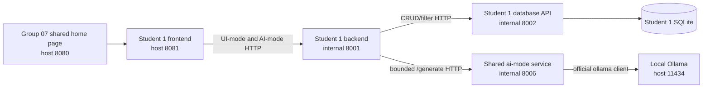

# Student 1 Release 0 Architecture, Runtime Modes, and Decision Traceability

Related planning document: [Student 1 Release 0 scope, assessed workflow, and evidence plan](../reports/release-0/student-1-release-0-plan.md)
Related ADRs: [ADR-0001](./decisions/0001-student-1-service-mapping.md), [ADR-0002](./decisions/0002-student-1-internal-api-and-observability.md)
Runtime AI-mode notes: [Student 1 runtime AI-mode contract and implementation notes](./student-1-runtime-ai-mode.md)

## 1. Architecture stance

This document describes the **Student 1 Release 0 runtime target**.

- The assessed course workflow remains the evidence-driven development/review loop documented in the paired plan, not the end-user AI suggestion runtime.
- Student 1 still owns a three-service application slice: frontend, backend, and database API.
- Issue #12 adds a **shared Release 0 AI-Mode service** between Student 1 backends and Ollama, so Student 1 no longer talks to Ollama directly.
- Final Compose wiring stays out of scope here and is deferred to issue #13.

## 2. Traceability summary

| Topic | Visible baseline | TripGenie Student 1 decision |
| --- | --- | --- |
| Student-owned service split | Labs show separated frontend/service/database responsibilities. | Keep Student 1 frontend, backend, and database API as the owned slice. |
| Shared AI dependency | Labs and the AI guide use local Ollama as the model runtime baseline. | Insert a shared `ai-mode` FastAPI service between Student backends and Ollama so provider concerns are centralized. |
| UI-mode vs AI-mode | Lab 04 separates normal UI and AI-assisted flows. | Keep CRUD/filtering in UI-mode and day-planning suggestions in AI-mode, without relabelling AI-mode as the assessed loop. |
| Database ownership | Visible labs keep persistence in the data-owning layer. | Student 1 database API remains the only SQLite owner. |
| Prompt assets | Lab 03 externalises prompt files. | Student 1 keeps its domain prompt asset in `student-1/backend/backend_service/prompts/`. |
| Provider ownership | Release 0 only needs bounded local generation. | Shared AI-Mode owns `ollama==0.6.2`, allowlisted models, provider timeouts, response bounds, and provider error normalization. |
| Backend ownership | Student backends keep their own domain rules. | Student 1 backend owns prompt rendering, itinerary validation, domain retries, and the public `/api/trips/{tripId}/ai-suggestions` endpoint. |
| Release boundary | Later MCP/RAG/multi-agent scope is separate. | Keep Release 0 to CRUD plus single-shot bounded local generation only. |

## 3. Runtime service map

## 4. Release 0 service responsibilities

| Service | Release 0 responsibility | Must not do |
| --- | --- | --- |
| Shared home page | Provide the Group 07 landing page and Student 1 navigation entry. | Own Student 1 data or bypass Student 1 boundaries. |
| Student 1 frontend | Render UI-mode CRUD pages and AI-mode request/review screens; call Student 1 backend over HTTP only. | Access SQLite directly or call Ollama/shared AI-Mode directly. |
| Student 1 backend | Own public endpoints, business rules, prompt assets, itinerary validation, domain retry logic, and approval boundaries. | Read/write SQLite directly or import/configure the `ollama` package. |
| Student 1 database API | Own persistence, filtering, integrity, and the SQLite file. | Render frontend pages or call AI services. |
| Shared AI-Mode service | Own official `ollama==0.6.2` integration, approved model allowlist, provider health/readiness, single-shot non-stream generation, and normalized provider errors. | Own Student 1 domain prompts, persistence, approval logic, or student-specific retries. |

## 5. UI-mode versus AI-mode

| Runtime mode | What it does | Important boundary |
| --- | --- | --- |
| UI-mode | Trip CRUD, itinerary-item CRUD, and itinerary filtering through standard Student 1 pages/forms. | Standard application behaviour only. |
| AI-mode | Student 1 backend builds bounded context for one trip/day, calls shared AI-Mode, validates returned suggestions, and shows drafts for human review. | Runtime feature only, not evidence that the assessed workflow executed. |

## 6. Public Student 1 API surface

| Method | Path | Purpose |
| --- | --- | --- |
| `GET`, `POST` | `/api/trips` | List or create trips. |
| `GET`, `PATCH`, `DELETE` | `/api/trips/{tripId}` | View, update, or delete a trip. |
| `GET`, `POST` | `/api/trips/{tripId}/itinerary-items` | List/filter or create itinerary items for one trip. |
| `GET`, `PATCH`, `DELETE` | `/api/itinerary-items/{itemId}` | View, update, or delete one itinerary item. |
| `POST` | `/api/trips/{tripId}/ai-suggestions` | Return draft itinerary suggestions for human review. |

### Shared AI-Mode API surface

| Method | Path | Purpose |
| --- | --- | --- |
| `GET` | `/health` | Report shared service status plus Ollama dependency status. |
| `GET` | `/ready` | Report shared service readiness for generation. |
| `POST` | `/generate` | Accept a fully rendered prompt, optional allowlisted model override, optional JSON schema, and safe metadata for one single-shot generation. |

## 7. Runtime AI-mode flow

1. user requests suggestions for one trip and one planning date in the Student 1 frontend;
2. Student 1 backend loads trip and itinerary context through the Student 1 database API;
3. Student 1 backend renders its versioned prompt asset and output schema;
4. Student 1 backend calls the shared AI-Mode `/generate` endpoint;
5. shared AI-Mode performs one bounded non-stream Ollama generation and returns a normalized envelope; and
6. Student 1 validates, de-duplicates, and returns **draft-only** suggestions for human review/edit/save through normal CRUD.

## 8. Operational boundaries

- Student 1 `/health` may report shared AI-Mode as degraded.
- Student 1 `/ready` remains database-only and never blocks on shared AI-Mode.
- Shared AI-Mode readiness may probe Ollama because that service owns provider availability.
- Student 1 never persists AI suggestions automatically.
- Shared AI-Mode does not keep chat sessions, tools, RAG, MCP, or multi-agent state.

## 9. Compose and deployment boundary

Issue #13 owns final Compose wiring. This issue only establishes the service expectations:

- shared service name: `ai-mode`
- expected internal port: `8006`
- backend consumer URL: `http://ai-mode:8006`
- provider URL from the shared service: `http://ollama:11434`

No Compose changes are required in this refactor PR.

## 10. Evidence expectations

Release 0 evidence should still be honest and implementation-based:

- browser checks for CRUD and AI-mode review flows
- direct HTTP checks for Student 1 and shared AI-Mode endpoints
- database evidence for persistence ownership
- prompt assets and review artefacts where actually executed
- health/readiness traces and bounded runtime identifiers where useful

Do not fabricate live Ollama or Compose showcase evidence that has not been run.
