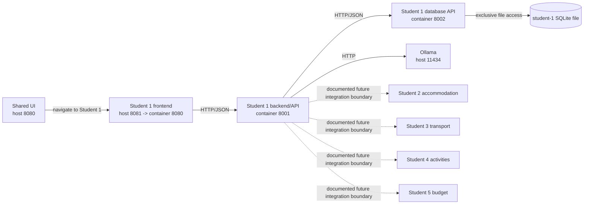
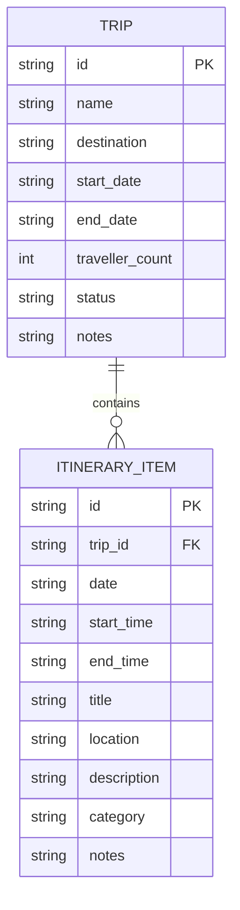
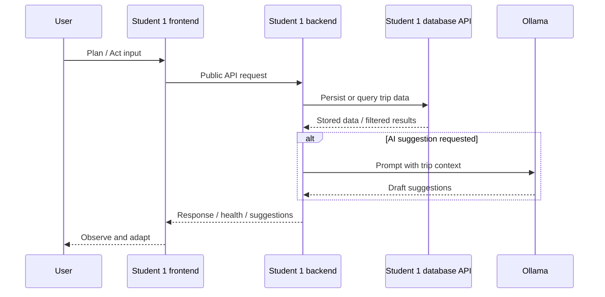

# Student 1 Release 0 Architecture and API Contracts

Related planning document: [Student 1 Release 0 scope, requirements, and risk plan](../reports/release-0/student-1-release-0-plan.md)

## 1. Architecture summary
Student 1 Release 0 turns the current placeholder `student-1/` service into a documented three-service architecture that preserves the existing TripGenie entry-point pattern:

- the shared TripGenie home page still links users to Student 1 on `http://localhost:8081`;
- Student 1 owns trip and itinerary planning only;
- Ollama is used directly by the Student 1 backend for draft suggestions; and
- the Student 1 SQLite file is private to the Student 1 database API service.

## 2. Runtime context



### Service responsibilities

| Service | Responsibility | Cannot do |
| --- | --- | --- |
| Student 1 frontend | Render HTMX pages/forms, call the Student 1 backend, and present trip/day planning flows. | Call Ollama directly or access SQLite directly. |
| Student 1 backend/API | Enforce business validation, expose public REST endpoints, call the database API, and request AI suggestions from Ollama. | Read/write the SQLite file or bypass the database API. |
| Student 1 database API | Own persistence, execute SQLite CRUD/filter queries, and enforce relational constraints such as cascade delete. | Serve HTMX pages or call Ollama/other student services. |

## 3. Ports, configuration, and data ownership

| Component | Port model | Key configuration | Owned data |
| --- | --- | --- | --- |
| Shared UI | Existing host `8080` | Existing shared UI configuration | None |
| Student 1 frontend | Host `8081` -> container `8080` | `STUDENT1_FRONTEND_PORT=8080`, `STUDENT1_API_BASE_URL=http://student-1-backend:8001/api` | None |
| Student 1 backend/API | Container `8001` on the Docker network | `STUDENT1_BACKEND_PORT=8001`, `STUDENT1_DATABASE_API_URL=http://student-1-database:8002/internal`, `OLLAMA_BASE_URL=http://ollama:11434`, `OLLAMA_MODEL=<chosen-model>`, `OLLAMA_TIMEOUT_SECONDS=<n>` | No persistent data; orchestration only |
| Student 1 database API | Container `8002` on the Docker network | `STUDENT1_DB_API_PORT=8002`, `STUDENT1_SQLITE_PATH=/data/student-1/tripgenie.db` | `trips`, `itinerary_items`, and the SQLite file |
| Ollama | Existing host/container `11434` | Model pull/runtime settings managed outside Student 1 | None owned by Student 1 |

**Boundary rule:** only the Student 1 database API mounts `STUDENT1_SQLITE_PATH`. Frontend, backend, and all other TripGenie services use HTTP APIs instead of file access.

## 4. Conceptual model

- **Trip** is the aggregate root for a travel plan.
- **ItineraryItem** is always scoped to exactly one Trip.
- A Trip defines the valid planning window (`start_date` to `end_date`).
- An ItineraryItem may optionally have a time window, but if both `start_time` and `end_time` are present then `start_time < end_time` must hold.
- Deleting a Trip deletes its ItineraryItems through database-owned cascade behaviour.

### ERD



## 5. Logical and physical schema

### Logical schema

| Entity | Fields | Rules |
| --- | --- | --- |
| `trips` | `id`, `name`, `destination`, `start_date`, `end_date`, `traveller_count`, `status`, `notes` | `id` is the stable trip identifier; `traveller_count > 0`; `start_date <= end_date`; `status` is a constrained lifecycle value. |
| `itinerary_items` | `id`, `trip_id`, `date`, `start_time`, `end_time`, `title`, `location`, `description`, `category`, `notes` | `trip_id` references `trips.id`; `date` must fall within the parent trip range; `start_time < end_time` when both are present; category is constrained. |

### Physical schema (SQLite)

```sql
CREATE TABLE trips (
  id TEXT PRIMARY KEY,
  name TEXT NOT NULL,
  destination TEXT NOT NULL,
  start_date TEXT NOT NULL,
  end_date TEXT NOT NULL,
  traveller_count INTEGER NOT NULL CHECK (traveller_count > 0),
  status TEXT NOT NULL CHECK (status IN ('draft', 'planned', 'active', 'completed', 'cancelled')),
  notes TEXT,
  CHECK (start_date <= end_date)
);

CREATE TABLE itinerary_items (
  id TEXT PRIMARY KEY,
  trip_id TEXT NOT NULL REFERENCES trips(id) ON DELETE CASCADE,
  date TEXT NOT NULL,
  start_time TEXT,
  end_time TEXT,
  title TEXT NOT NULL,
  location TEXT,
  description TEXT,
  category TEXT NOT NULL CHECK (category IN ('accommodation', 'transport', 'activity', 'meal', 'note', 'other')),
  notes TEXT,
  CHECK (start_time IS NULL OR end_time IS NULL OR start_time < end_time)
);

CREATE INDEX idx_trips_status_start_date
  ON trips (status, start_date);

CREATE INDEX idx_itinerary_items_trip_date
  ON itinerary_items (trip_id, date);

CREATE INDEX idx_itinerary_items_trip_category_date
  ON itinerary_items (trip_id, category, date);
```

**Storage decision:** SQLite stores dates as ISO `YYYY-MM-DD` text and times as `HH:MM` text. The backend and database API both validate these formats before persistence.

## 6. Public backend REST API

All public endpoints are rooted at `/api`. Successful responses use a `data` envelope. Errors use the shared error envelope in [Error conventions](#8-error-conventions).

| Method | Path | Purpose |
| --- | --- | --- |
| `GET` | `/health` | Backend health and dependency summary (`database_api`, `ollama`). |
| `GET` | `/api/trips` | List trips; optional filters `status` and `destination`. |
| `POST` | `/api/trips` | Create a trip. |
| `GET` | `/api/trips/{tripId}` | Retrieve a single trip. |
| `PATCH` | `/api/trips/{tripId}` | Update a trip. |
| `DELETE` | `/api/trips/{tripId}` | Delete a trip and cascade-delete its itinerary items. |
| `GET` | `/api/trips/{tripId}/itinerary-items?date=YYYY-MM-DD&category=<value>` | List itinerary items for a trip, optionally filtered by date and/or category. |
| `POST` | `/api/trips/{tripId}/itinerary-items` | Create an itinerary item under a trip. |
| `GET` | `/api/itinerary-items/{itemId}` | Retrieve a single itinerary item. |
| `PATCH` | `/api/itinerary-items/{itemId}` | Update an itinerary item. |
| `DELETE` | `/api/itinerary-items/{itemId}` | Delete an itinerary item. |
| `POST` | `/api/trips/{tripId}/ai-suggestions` | Ask Ollama for draft itinerary suggestions using the current trip context. |

### Example: create trip

**Request**

```http
POST /api/trips
Content-Type: application/json
```

```json
{
  "name": "Sydney Long Weekend",
  "destination": "Sydney",
  "start_date": "2026-10-02",
  "end_date": "2026-10-05",
  "traveller_count": 2,
  "status": "planned",
  "notes": "Prefer walkable places and early starts."
}
```

**Response — `201 Created`**

```json
{
  "data": {
    "id": "trip_01J0EXAMPLE",
    "name": "Sydney Long Weekend",
    "destination": "Sydney",
    "start_date": "2026-10-02",
    "end_date": "2026-10-05",
    "traveller_count": 2,
    "status": "planned",
    "notes": "Prefer walkable places and early starts."
  }
}
```

### Example: create itinerary item

**Request**

```http
POST /api/trips/trip_01J0EXAMPLE/itinerary-items
Content-Type: application/json
```

```json
{
  "date": "2026-10-03",
  "start_time": "09:00",
  "end_time": "11:00",
  "title": "Harbour walk",
  "location": "Circular Quay",
  "description": "Start the day with a harbour loop and coffee stop.",
  "category": "activity",
  "notes": "Weather dependent."
}
```

**Response — `201 Created`**

```json
{
  "data": {
    "id": "item_01J0EXAMPLE",
    "trip_id": "trip_01J0EXAMPLE",
    "date": "2026-10-03",
    "start_time": "09:00",
    "end_time": "11:00",
    "title": "Harbour walk",
    "location": "Circular Quay",
    "description": "Start the day with a harbour loop and coffee stop.",
    "category": "activity",
    "notes": "Weather dependent."
  }
}
```

### Example: filter itinerary items by trip/date

```http
GET /api/trips/trip_01J0EXAMPLE/itinerary-items?date=2026-10-03&category=activity
```

**Response — `200 OK`**

```json
{
  "data": [
    {
      "id": "item_01J0EXAMPLE",
      "trip_id": "trip_01J0EXAMPLE",
      "date": "2026-10-03",
      "start_time": "09:00",
      "end_time": "11:00",
      "title": "Harbour walk",
      "location": "Circular Quay",
      "description": "Start the day with a harbour loop and coffee stop.",
      "category": "activity",
      "notes": "Weather dependent."
    }
  ]
}
```

### Example: AI suggestions

**Request**

```http
POST /api/trips/trip_01J0EXAMPLE/ai-suggestions
Content-Type: application/json
```

```json
{
  "date": "2026-10-03",
  "prompt": "Suggest a balanced sightseeing day with a lunch break.",
  "constraints": [
    "walkable itinerary",
    "avoid late-night activities"
  ]
}
```

**Response — `200 OK`**

```json
{
  "data": {
    "trip_id": "trip_01J0EXAMPLE",
    "date": "2026-10-03",
    "persisted": false,
    "source": "ollama",
    "suggestions": [
      {
        "date": "2026-10-03",
        "start_time": "09:30",
        "end_time": "11:00",
        "title": "Royal Botanic Garden walk",
        "location": "Sydney",
        "description": "Easy morning activity near the harbour.",
        "category": "activity",
        "notes": "Draft suggestion only."
      }
    ]
  }
}
```

## 7. Internal database API contracts

The Student 1 backend is the only caller of the database API. Internal endpoints are rooted at `/internal` and exist to enforce a single persistence boundary.

| Method | Path | Purpose |
| --- | --- | --- |
| `GET` | `/internal/health` | Database API health and SQLite availability. |
| `GET` | `/internal/trips` | List/filter trips for the backend. |
| `POST` | `/internal/trips` | Insert a trip record. |
| `GET` | `/internal/trips/{tripId}` | Fetch a single trip record. |
| `PATCH` | `/internal/trips/{tripId}` | Update a trip record. |
| `DELETE` | `/internal/trips/{tripId}` | Delete a trip and cascade to itinerary items. |
| `GET` | `/internal/trips/{tripId}/itinerary-items?date=...&category=...` | List/filter itinerary items for a trip. |
| `POST` | `/internal/trips/{tripId}/itinerary-items` | Insert an itinerary item. |
| `GET` | `/internal/itinerary-items/{itemId}` | Fetch a single itinerary item. |
| `PATCH` | `/internal/itinerary-items/{itemId}` | Update an itinerary item. |
| `DELETE` | `/internal/itinerary-items/{itemId}` | Delete an itinerary item. |

**Design note:** the backend remains responsible for business-friendly error messages and Ollama orchestration, while the database API remains responsible for persistence guarantees and relational integrity.

## 8. Error conventions

```json
{
  "error": {
    "code": "VALIDATION_ERROR",
    "message": "One or more fields failed validation.",
    "details": [
      {
        "field": "start_date",
        "issue": "must be on or before end_date"
      }
    ]
  }
}
```

| Status | Code | When it is used |
| --- | --- | --- |
| `400` | `BAD_REQUEST` | Malformed JSON, unsupported query parameters, or invalid enum values that cannot be parsed. |
| `404` | `NOT_FOUND` | Trip or itinerary item does not exist. |
| `422` | `VALIDATION_ERROR` | Dates/times are well-formed but fail business rules such as trip window or time order checks. |
| `503` | `DEPENDENCY_UNAVAILABLE` | Database API or Ollama is unavailable, timed out, or unhealthy. |

## 9. Health endpoints

### Frontend health

```http
GET /health
```

```json
{
  "status": "ok",
  "service": "student-1-frontend",
  "backend_base_url": "http://student-1-backend:8001/api"
}
```

### Backend health

```json
{
  "status": "ok",
  "service": "student-1-backend",
  "dependencies": {
    "database_api": "ok",
    "ollama": "ok"
  }
}
```

If Ollama is unavailable but CRUD remains available, the backend may return a degraded status:

```json
{
  "status": "degraded",
  "service": "student-1-backend",
  "dependencies": {
    "database_api": "ok",
    "ollama": "unavailable"
  }
}
```

### Database API health

```json
{
  "status": "ok",
  "service": "student-1-database",
  "sqlite_path": "/data/student-1/tripgenie.db"
}
```

## 10. Integration boundaries

| Boundary | Release 0 rule | Not allowed in Release 0 |
| --- | --- | --- |
| Shared UI -> Student 1 frontend | Shared UI links users to the Student 1 frontend on host port `8081`; Student 1 owns its own pages thereafter. | Shared UI calling Student 1 internals or reading Student 1 data directly. |
| Student 1 frontend -> Student 1 backend | All trip and itinerary actions go through public `/api` endpoints. | Direct SQLite or Ollama access from the frontend. |
| Student 1 backend -> Student 1 database API | All persistence and filters go through `/internal` endpoints. | Backend file access to the SQLite database. |
| Student 1 backend -> Ollama | Ollama is called only for best-effort draft suggestions. | Blocking CRUD on Ollama success or persisting AI suggestions automatically. |
| Student 1 -> Student 2/3/4/5 services | Student 1 exposes trip IDs, date windows, and itinerary summaries as future integration points. Each other service remains the source of truth for its own domain. | Shared tables/files, distributed transactions, MCP/RAG orchestration, or hidden cross-service writes. |

## 11. Plan -> Act -> Observe -> Adapt architecture mapping

| Stage | Frontend role | Backend role | Database role |
| --- | --- | --- | --- |
| Plan | Capture trip inputs and render planning forms. | Validate trip data and orchestrate trip CRUD. | Persist and retrieve the `trips` aggregate. |
| Act | Capture itinerary item inputs and AI prompt requests. | Validate itinerary data, call DB API, and optionally call Ollama. | Persist and query `itinerary_items`. |
| Observe | Render trip summaries, day filters, and health states. | Compose trip/day responses and dependency status. | Serve filtered trip/item reads. |
| Adapt | Submit edits/deletes or ask for refreshed suggestions. | Re-validate updated data and re-run draft suggestion flow when requested. | Apply updates/deletes with cascade integrity. |



## 12. Release boundary
This architecture is limited to **Release 0**. It deliberately excludes Release 1 MCP/RAG behaviour and Release 2 multi-agent or cloud execution features.
