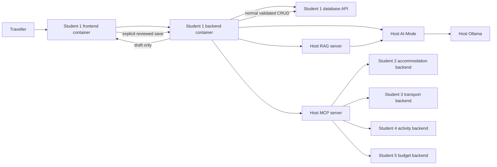

# Student 1 Release 1 Architecture

Related issue: [#121](https://github.com/JulianKirk/TripGenie/issues/121)

Shared topology: [Release 1 integrated architecture](./release-1-integrated-architecture.md)

Shared contracts: [Release 1 MCP and RAG flow](./release-1-mcp-rag-flow.md)

Release 0 baseline: [Student 1 Release 0 architecture](./student-1-release-0-architecture.md)

## 1. Student 1 responsibility

Student 1 remains the owner of Trips, Itinerary Items, and cross-service
itinerary associations. Release 1 adds:

- a trip-scoped MCP interaction that discovers authoritative options from the
  other feature services;
- a trip-scoped RAG interaction that answers planning questions from curated
  project knowledge; and
- a bounded itinerary planner that combines tool observations, retrieved
  evidence, existing itinerary state, and user constraints into draft items.

Release 0 CRUD and AI suggestions remain available. MCP and RAG are optional
capabilities and do not become database or readiness dependencies.

## 2. Student 1 runtime flow

Student 1 never accesses another service's database and never accepts
model-generated records as authoritative catalogue data.

## 3. Planned public endpoints

Final names and schemas are fixed by the implementation tests and API
documentation, but the feature boundary is:

| Method | Path | Purpose |
| --- | --- | --- |
| `POST` | `/api/trips/{trip_id}/mcp-plan` | Run a bounded tool-backed itinerary planning request and return advisory drafts plus safe observations. |
| `POST` | `/api/trips/{trip_id}/rag-query` | Ask a trip/planning question and return the RAG answer, citations, confidence, or insufficient-context state. |

Neither route accepts a raw tool name, dependency URL, file path, model name, or
write instruction from the browser.

## 4. Bounded planner loop

The planner implements one request-scoped Plan -> Act -> Observe -> Adapt loop:

1. **Plan:** load the authoritative trip and itinerary snapshot, validate the
   requested date/goal, and choose from an internal read-only tool allowlist.
2. **Act:** invoke the selected MCP tool with typed, bounded arguments.
3. **Observe:** validate the tool result, retain authoritative identifiers and
   explicit unavailable/unknown states, and record safe evidence metadata.
4. **Adapt:** either make another bounded read or construct candidate itinerary
   drafts using the accumulated observations and optional RAG evidence.
5. **Review:** return `persisted=false` and `approval_required=true`.
6. **Save:** only the user's explicit action invokes existing Itinerary Item
   CRUD, which revalidates dates, times, categories, and collisions.

Initial hard limits:

| Limit | Value |
| --- | ---: |
| Planner steps | 6 |
| MCP tool calls | 5 |
| Calls to one tool | 2 |
| Candidates returned by one search | 10 |
| Total tool observations retained | 20 |
| MCP provider timeout | 5 seconds |
| Complete planner request | 120 seconds |
| Rendered model/RAG context | 12,000 characters |
| Draft suggestions | 5 |

The implementation may reduce these limits. Increasing them requires measured
local evidence and updated tests/documentation.

## 5. Tool use by planning concern

| Planning concern | Tools | Student 1 validation |
| --- | --- | --- |
| Existing schedule | `trip_get`, `trip_itinerary_list` | Trip window, requested date, timed collisions, category rules. |
| Stay | `accommodation_search`, `accommodation_get`, `accommodation_costs` | Destination/location match, date context, price as provided, authoritative ID. |
| Travel | `transport_search`, `transport_get`, `transport_compare` | Route, local timestamps/offsets, capacity unknown versus zero, pricing basis, authoritative ID. |
| Activities | `activity_search`, `activity_get`, `activity_categories`, `activity_costs` | Destination/date/time, duration, accessibility unknown versus false, exact pricing basis, authoritative ID. |
| Budget | `budget_list`, `budget_summary`, `expense_list` | Currency, planned/committed/actual distinction, unavailable provider state, no binary-float totals. |
| Project knowledge | RAG `/query` | Valid citations, deterministic confidence, and explicit insufficient context. |

Student 5's budget summary may call Students 1-4. Student 1 therefore invokes
it outside any write transaction and with bounded timeouts to avoid blocking a
Student 1 -> Student 5 -> Student 1 dependency cycle.

## 6. Planner output

A successful planner response contains:

- run and correlation IDs;
- trip ID and requested planning date;
- a bounded list of tool observations containing tool/source identifiers and
  counts, not hidden reasoning;
- optional RAG citations and confidence;
- warnings for unavailable or partial providers;
- validated itinerary drafts;
- `persisted=false`; and
- `approval_required=true`.

The response does not expose chain-of-thought, full prompts, full RAG source
chunks, raw vectors, provider stack traces, or credentials.

## 7. Validation and failure behavior

Student 1 rejects or surfaces:

- unknown or unavailable trips;
- dates outside the trip window;
- unsupported tool plans or excessive steps;
- IDs not returned by an authoritative tool or stored association;
- malformed tool/RAG envelopes;
- timed collisions with itinerary items or authoritative selected transport and
  activity windows;
- explicit capacity, accessibility, or budget conflicts;
- fabricated citations;
- RAG context below the relevance threshold; and
- dependency timeout/unavailability.

Unknown information is not a conflict and is never converted to zero, false, or
available. Partial provider results remain visibly partial.

## 8. Configuration and degraded mode

Student 1 backend settings:

| Variable | Default | Purpose |
| --- | --- | --- |
| `STUDENT1_BACKEND_MCP_ENABLED` | `false` | Enables MCP planning only when explicitly configured. |
| `STUDENT1_BACKEND_MCP_BASE_URL` | blank | Host MCP URL; Compose supplies `http://host.docker.internal:8010`. |
| `STUDENT1_BACKEND_MCP_TIMEOUT_SECONDS` | `10` | Student 1 request timeout above individual provider budgets. |
| `STUDENT1_BACKEND_RAG_ENABLED` | `false` | Enables RAG only when explicitly configured. |
| `STUDENT1_BACKEND_RAG_BASE_URL` | blank | Host RAG URL; Compose supplies `http://host.docker.internal:8011`. |
| `STUDENT1_BACKEND_RAG_TIMEOUT_SECONDS` | `120` | End-to-end local RAG timeout. |

CI sets both enable flags to `false`. Tests inject fake transports and still
exercise all consumer contracts.

When MCP or RAG is disabled/unavailable:

- Trip and Itinerary CRUD remains usable;
- Student 1 `/ready` remains database-only;
- the requested MCP/RAG route returns an explicit disabled/unavailable error;
  and
- the frontend preserves trip context and displays a distinct recovery state.

## 9. Frontend behavior

The trip detail view adds:

- a planner form for goal, date, interests, and constraints;
- a grounded-question form;
- loading and duplicate-submit protection for slow local requests;
- a tool-observation summary;
- answer confidence and readable citation source/section details;
- explicit insufficient-context, disabled, unavailable, timeout, partial, and
  validation states; and
- draft review/edit/save through existing accessible CRUD forms.

HTMX responses use the established app-shell-compatible replacement boundary.
Both forms retain labels, keyboard operation, focus management, status
announcements, and non-JavaScript error clarity.

## 10. Verification

Automated tests use injected transports and cover:

- MCP and RAG disabled;
- successful tool and grounded-query responses;
- empty tool results and partial providers;
- insufficient RAG context;
- invalid citations and malformed dependency data;
- timeouts and unavailable dependencies;
- planner limits and tool allowlisting;
- authoritative ID provenance;
- trip-window, collision, exact-money, capacity, and unknown-value rules; and
- review-before-save.

Local evidence must prove:

1. existing CRUD and Release 0 AI suggestions;
2. frontend -> backend -> host MCP -> another feature backend -> frontend;
3. frontend -> backend -> host RAG -> AI-Mode/Ollama -> cited answer;
4. an insufficient-context RAG query;
5. degraded CRUD behavior with host services stopped; and
6. agentic-loop MCP and RAG validation modes.
