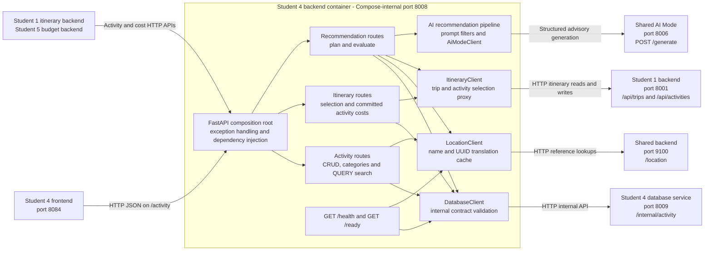

# Student 4 Backend/API Architecture

The backend is Student 4's public Activities and Attractions API. It keeps
public contracts independent from internal database schemas, translates
country and city names through the shared reference service, proxies itinerary
activity selections to Student 1, and uses AI Mode only for advisory search
planning and grounded recommendation evaluation.

Database availability gates backend readiness. The broader health check also
reports location-service status. Itinerary and AI dependencies are deliberately
not readiness gates: ordinary catalogue operations can continue when those
optional capabilities are unavailable. AI output is validated and grounded
against database results and cannot write catalogue or itinerary state.

## Implementation sources

- [`app.py`](../../../../../student-4/backend/student4_backend_service/app.py)
- [`activity_routes.py`](../../../../../student-4/backend/student4_backend_service/activity_routes.py)
- [`itinerary_routes.py`](../../../../../student-4/backend/student4_backend_service/itinerary_routes.py)
- [`recommendation_routes.py`](../../../../../student-4/backend/student4_backend_service/recommendation_routes.py)
- [`docker-compose.yml`](../../../../../docker-compose.yml)
