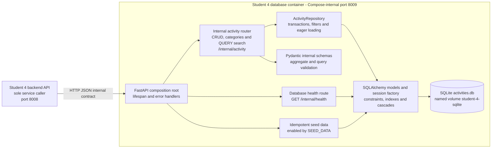

# Student 4 Database Architecture

The database microservice is an internal FastAPI application and the sole owner
of Student 4's activity data. Thin HTTP routers validate internal wire schemas
and delegate transactional catalogue CRUD and search to a SQLAlchemy repository,
which persists the activity aggregate in a dedicated SQLite file.

The service makes no outbound service calls. Shared country and city UUIDs are
stored as external references, not joined across databases. On startup or the
first request, the service creates the schema and optionally seeds reference and
catalogue rows. SQLite foreign-key enforcement is enabled for every connection.

## Implementation sources

- [`app.py`](../../../../../student-4/database/student4_database_service/app.py)
- [`repository.py`](../../../../../student-4/database/student4_database_service/repository.py)
- [`models.py`](../../../../../student-4/database/student4_database_service/models.py)
- [`database.py`](../../../../../student-4/database/student4_database_service/database.py)
- [`docker-compose.yml`](../../../../../docker-compose.yml)
