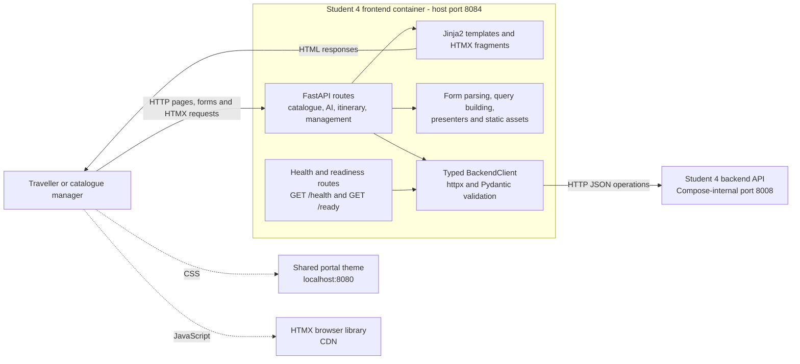

# Student 4 Frontend Architecture

The frontend is a server-rendered FastAPI application. It uses Jinja2 templates
for full pages and HTMX fragments for interactive catalogue search, itinerary
selection, AI-assisted suggestions, and catalogue management. A typed `httpx`
client is its only service dependency and sends every data operation to the
Student 4 backend/API.

The frontend never calls the database, location, itinerary, or AI services
directly. Its `/ready` endpoint succeeds only when the backend reports ready;
its `/health` endpoint reports a degraded state when the backend is unavailable.

## Implementation sources

- [`app.py`](../../../../../student-4/frontend/student4_frontend_service/app.py)
- [`client.py`](../../../../../student-4/frontend/student4_frontend_service/client.py)
- [`docker-compose.yml`](../../../../../docker-compose.yml)
