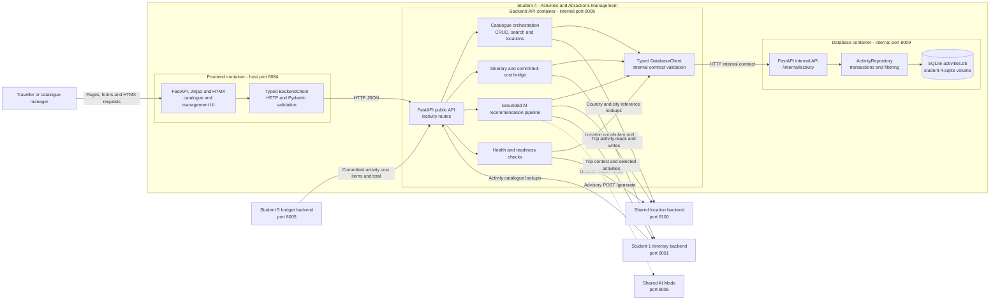

# Student 4 Whole-Feature Architecture

The Activities and Attractions feature is delivered by three Student 4
microservices. The host-published frontend is the user entry point, the backend
owns the public feature API and all cross-service orchestration, and the
internal database service is the sole owner of the activity catalogue's SQLite
data. The dotted AI connection is advisory and cannot persist a change.

No caller accesses the Student 4 database service or SQLite file directly.
Public location names are translated by the backend to shared-service UUIDs
before database requests. Trip selections remain owned by Student 1, while
Student 5 consumes Student 4's calculated committed activity cost items and
total through the public backend API.

## Detailed diagrams

- [Frontend architecture](frontend.md)
- [Backend/API architecture](backend-api.md)
- [Database architecture](database.md)
