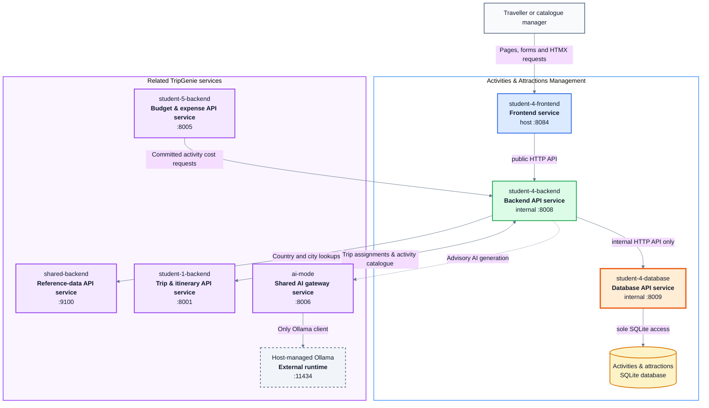

# Student 4 Whole-Feature Architecture

This high-level diagram shows how the Student 4 Activities and Attractions
services interact with each other and with the other TripGenie services they
depend on. Detailed components inside each Student 4 service are documented in
the separate diagrams linked below.

Each bordered card represents an independently deployed service. A
high-resolution [PNG export](overview.png) is included alongside this document
for use in reports and presentations.

Only the frontend is published to the host. All database access and
cross-service calls pass through the Student 4 backend. The AI connection is
advisory and cannot persist catalogue or itinerary changes directly. The
database API service is the only process that opens the Student 4 SQLite file.

## Detailed diagrams

- [Frontend architecture](frontend.md)
- [Backend/API architecture](backend-api.md)
- [Database architecture](database.md)
