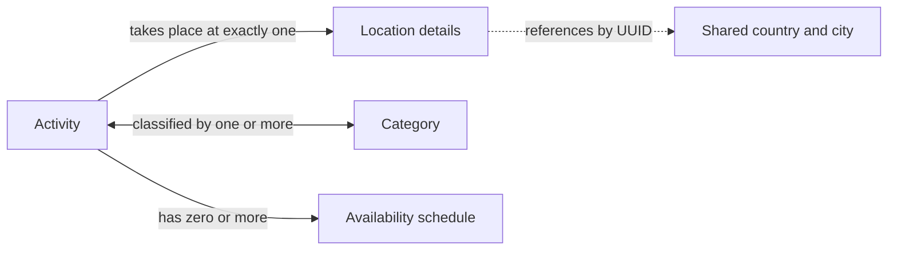

# Student 4 Conceptual Data Design

The conceptual model shows the business concepts without database-specific
attributes. An activity occurs at one location, belongs to one or more
categories, and may have multiple recurring or one-off availability schedules.

An inactive draft may have no schedule. An active activity must have at least
one schedule. The dotted connection represents a cross-service reference, not
a local database relationship.
