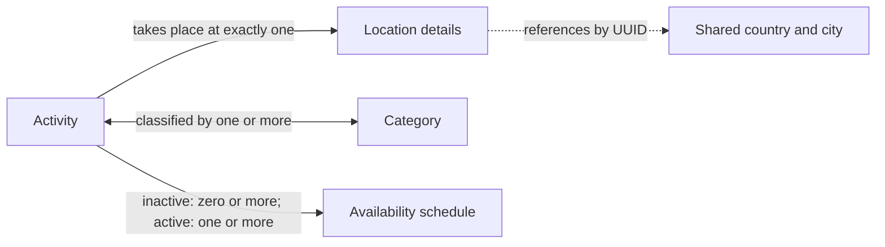

# Student 4 Conceptual Data Design

`Activity` is the single catalogue concept for both activities and attractions.
For example, museum admission and a guided tour of that museum are separate
activities when their price, duration or availability differs. Location and
schedule data belong to that catalogue entry, while seeded categories provide
a controlled way to classify and filter it.

An inactive catalogue entry may have no schedule, but an active activity must
have at least one. Country and city remain authoritative in the shared
reference service, so the dotted connection is a UUID reference across service
boundaries rather than a relationship between tables in one database.
