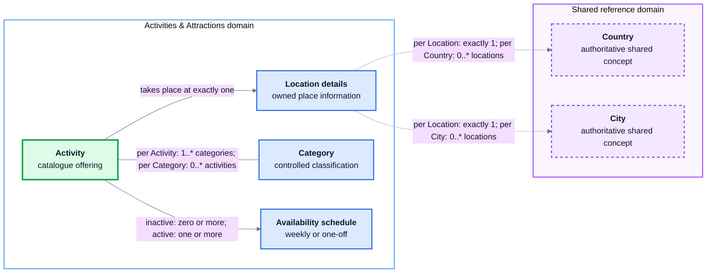

# Student 4 Conceptual Data Design

`Activity` is the single catalogue concept for both activities and attractions.
For example, museum admission and a guided tour of that museum are separate
activities when their price, duration or availability differs. Location and
schedule data belong to that catalogue entry, while seeded categories provide
a controlled way to classify and filter it.

This view deliberately omits attributes, keys, storage types and table names.
It describes the business concepts only. A high-resolution
[PNG export](conceptual.png) is included alongside this document.

An inactive catalogue entry may have no schedule, but an active activity must
have at least one. Country and city remain authoritative in the shared
reference service, so the dotted connections cross domain ownership boundaries
rather than representing tables owned by Student 4.
