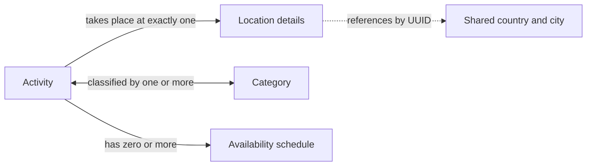
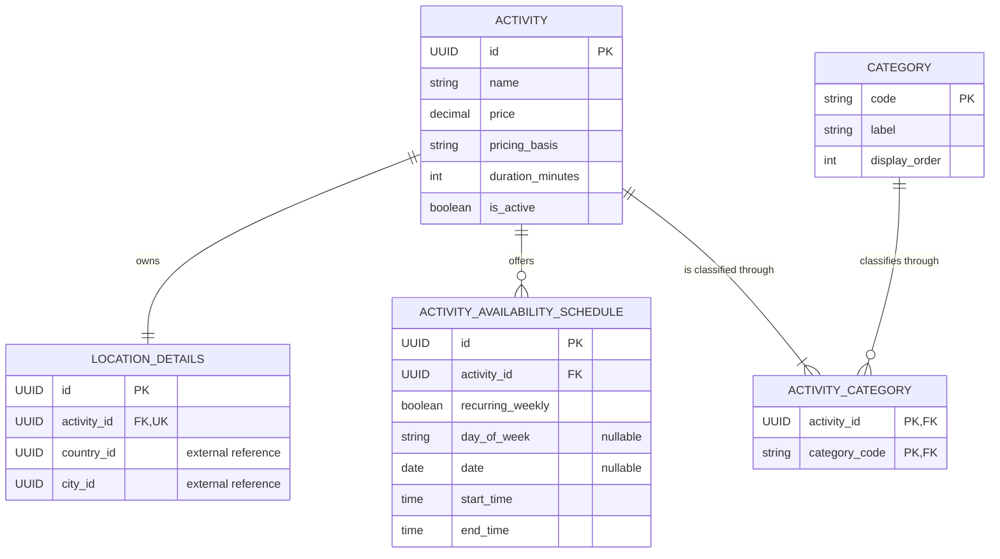
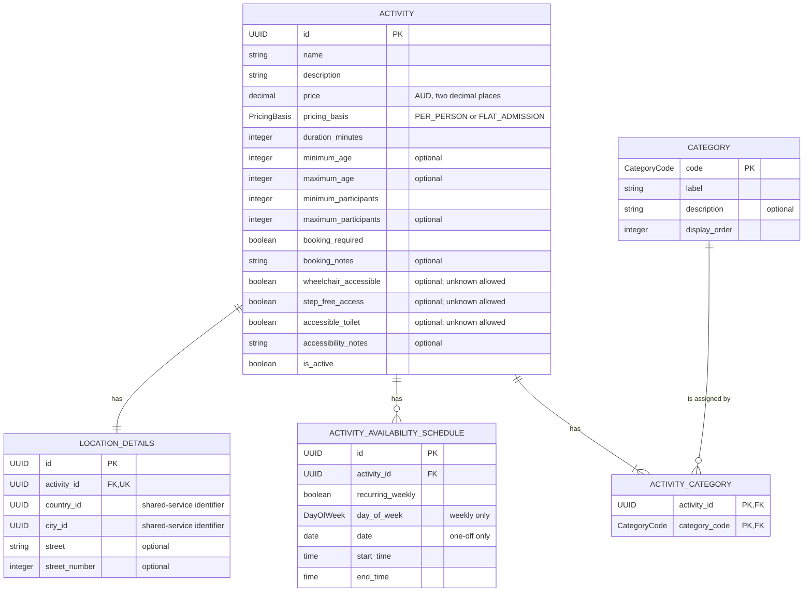
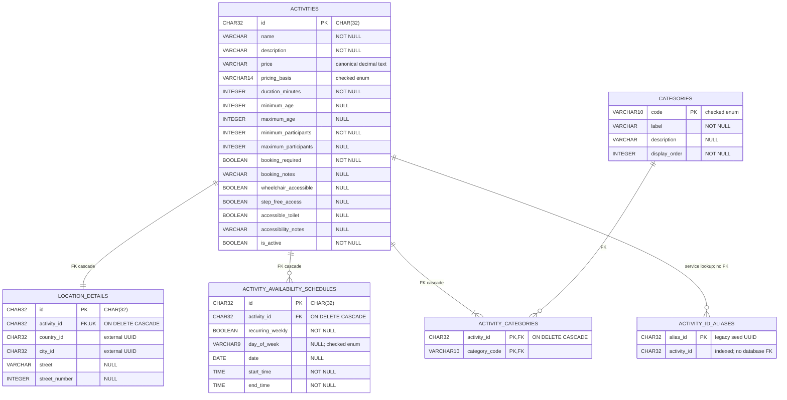

# Student 4 Data Design

Student 4 owns TripGenie's Activities and Attractions catalogue. The service
stores activity aggregates in its own SQLite database and exposes them through
the Student 4 database and backend APIs. Country and city records remain owned
by the shared reference service; Student 4 stores their UUIDs but does not join
across service databases. These diagrams describe the implemented Release 0
model at progressively more concrete levels.

## Conceptual diagram

The conceptual model shows the business concepts without database-specific
attributes. An activity occurs at one location, belongs to one or more
categories, and may have multiple recurring or one-off availability schedules.

An inactive draft may have no schedule. An active activity must have at least
one schedule. The dotted connection represents a cross-service reference, not
a local database relationship.

## Entity-relationship diagram (ERD)

The ERD resolves the many-to-many activity/category relationship through
`ACTIVITY_CATEGORY`. Location is a one-to-one owned entity, while schedules
are one-to-many children of an activity.

## Logical diagram

The logical model is independent of SQLite storage types. It includes the
complete business data and identifies optional values, keys, and controlled
enumerations used by the service contract.

The principal logical rules are: duration must be positive; age and party
bounds must be ordered; every category assignment must reference a seeded
category; end time must follow start time; and each schedule must provide
either a weekday or a date according to `recurring_weekly`, never both.

## Physical diagram

The physical model reflects the SQLAlchemy-generated SQLite schema. UUIDs are
stored as 32-character values, money is canonical decimal text, booleans use
SQLite boolean affinity with checks, and foreign-key cascading is enabled for
owned rows.

The physical indexes support country/city filtering, category-first lookup,
schedule lookup by activity, and activity lookup from a legacy alias. Two
partial unique indexes prevent duplicate weekly and one-off schedule rows.
SQLite `CHECK` constraints enforce enum values, canonical prices, valid
booleans, ordered bounds, non-negative values, valid local date/time text, and
the weekly-versus-one-off schedule discriminator. The service layer additionally
enforces aggregate rules that require parent-row context, including schedule
duration and the active-activity requirements.

## Implementation sources

- [`student-4/database/student4_database_service/models.py`](../../../../../student-4/database/student4_database_service/models.py)
- [`student-4/database/student4_database_service/database.py`](../../../../../student-4/database/student4_database_service/database.py)
- [`student-4/database/student4_database_service/enums.py`](../../../../../student-4/database/student4_database_service/enums.py)
- [`student-4/docs/object-model.md`](../../../../../student-4/docs/object-model.md)
