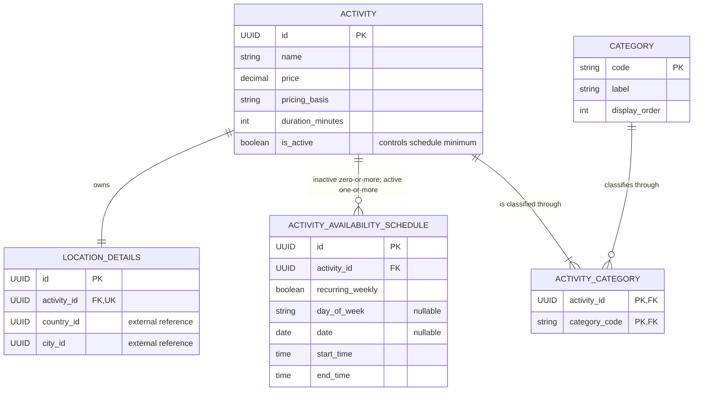

# Student 4 Entity-Relationship Diagram

Each activity owns exactly one `LOCATION_DETAILS` row and at least one category
assignment. Schedule cardinality depends on catalogue state: an inactive entry
may have none, while an active activity requires one or more weekly or one-off
schedules. `ACTIVITY_CATEGORY` supports classification under several categories
without duplicating catalogue data. Country and city are external UUIDs and do
not appear as locally owned entities.

