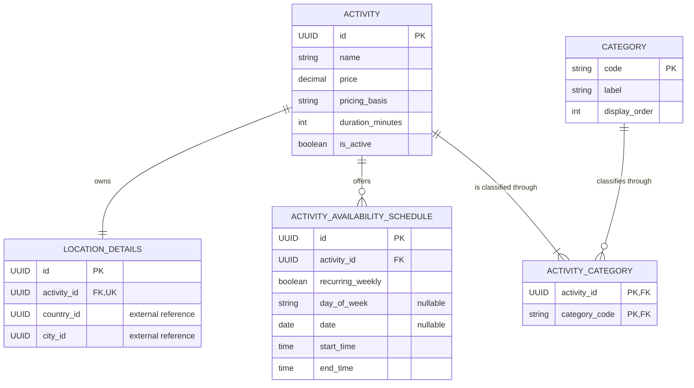

# Student 4 Entity-Relationship Diagram

Each activity owns exactly one `LOCATION_DETAILS` row and can own several
weekly or one-off schedules. `ACTIVITY_CATEGORY` allows the same activity to be
found under several controlled categories without duplicating catalogue data.
Country and city are recorded as external UUIDs on the location and therefore
do not appear as locally owned entities.

