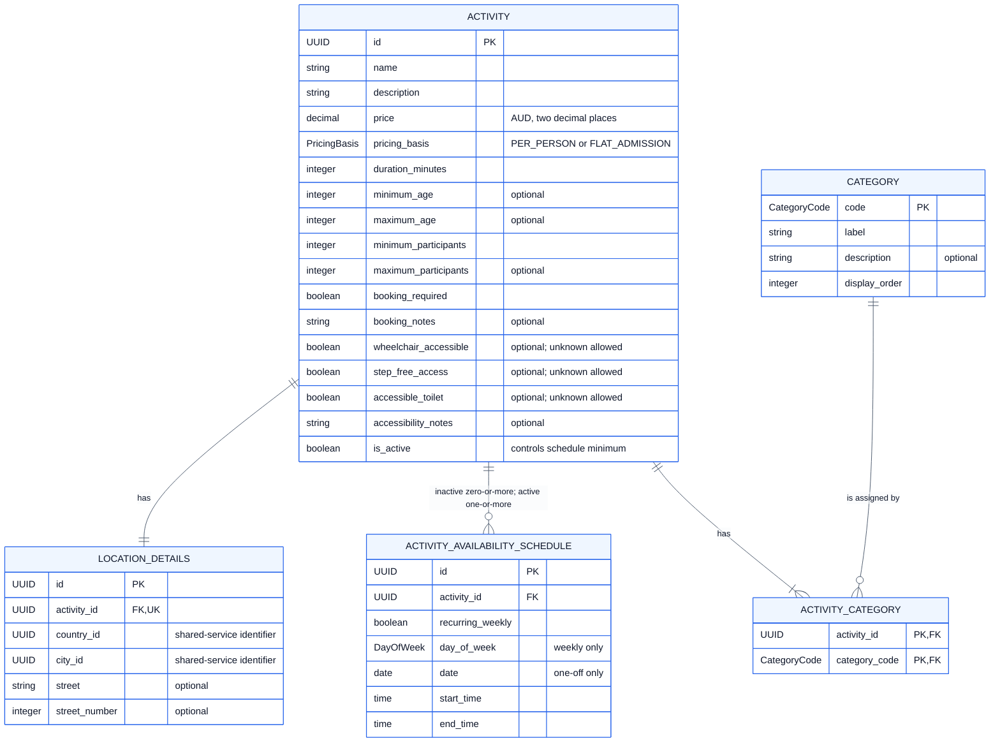

# Student 4 Logical Data Model (ERD)

The fields support catalogue search and the planning information consumed by
the itinerary and budget services. Prices are exact AUD values and
`pricing_basis` determines whether a party cost is per person or a single flat
admission charge. Nullable accessibility flags deliberately distinguish an
unknown value from a confirmed `false` value.

This implementation-neutral ERD shows every business attribute, logical data
type, key and relationship, but not SQLite storage details, indexes or
implementation-only compatibility tables. A high-resolution
[PNG export](logical.png) is included alongside this document.

The principal logical rules are: every activity has at least one category;
every active activity has at least one schedule; duration must be positive; age
and party bounds must be ordered; end time must follow start time; and each
schedule must provide either a weekday or a date according to
`recurring_weekly`, never both.
