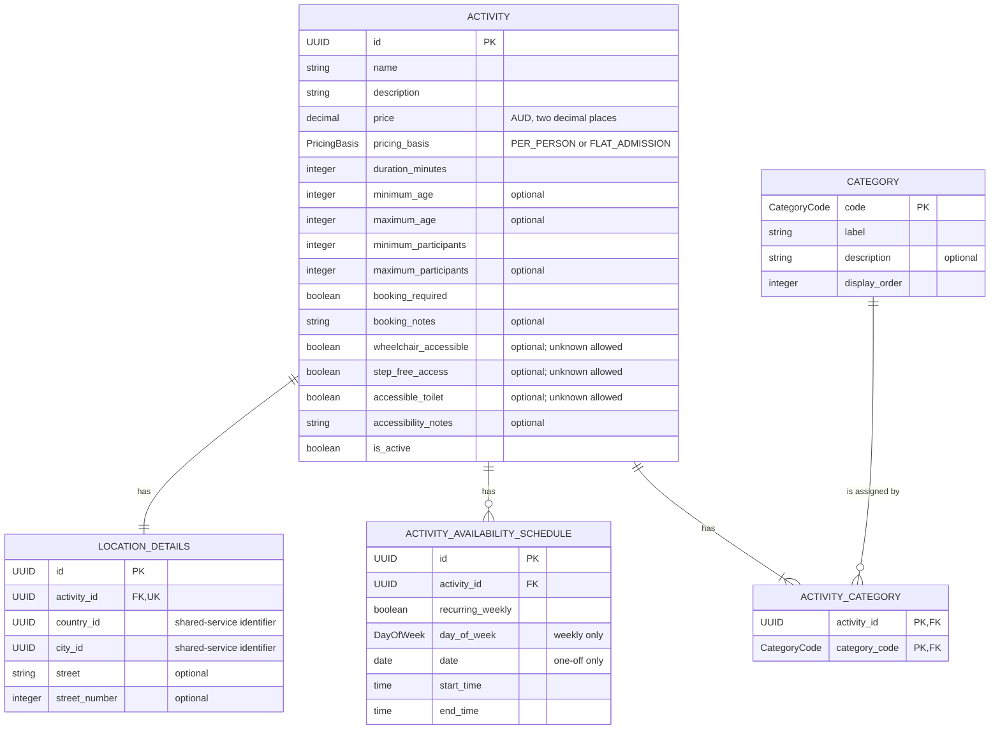

# Student 4 Logical Data Design

The logical model is independent of SQLite storage types. It includes the
complete business data and identifies optional values, keys, and controlled
enumerations used by the service contract.

The principal logical rules are: duration must be positive; age and party
bounds must be ordered; every category assignment must reference a seeded
category; end time must follow start time; and each schedule must provide
either a weekday or a date according to `recurring_weekly`, never both.
