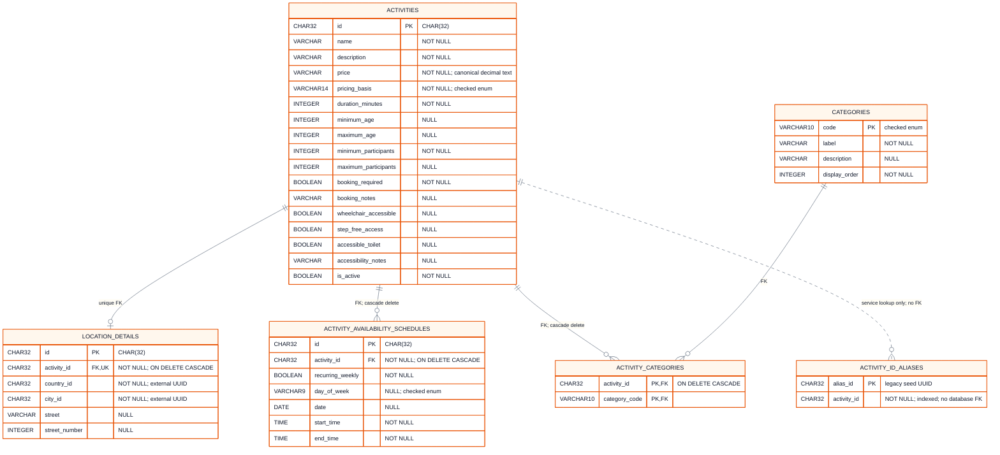

# Student 4 Physical Database Model (ERD)

The database service is the only component that reads this SQLite database.
SQLAlchemy stores UUIDs as 32-character values and stores prices as canonical
decimal text so filtering and API serialization never introduce binary
floating-point errors. Owned locations, schedules and category links cascade
when an activity is deleted; the alias table exists only to resolve legacy seed
identifiers and intentionally has no database foreign key.

This implementation-specific ERD mirrors the deployed SQLite schema: exact
table and column names, storage types, nullability, foreign keys and cascade
behaviour. A high-resolution [PNG export](physical.png) is included alongside
this document.

SQLite foreign keys enforce child-to-parent references and cascade deletion,
but they cannot require a parent activity to have child rows. The API validation
therefore requires one location, at least one category, and at least one
schedule whenever `is_active` is true. The database still permits an inactive
catalogue entry to have no schedules.

The physical indexes support country/city filtering, category-first lookup,
schedule lookup by activity, and activity lookup from a legacy alias. Two
partial unique indexes prevent duplicate weekly and one-off schedule rows.
SQLite `CHECK` constraints enforce enum values, canonical prices, valid
booleans, ordered bounds, non-negative values, valid local date/time text, and
the weekly-versus-one-off schedule discriminator. The service additionally
checks that each schedule interval can contain the activity's full duration.

## Implementation sources

- [`models.py`](../../../../../student-4/database/student4_database_service/models.py)
- [`database.py`](../../../../../student-4/database/student4_database_service/database.py)
- [`enums.py`](../../../../../student-4/database/student4_database_service/enums.py)
- [`object-model.md`](../../../../../student-4/docs/object-model.md)
