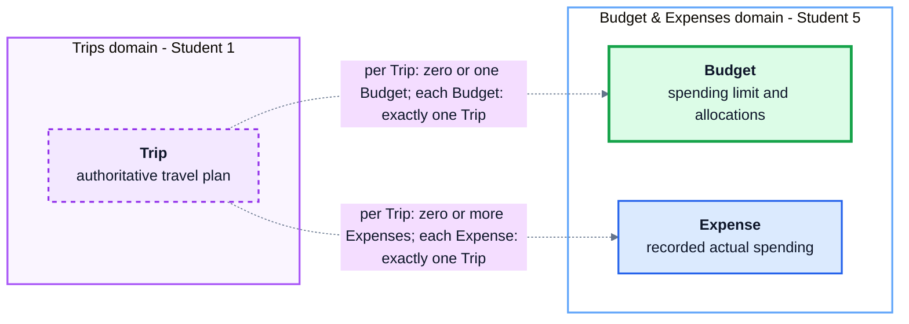

# Student 5 Conceptual Data Design

`Budget` captures the spending limit and planned category allocations for one
trip. `Expense` captures an individual amount actually spent for that trip.
Each trip may have at most one budget and any number of expenses, while the two
Student 5 concepts have independent lifecycles.

This view deliberately omits attributes, keys, storage types and table names.
It describes the business concepts and ownership boundaries only. A
high-resolution [PNG export](conceptual.png) is included alongside this
document.

Trip remains authoritative in Student 1. The dotted connections cross a
service ownership boundary rather than representing database foreign keys.
Deleting a Student 5 budget has no effect on the Trip or its expenses.