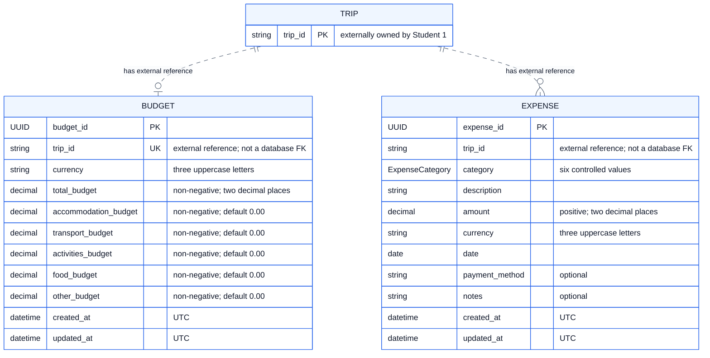

# Student 5 Logical Data Model (ERD)

Budgets retain one total spending limit plus five non-negative planned
allocations. Expenses retain positive actual amounts classified independently;
`shopping` is an expense category but does not have a dedicated budget
allocation field. Money has at most two decimal places and all records carry a
three-letter uppercase currency code.

This implementation-neutral ERD shows every business attribute, logical data
type, identifier and relationship, but not SQLite storage details or indexes.
A high-resolution [PNG export](logical.png) is included alongside this
document.

The principal logical rules are: a trip has at most one budget; each category
allocation and the total budget are non-negative; the five allocations
together cannot exceed the total; and every expense amount is positive.
Expense categories are `accommodation`, `transport`, `activities`, `food`,
`shopping` and `other`. Budget and expense deletion remain independent.