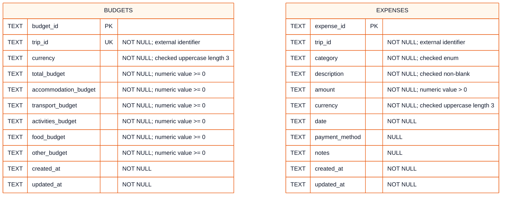

# Student 5 Physical Database Model (ERD)

The database service is the only component that reads this SQLite database.
SQLite stores UUIDs, dates, timestamps and money as `TEXT`. The API validates
UUIDs and dates and canonicalises money to two decimal places before writes;
application arithmetic uses Python `Decimal`, never binary floating point.

This implementation-specific ERD mirrors the deployed SQLite schema: exact
table and column names, storage types, nullability and uniqueness. There are
no database relationships between the two tables and no local Trip table. A
high-resolution [PNG export](physical.png) is included alongside this
document.

`budgets.trip_id` is unique, enforcing at most one budget per external trip.
The budget table also checks that the sum of `accommodation_budget`,
`transport_budget`, `activities_budget`, `food_budget` and `other_budget` does
not exceed `total_budget`. Expense categories are constrained to
`accommodation`, `transport`, `activities`, `food`, `shopping` and `other`.
Neither table declares a foreign key, so deleting a budget cannot cascade to
expenses and external Trip integrity is enforced through service workflows.

The deployed indexes are:

- `idx_budgets_trip (trip_id)`
- `idx_expenses_trip_date (trip_id, date)`
- `idx_expenses_category_date (category, date)`

The API boundary additionally enforces UUID syntax, ISO dates, field length
limits, two-decimal money values and a maximum money value of
`1000000000.00`. Those rules are not repeated as SQLite constraints and are
therefore not labelled as physical guarantees in the diagram.

## Implementation sources

- [`repository.py`](../../../../../student-5/database/student5_database_service/repository.py)
- [`models.py`](../../../../../student-5/database/student5_database_service/models.py)
- [`README.md`](../../../../../student-5/database/README.md)