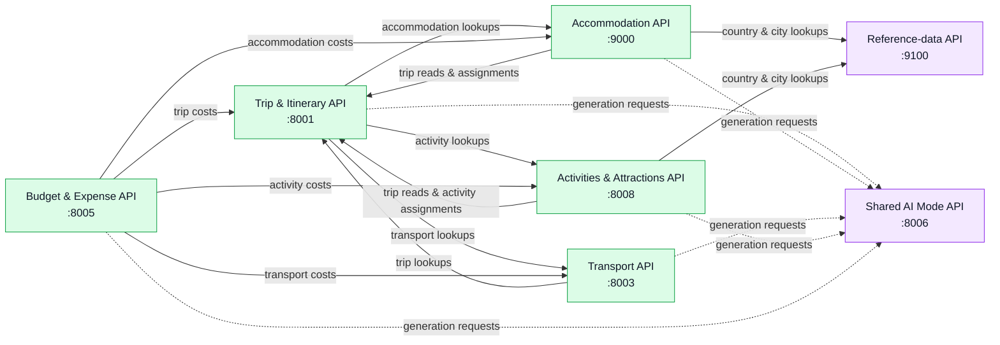

# TripGenie Release 0 Integrated Architecture

This diagram reflects the services declared in the root
[`docker-compose.yml`](../../../docker-compose.yml). Each feature owns a
frontend, a public backend API, and an internal database API service. The
database API service is the **only** process allowed to open that feature's
SQLite database; neither the frontend nor the backend accesses SQLite
directly.

Each bordered card below is one independently deployed Compose service. A
high-resolution [PNG export](integrated-architecture.png) is included alongside
this document for use in reports and presentations.

## Deployment and storage ownership

```mermaid
%%{init: {"theme":"base","themeVariables":{"fontFamily":"Inter, ui-sans-serif, system-ui, sans-serif","primaryTextColor":"#0f172a","lineColor":"#64748b","clusterBkg":"#f8fafc","clusterBorder":"#cbd5e1"},"flowchart":{"curve":"basis","nodeSpacing":34,"rankSpacing":46}}}%%
flowchart TB
    USER[Traveller / browser]
    PORTAL[shared-ui<br/><b>Portal service</b><br/>host :8080 → container :80]

    USER -->|opens| PORTAL

    subgraph FEATURES[Feature services]
        direction LR

        subgraph TRIPS[Trip & Itinerary Management]
            direction TB
            T_FE[student-1-frontend<br/><b>Frontend service</b><br/>host :8081]
            T_BE[student-1-backend<br/><b>Backend API service</b><br/>internal :8001]
            T_DB_API[student-1-database<br/><b>Database API service</b><br/>internal :8002]
            T_DB[(Trip & itinerary<br/>SQLite database)]
            T_FE -->|HTTP API| T_BE
            T_BE -->|internal HTTP API only| T_DB_API
            T_DB_API -->|sole SQLite access| T_DB
        end

        subgraph ACCOMMODATION[Accommodation Management]
            direction TB
            A_FE[student-2-frontend<br/><b>Frontend service</b><br/>host :9003]
            A_BE[student-2-backend<br/><b>Backend API service</b><br/>host :9000]
            A_DB_API[student-2-database<br/><b>Database API service</b><br/>internal :9001]
            A_DB[(Accommodation<br/>SQLite database)]
            A_FE -->|HTTP API| A_BE
            A_BE -->|internal HTTP API only| A_DB_API
            A_DB_API -->|sole SQLite access| A_DB
        end

        subgraph TRANSPORT[Transport Management]
            direction TB
            R_FE[student-3-frontend<br/><b>Frontend service</b><br/>host :8093]
            R_BE[student-3-backend<br/><b>Backend API service</b><br/>internal :8003]
            R_DB_API[student-3-database<br/><b>Database API service</b><br/>internal :8004]
            R_DB[(Transport<br/>SQLite database)]
            R_FE -->|HTTP API| R_BE
            R_BE -->|internal HTTP API only| R_DB_API
            R_DB_API -->|sole SQLite access| R_DB
        end

        subgraph ACTIVITIES[Activities & Attractions Management]
            direction TB
            C_FE[student-4-frontend<br/><b>Frontend service</b><br/>host :8084]
            C_BE[student-4-backend<br/><b>Backend API service</b><br/>internal :8008]
            C_DB_API[student-4-database<br/><b>Database API service</b><br/>internal :8009]
            C_DB[(Activities & attractions<br/>SQLite database)]
            C_FE -->|HTTP API| C_BE
            C_BE -->|internal HTTP API only| C_DB_API
            C_DB_API -->|sole SQLite access| C_DB
        end

        subgraph BUDGET[Budget & Expense Management]
            direction TB
            B_FE[student-5-frontend<br/><b>Frontend service</b><br/>host :8085]
            B_BE[student-5-backend<br/><b>Backend API service</b><br/>internal :8005]
            B_DB_API[student-5-database<br/><b>Database API service</b><br/>internal :8007]
            B_DB[(Budget & expense<br/>SQLite database)]
            B_FE -->|HTTP API| B_BE
            B_BE -->|internal HTTP API only| B_DB_API
            B_DB_API -->|sole SQLite access| B_DB
        end
    end

    PORTAL -.->|links to| T_FE
    PORTAL -.->|links to| A_FE
    PORTAL -.->|links to| R_FE
    PORTAL -.->|links to| C_FE
    PORTAL -.->|links to| B_FE

    subgraph SHARED[Shared platform services]
        direction LR
        REF_BE[shared-backend<br/><b>Reference-data API service</b><br/>host :9100]
        REF_DB_API[shared-database<br/><b>Reference database API service</b><br/>internal :9101]
        REF_DB[(Country & city<br/>SQLite database)]
        AI[ai-mode<br/><b>Shared AI gateway service</b><br/>internal :8006]
        OLLAMA[Host-managed Ollama<br/><b>External runtime</b><br/>host :11434]

        REF_BE -->|internal HTTP API only| REF_DB_API
        REF_DB_API -->|sole SQLite access| REF_DB
        AI -->|only Ollama client| OLLAMA
    end

    T_BE -.->|AI generation| AI
    A_BE -.->|AI generation| AI
    R_BE -.->|AI generation| AI
    C_BE -.->|AI generation| AI
    B_BE -.->|AI generation| AI

    classDef actor fill:#f8fafc,stroke:#64748b,color:#0f172a,stroke-width:2px;
    classDef frontend fill:#dbeafe,stroke:#2563eb,color:#0f172a,stroke-width:2px;
    classDef backend fill:#dcfce7,stroke:#16a34a,color:#0f172a,stroke-width:2px;
    classDef dbapi fill:#ffedd5,stroke:#ea580c,color:#0f172a,stroke-width:3px;
    classDef database fill:#fef3c7,stroke:#d97706,color:#0f172a,stroke-width:2px;
    classDef shared fill:#f3e8ff,stroke:#9333ea,color:#0f172a,stroke-width:2px;
    classDef external fill:#f1f5f9,stroke:#64748b,color:#0f172a,stroke-width:2px,stroke-dasharray:5 5;
    class USER actor;
    class T_FE,A_FE,R_FE,C_FE,B_FE frontend;
    class T_BE,A_BE,R_BE,C_BE,B_BE backend;
    class T_DB_API,A_DB_API,R_DB_API,C_DB_API,B_DB_API,REF_DB_API dbapi;
    class T_DB,A_DB,R_DB,C_DB,B_DB,REF_DB database;
    class PORTAL,REF_BE,AI shared;
    class OLLAMA external;
    style FEATURES fill:#f8fafc,stroke:#94a3b8,stroke-width:2px;
    style TRIPS fill:#ffffff,stroke:#60a5fa,stroke-width:2px;
    style ACCOMMODATION fill:#ffffff,stroke:#60a5fa,stroke-width:2px;
    style TRANSPORT fill:#ffffff,stroke:#60a5fa,stroke-width:2px;
    style ACTIVITIES fill:#ffffff,stroke:#60a5fa,stroke-width:2px;
    style BUDGET fill:#ffffff,stroke:#60a5fa,stroke-width:2px;
    style SHARED fill:#faf5ff,stroke:#a855f7,stroke-width:2px;
```

Solid arrows represent runtime HTTP or storage calls. Dotted arrows represent
portal navigation or optional AI-generation calls. Database APIs stay internal
to their owning feature.

## Backend API integration

Cross-feature requests go only to public backend APIs. No feature can call
another feature's database API or open another feature's SQLite database.

The `student-1` through `student-5` Compose services are lightweight grouping
targets, so they are not runtime application nodes in the diagram.
