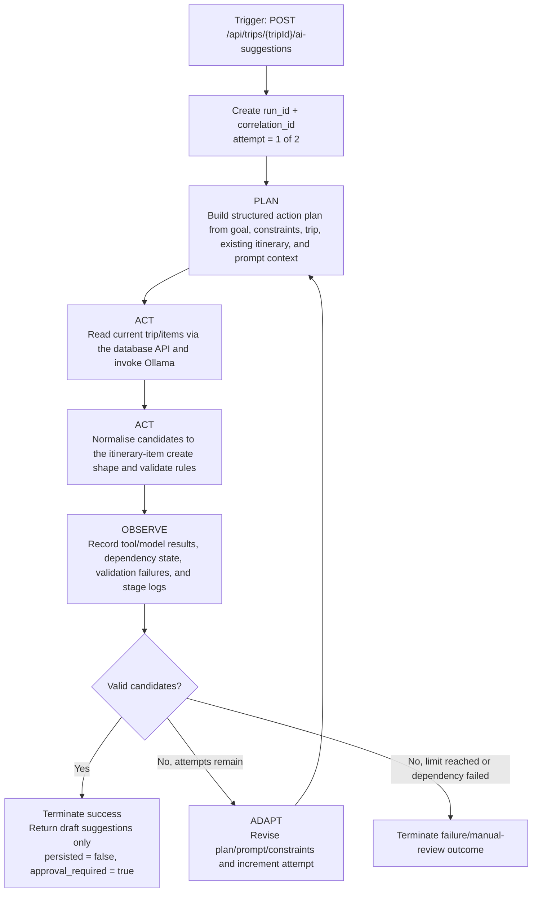

# Student 1 Release 0 Scope, Requirements, and Risk Plan

Related architecture: [Student 1 Release 0 architecture and contracts](../../architecture/student-1-release-0-architecture.md)

## 1. Release 0 scope
Student 1 Release 0 covers the first deployable slice of TripGenie's trip and itinerary management capability. It is intentionally limited to a three-service Student 1 stack:

1. an HTMX frontend for trip planning flows;
2. a backend/API service for orchestration, validation, and AI suggestion calls; and
3. a database API service that is the **only** service allowed to access the Student 1 SQLite file.

### In scope
- Trip CRUD for `trips`.
- Itinerary item CRUD for `itinerary_items`.
- Filtering itinerary items by trip and date.
- AI-generated draft itinerary suggestions through Ollama, executed as a bounded backend Plan -> Act -> Observe -> Adapt run.
- Service health endpoints, validation rules, and documented integration boundaries.
- Structured per-run logging, run IDs, and correlation IDs for AI suggestion runs.

### Explicitly out of scope
- Release 1 MCP, RAG, and retrieval-enhanced prompting.
- Release 2 multi-agent, cloud, or autonomous cross-service orchestration.
- Direct writes into Student 2-5 data stores or shared database/file access.

## 2. Functional requirements

| ID | Requirement | Release 0 expectation |
| --- | --- | --- |
| FR-01 | Manage trips | Users can create, list, view, update, and delete trips with `name`, `destination`, `start_date`, `end_date`, `traveller_count`, `status`, and `notes`. |
| FR-02 | Manage itinerary items | Users can create, list, view, update, and delete itinerary items for a trip with `date`, `start_time`, `end_time`, `title`, `location`, `description`, `category`, and `notes`. |
| FR-03 | Filter itinerary by trip/date | Users can request itinerary items for a specific trip and optionally narrow the result set by `date` and `category`. |
| FR-04 | Enforce planning rules | The backend rejects invalid trip date ranges, invalid time ranges, itinerary dates outside the parent trip window, and missing required fields. |
| FR-05 | Generate AI suggestions | Users can trigger a bounded AI itinerary-suggestion run for one trip/day. The backend builds a structured plan from the user's goal, trip constraints, existing itinerary, and prompt context, then returns validated draft suggestions without persisting them automatically. |
| FR-06 | Provide operational visibility | Frontend, backend, and database API services each expose a health endpoint, and AI suggestion runs emit auditable stage-transition logs with run/correlation IDs, dependency snapshots, and validation outcomes. |
| FR-07 | Preserve ownership boundaries | Frontend talks only to backend; backend reads current trip/items and later persists user-approved changes through the database API; only the database API owns the SQLite file and cascade deletion behavior. |
| FR-08 | Preserve human approval | AI suggestions remain drafts only. A user must explicitly accept/edit them and persist the final itinerary items through the existing CRUD endpoints. |

## 3. Non-functional requirements

| ID | Requirement | Release 0 expectation |
| --- | --- | --- |
| NFR-01 | Independent deployment units | Student 1 frontend, backend, and database services are containerised separately so they can be built, run, and debugged independently. |
| NFR-02 | Clear data ownership | The Student 1 SQLite file is mounted only into the database API service. No other TripGenie service reads or writes the file directly. |
| NFR-03 | Graceful dependency handling | If Ollama or the database API is unavailable, CRUD flows still work and AI suggestion runs terminate with a documented dependency/manual-review outcome instead of crashing the stack. |
| NFR-04 | Predictable contracts | All REST endpoints use JSON payloads, ISO `YYYY-MM-DD` dates, `HH:MM` times, and a shared error envelope. |
| NFR-05 | Local-first operability | Configuration is injected through environment variables and fixed container ports so the stack remains consistent with the repository's Docker-based development model. |
| NFR-06 | Performance for core workflows | CRUD and filtering should remain lightweight for a single-trip planning workflow; AI suggestion runs may be slower but remain bounded by backend timeouts and `AI_SUGGESTION_MAX_ATTEMPTS=2`. |
| NFR-07 | Maintainable scope | Release 0 documentation and contracts must stay limited to trip/itinerary management and not quietly absorb Release 1 or Release 2 concerns. |
| NFR-08 | Internal consistency | Documentation must align with the current repository layout, current shared UI port assumptions, and the Student 1 assignment brief without claiming unverified runtime behaviour. |
| NFR-09 | Auditable agent runs | Each AI suggestion run has a run ID, correlation ID, stage transition history, dependency snapshot, and termination reason suitable for debugging and review. |

## 4. Release 0 feature plan

| Slice | Capability | Outcome | Dependencies |
| --- | --- | --- | --- |
| Slice 1 | Service boundaries and contracts | Lock the three-service design, ports, ownership rules, schemas, and public/internal APIs before implementation starts. | Current repo structure and Docker conventions |
| Slice 2 | Trip lifecycle | Deliver trip create/read/update/delete flows and trip-level validation so a plan can exist independently of itinerary details. | Slice 1 |
| Slice 3 | Itinerary lifecycle | Deliver itinerary item CRUD plus trip/date filtering so users can build and inspect day plans. | Slice 2 |
| Slice 4 | AI itinerary-suggestion run | Add a bounded backend-to-Ollama execution loop that reads current trip context via the database API, retries within a documented limit, and returns validated draft suggestions without automatic persistence. | Slice 2, Slice 3 |
| Slice 5 | Operational hardening | Add health endpoints, dependency status reporting, per-run stage logs, and documented failure behaviour for database API and Ollama outages. | Slice 1, Slice 4 |

## 5. Risk plan

| Risk | Why it matters | Mitigation in Release 0 |
| --- | --- | --- |
| Service availability | Frontend, backend, database API, and Ollama are separate processes, so partial outages are possible. | Provide per-service health endpoints, keep CRUD independent from Ollama, and surface degraded dependency state from the backend. |
| Invalid dates and times | Trip windows and itinerary times are core planning data; invalid ranges undermine all downstream logic. | Validate `start_date <= end_date`, `start_time < end_time`, and enforce itinerary dates within the parent trip range at the backend and database layers. |
| Ollama unavailable or slow | AI suggestions are optional but visible user functionality. | Treat AI as best-effort, apply backend timeouts, return `503 DEPENDENCY_UNAVAILABLE`, and terminate with a manual-review outcome so users can continue manual planning. |
| Model output violates constraints | Ollama can return duplicates, unsupported categories, or dates/times that do not fit the trip window. | Normalise every candidate to the itinerary item create schema, validate against trip/date/category rules and existing itinerary state, log failures, and retry only within the documented attempt limit. |
| Hidden persistence of AI drafts | Users must understand that AI output is advisory until reviewed. | Keep AI suggestions in memory only, return `persisted = false`, and require explicit follow-up CRUD calls to save accepted items. |
| Cross-service data consistency | Accommodation, transport, activities, and budget data live in different student-owned services. | Keep Student 1 as the source of truth only for trips and itinerary items, avoid distributed writes, and integrate via documented API boundaries rather than shared storage. |
| Scope creep into Release 1/2 | MCP, RAG, and cloud autonomy would distort Release 0 implementation cost and timelines. | State explicit exclusions in all design artefacts and keep AI suggestion flow limited to direct Ollama calls. |

## 6. AI itinerary-suggestion agent loop

### 6.1 Trigger and bounded goal

- **Trigger:** `POST /api/trips/{tripId}/ai-suggestions` for exactly one trip and one planning date, with a user goal, optional prompt context, and explicit constraints.
- **Bounded goal:** return a validated, normalised set of draft itinerary-item candidates for that single request, using stored trip data and the current itinerary as context, without mutating persisted data.
- **Run controls:** each execution gets a `run_id`, shares a `correlation_id`, and is limited to `AI_SUGGESTION_MAX_ATTEMPTS=2`.

The loop uses only the Student 1 backend, Student 1 database API, and direct Ollama calls. Release 1 MCP/RAG and Release 2 multi-agent behaviour remain out of scope.

### 6.2 Stage definitions

| Stage | What happens in Release 0 | Evidence captured | Exit criteria |
| --- | --- | --- | --- |
| Plan | The backend creates a structured proposed action plan from the user's goal, trip constraints, existing itinerary snapshot, prompt context, requested date, and expected output schema. | `run_id`, `correlation_id`, attempt number, planning inputs, and the structured plan object. | The plan is complete for the current attempt and ready for execution. |
| Act | The backend retrieves the current trip and itinerary items through the database API, invokes Ollama, normalises candidate suggestions to the itinerary-item create shape, validates rules, and **never** persists AI output automatically. | Database API results, Ollama response, normalised candidates, and validation outcomes. | The backend has either validated candidate suggestions or classified a failure for this attempt. |
| Observe | The backend records tool results, model output, dependency state, validation/constraint failures, latency, and stage-transition logs for the current attempt. | Structured per-run logs and a dependency snapshot. | The attempt is classified as success, retryable failure, or terminal failure. |
| Adapt | The backend revises the plan, prompt context, or constraints and retries while attempts remain; otherwise it terminates with an explicit failure/manual-review outcome. | Retry reason, updated plan inputs, and final termination reason when applicable. | The run either loops back to Plan for another attempt or terminates. |

### 6.3 Deterministic CRUD versus the agentic loop

| Concern | Deterministic CRUD | AI itinerary-suggestion loop |
| --- | --- | --- |
| Trigger | Trip and itinerary create/read/update/delete endpoints. | `POST /api/trips/{tripId}/ai-suggestions`. |
| Persistence | Writes trip or itinerary state immediately once validation passes. | Never persists suggestions automatically; returns drafts only. |
| Retry model | Standard request/response handling only. | Internal Plan -> Act -> Observe -> Adapt retry loop bounded to two attempts. |
| Audit trail | Standard request logs. | Per-run stage-transition logs with `run_id`, `correlation_id`, dependency state, and termination reason. |
| Output | Stored trip or itinerary records. | Draft suggestion candidates that a user may later save through normal CRUD. |

### 6.4 Termination and approval boundary

- **Successful termination:** at least one candidate passes normalisation and hard-constraint validation, so the backend returns draft suggestions with `persisted = false` and `approval_required = true`.
- **Retryable failure:** parsing, validation, or dependency issues that might be corrected within the same run cause the Adapt stage to revise inputs and retry.
- **Terminal failure:** the backend returns an explicit error/manual-review outcome when a dependency is unavailable, the request is invalid, the final attempt still fails validation, or the run times out.
- **Human approval boundary:** users review, edit, and persist any accepted suggestion later through the standard itinerary item CRUD endpoints. The agentic loop itself never writes itinerary items.

## 7. Evidence boundary
This issue produces design artefacts only. It intentionally does **not** claim that the three-service stack, APIs, or validations are already implemented or runtime-verified.
