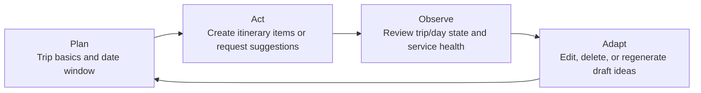

# Student 1 Release 0 Scope, Requirements, and Risk Plan

Related architecture: [Student 1 Release 0 architecture and contracts](../../architecture/student-1-release-0-architecture.md)

## 1. Release 0 scope
Student 1 Release 0 covers the first deployable slice of TripGenie's trip and itinerary management capability. It is intentionally limited to a three-service Student 1 stack:

1. an HTMX frontend for trip planning flows;
2. a backend/API service for orchestration, validation, and AI suggestion calls; and
3. a database API service that is the **only** service allowed to access the Student 1 SQLite file.

### In scope
- Trip CRUD for `trips`.
- Itinerary item CRUD for `itinerary_items`.
- Filtering itinerary items by trip and date.
- AI-generated draft itinerary suggestions through Ollama.
- Service health endpoints, validation rules, and documented integration boundaries.
- Explicit alignment to the TripGenie **Plan -> Act -> Observe -> Adapt** workflow.

### Explicitly out of scope
- Release 1 MCP, RAG, and retrieval-enhanced prompting.
- Release 2 multi-agent, cloud, or autonomous cross-service orchestration.
- Direct writes into Student 2-5 data stores or shared database/file access.

## 2. Functional requirements

| ID | Requirement | Release 0 expectation |
| --- | --- | --- |
| FR-01 | Manage trips | Users can create, list, view, update, and delete trips with `name`, `destination`, `start_date`, `end_date`, `traveller_count`, `status`, and `notes`. |
| FR-02 | Manage itinerary items | Users can create, list, view, update, and delete itinerary items for a trip with `date`, `start_time`, `end_time`, `title`, `location`, `description`, `category`, and `notes`. |
| FR-03 | Filter itinerary by trip/date | Users can request itinerary items for a specific trip and optionally narrow the result set by `date` and `category`. |
| FR-04 | Enforce planning rules | The backend rejects invalid trip date ranges, invalid time ranges, itinerary dates outside the parent trip window, and missing required fields. |
| FR-05 | Generate AI suggestions | Users can request draft itinerary suggestions for a trip/day via Ollama. Suggested items are returned to the caller and are **not** automatically persisted. |
| FR-06 | Provide operational visibility | Frontend, backend, and database API services each expose a health endpoint suitable for local orchestration and diagnostics. |
| FR-07 | Preserve ownership boundaries | Frontend talks only to backend; backend talks to database API and Ollama; only the database API owns the SQLite file and cascade deletion behavior. |

## 3. Non-functional requirements

| ID | Requirement | Release 0 expectation |
| --- | --- | --- |
| NFR-01 | Independent deployment units | Student 1 frontend, backend, and database services are containerised separately so they can be built, run, and debugged independently. |
| NFR-02 | Clear data ownership | The Student 1 SQLite file is mounted only into the database API service. No other TripGenie service reads or writes the file directly. |
| NFR-03 | Graceful dependency handling | If Ollama is unavailable, CRUD flows still work and AI suggestion requests fail with a documented dependency error instead of crashing the stack. |
| NFR-04 | Predictable contracts | All REST endpoints use JSON payloads, ISO `YYYY-MM-DD` dates, `HH:MM` times, and a shared error envelope. |
| NFR-05 | Local-first operability | Configuration is injected through environment variables and fixed container ports so the stack remains consistent with the repository's Docker-based development model. |
| NFR-06 | Performance for core workflows | CRUD and filtering should remain lightweight for a single-trip planning workflow; AI suggestions may be slower but should remain bounded by backend timeouts. |
| NFR-07 | Maintainable scope | Release 0 documentation and contracts must stay limited to trip/itinerary management and not quietly absorb Release 1 or Release 2 concerns. |
| NFR-08 | Internal consistency | Documentation must align with the current repository layout, current shared UI port assumptions, and the Student 1 assignment brief without claiming unverified runtime behaviour. |

## 4. Release 0 feature plan

| Slice | Capability | Outcome | Dependencies |
| --- | --- | --- | --- |
| Slice 1 | Service boundaries and contracts | Lock the three-service design, ports, ownership rules, schemas, and public/internal APIs before implementation starts. | Current repo structure and Docker conventions |
| Slice 2 | Trip lifecycle | Deliver trip create/read/update/delete flows and trip-level validation so a plan can exist independently of itinerary details. | Slice 1 |
| Slice 3 | Itinerary lifecycle | Deliver itinerary item CRUD plus trip/date filtering so users can build and inspect day plans. | Slice 2 |
| Slice 4 | AI-assisted adaptation | Add backend-to-Ollama suggestion generation that returns draft itinerary options without persisting them automatically. | Slice 2, Slice 3 |
| Slice 5 | Operational hardening | Add health endpoints, dependency status reporting, and documented failure behaviour for database API and Ollama outages. | Slice 1, Slice 4 |

## 5. Risk plan

| Risk | Why it matters | Mitigation in Release 0 |
| --- | --- | --- |
| Service availability | Frontend, backend, database API, and Ollama are separate processes, so partial outages are possible. | Provide per-service health endpoints, keep CRUD independent from Ollama, and surface degraded dependency state from the backend. |
| Invalid dates and times | Trip windows and itinerary times are core planning data; invalid ranges undermine all downstream logic. | Validate `start_date <= end_date`, `start_time < end_time`, and enforce itinerary dates within the parent trip range at the backend and database layers. |
| Ollama unavailable or slow | AI suggestions are optional but visible user functionality. | Treat AI as best-effort, apply backend timeouts, return `503 DEPENDENCY_UNAVAILABLE`, and let users continue manual planning. |
| Cross-service data consistency | Accommodation, transport, activities, and budget data live in different student-owned services. | Keep Student 1 as the source of truth only for trips and itinerary items, avoid distributed writes, and integrate via documented API boundaries rather than shared storage. |
| Scope creep into Release 1/2 | MCP, RAG, and cloud autonomy would distort Release 0 implementation cost and timelines. | State explicit exclusions in all design artefacts and keep AI suggestion flow limited to direct Ollama calls. |

## 6. Plan -> Act -> Observe -> Adapt mapping

| TripGenie stage | Student 1 behaviour in Release 0 | Primary endpoints |
| --- | --- | --- |
| Plan | Create the trip shell, set destination/date range, and record traveller context. | `POST /api/trips`, `PATCH /api/trips/{tripId}` |
| Act | Add itinerary items manually or request draft suggestions for a day. | `POST /api/trips/{tripId}/itinerary-items`, `POST /api/trips/{tripId}/ai-suggestions` |
| Observe | Review trip state, daily schedule, and dependency health. | `GET /api/trips/{tripId}`, `GET /api/trips/{tripId}/itinerary-items?date=...`, `GET /health` |
| Adapt | Edit or delete trip/items, then re-run AI suggestions if needed. | `PATCH /api/trips/{tripId}`, `PATCH /api/itinerary-items/{itemId}`, `DELETE ...`, `POST /api/trips/{tripId}/ai-suggestions` |

## 7. Evidence boundary
This issue produces design artefacts only. It intentionally does **not** claim that the three-service stack, APIs, or validations are already implemented or runtime-verified.
