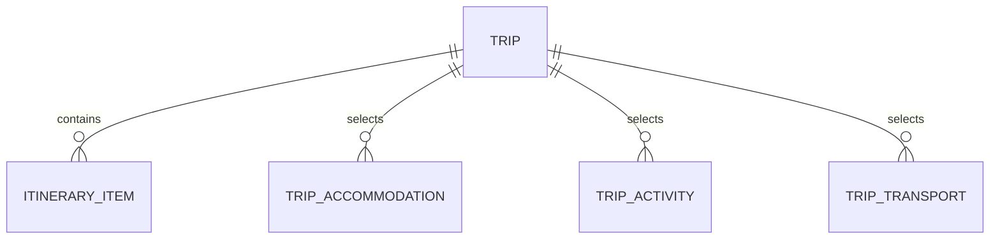

# Student 1 Release 0 report contribution

Prepared: **4 September 2026 (AEST)**

This document is source material for the Group 07 Release 0 technical report.
Claims about execution are limited to the linked evidence in the
[Student 1 evidence register](student-1-evidence-register.md).

## 1. Feature allocation and objective

**Student 1: Aaditya Rai — Trip & Itinerary Management**

The feature provides trip and day-by-day itinerary management through a
Student 1 frontend, backend API, and database API. It also provides
AI-assisted itinerary drafts through the shared AI-Mode service. AI output is
advisory and requires human review before normal CRUD persistence.

## 2. Functional and non-functional requirements

| ID | Requirement | Current source | Execution evidence |
| --- | --- | --- | --- |
| FR-1 | Create, list, view, update, and delete trips. | [Backend API](../../../student-1/backend), [frontend](../../../student-1/frontend), [database API](../../../student-1/database) | Browser CRUD pending. |
| FR-2 | Create, list/filter, view, update, and delete itinerary items belonging to a trip. | [Backend API](../../../student-1/backend), [frontend](../../../student-1/frontend), [database API](../../../student-1/database) | Browser CRUD pending. |
| FR-3 | Validate dates, times, identifiers, trip membership, and supported categories. | [Database models](../../../student-1/database/database_service/models.py), [backend](../../../student-1/backend) | CI is verified; integrated validation examples remain pending. |
| FR-4 | Request bounded itinerary suggestions through shared AI-Mode and return drafts without automatic persistence. | [Runtime notes](../../architecture/student-1-runtime-ai-mode.md), [prompt asset](../../../student-1/backend/backend_service/prompts/runtime_ai_suggestions_v1.md) | Live approved-model request pending. |
| FR-5 | Run as part of the shared local Docker Compose application and remain reachable from the shared home page. | [PR #29](https://github.com/JulianKirk/TripGenie/pull/29), [`docker-compose.yml`](../../../docker-compose.yml) | Manual Compose and navigation evidence pending. |
| NFR-1 | Preserve service ownership: only the Student 1 database API accesses its SQLite file. | [Architecture](../../architecture/student-1-release-0-architecture.md), [ADR-0001](../../architecture/decisions/0001-student-1-service-mapping.md) | Source and CI evidence only. |
| NFR-2 | Keep CRUD readiness independent of Ollama availability; report AI dependency failure separately. | [Runtime notes](../../architecture/student-1-runtime-ai-mode.md) | Degraded and live dependency captures pending. |
| NFR-3 | Keep prompt/context and logs bounded and avoid secrets or full sensitive free text. | [Runtime notes](../../architecture/student-1-runtime-ai-mode.md) | Live log inspection pending. |
| NFR-4 | Build and validate each Student 1 microservice in GitHub Actions. | [Student 1 CI](../../../.github/workflows/student-1-ci.yml) | [Successful run](https://github.com/JulianKirk/TripGenie/actions/runs/33764177551). |

## 3. Feature plan and completed increments

| Increment | Outcome | Delivery link |
| --- | --- | --- |
| Architecture and contracts | Release 0 boundaries, assessed workflow, ADRs, and target service map. | [PR #17](https://github.com/JulianKirk/TripGenie/pull/17) |
| Database | SQLite-owning database API for Trip and Itinerary Item persistence. | [PR #18](https://github.com/JulianKirk/TripGenie/pull/18) |
| Backend | Public Trip and Itinerary CRUD API over the database API. | [PR #21](https://github.com/JulianKirk/TripGenie/pull/21) |
| Frontend | HTMX pages and forms for Student 1 flows. | [PR #22](https://github.com/JulianKirk/TripGenie/pull/22) |
| AI-Mode | Shared provider boundary and Student 1 draft-suggestion flow. | [PR #23](https://github.com/JulianKirk/TripGenie/pull/23) |
| Compose | Shared Compose wiring for Student 1 and shared AI-Mode. | [PR #29](https://github.com/JulianKirk/TripGenie/pull/29) |
| Evidence/report organisation | Evidence register, report contribution, and demo capture runbook. | [Issue #15](https://github.com/JulianKirk/TripGenie/issues/15) |

## 4. Data design

### 4.1 Conceptual and logical model

- **Trip** is the aggregate used to organise a journey.
- **Itinerary Item** belongs to one Trip and records a dated activity, meal,
  accommodation, transport entry, note, or other schedule item.
- The three selection entities store Student 1's references to records owned by
  other student services. Student 1 stores opaque foreign-service identifiers
  rather than reading their databases.

### 4.2 Physical SQLite design

The implemented schema is defined in
[`student-1/database/database_service/repository.py`](../../../student-1/database/database_service/repository.py).

| Table | Key fields and constraints |
| --- | --- |
| `trips` | `id` primary key; name, destination, start/end date, traveller count, status, and notes; start date cannot follow end date. |
| `itinerary_items` | `id` primary key; `trip_id` foreign key with cascade delete; date, optional times, title, location, description, category, and notes; timed rows require start before end. |
| `trip_accommodations` | Composite key `(trip_id, accommodation_id)` plus stay dates/times. |
| `trip_activities` | Composite key `(trip_id, activity_id)` plus selected date/start time. |
| `trip_transport` | Composite key `(trip_id, transport_id)` plus traveller count, plan status, added date, and notes. |
| `schema_metadata` | Key/value metadata used for database lifecycle information. |

Indexes support trip status/start-date filtering, itinerary trip/date/category
queries, and reverse lookups for cross-feature selections. Actual populated row
counts must be captured from a running database; source seed definitions alone
are not presented as execution evidence.

## 5. Software, Compose, DevOps, and agentic architecture

- [The root README repository structure](../../../README.md#3-project-repository-structure)
  records the shared directories, services, workflow location, and report
  location.
- [Student 1 Release 0 architecture](../../architecture/student-1-release-0-architecture.md)
  contains the service diagram and runtime responsibilities.
- [Student 1 runtime AI-Mode notes](../../architecture/student-1-runtime-ai-mode.md)
  describe `frontend -> backend -> shared AI-Mode -> host Ollama`.
- [`docker-compose.yml`](../../../docker-compose.yml) is the shared local
  integration configuration; Ollama is host-managed.
- [`student-1-ci.yml`](../../../.github/workflows/student-1-ci.yml) validates the
  database, backend, and frontend separately.
- [`ai-mode-ci.yml`](../../../.github/workflows/ai-mode-ci.yml) validates shared
  AI-Mode.
- [`agentic-ci.yml`](../../../.github/workflows/agentic-ci.yml) and
  [`ai-services/agentic-loop`](../../../ai-services/agentic-loop) contain the
  shared Plan / Act / Observe / agent review / human decision / Adapt tooling.
  A qualifying Student 1 review record remains pending until a real execution
  is captured.

The course rubric names `student-1.yml` through `student-5.yml`; this repository
uses the consistent filenames `student-1-ci.yml` through `student-5-ci.yml`.

## 6. Verified implementation and workflow evidence

The report may cite:

- merged implementation PRs
  [#17](https://github.com/JulianKirk/TripGenie/pull/17),
  [#18](https://github.com/JulianKirk/TripGenie/pull/18),
  [#21](https://github.com/JulianKirk/TripGenie/pull/21),
  [#22](https://github.com/JulianKirk/TripGenie/pull/22),
  [#23](https://github.com/JulianKirk/TripGenie/pull/23), and
  [#29](https://github.com/JulianKirk/TripGenie/pull/29);
- [successful Student 1 CI run 33764177551](https://github.com/JulianKirk/TripGenie/actions/runs/33764177551);
  and
- [successful AI-Mode CI run 33764177488](https://github.com/JulianKirk/TripGenie/actions/runs/33764177488).

These workflow runs validate component tests and image builds. They are not
Docker Compose runtime, browser, or live Ollama evidence.

## 7. Risk management

| Risk | Impact | Mitigation | Evidence state |
| --- | --- | --- | --- |
| Host Ollama is stopped, unreachable, or missing the approved model. | AI requests fail while CRUD should remain available. | Keep Ollama host-managed, expose explicit dependency states, and demonstrate both CRUD readiness and a real approved-model request. | Manual capture pending. |
| Green component CI is mistaken for integrated execution. | The report overstates coverage. | Keep CI, Compose configuration, and manual runtime evidence as separate register entries. | Separation documented. |
| AI output violates dates, times, categories, or overlaps. | Unsafe or unusable itinerary drafts. | Validate output in Student 1, bound retry/adaptation, and require human review before save. | Source/CI verified; live result pending. |
| Cross-service dependencies are unavailable. | Enrichment may be incomplete or requests may degrade. | Preserve HTTP ownership boundaries and document degraded behavior and limitations. | Integrated capture pending. |
| Evidence contains secrets, local paths, or generated databases. | Privacy/security issue and unsuitable submission artefacts. | Redact secrets, use repository-relative references, and never commit SQLite files. | Capture rules documented. |
| Student 1 demonstration exceeds its share of the ten-minute video. | Other required group evidence is crowded out. | Use the [90-second runbook](student-1-demo-runbook.md) and rehearse against a timer. | Recording pending. |

## 8. Known issues and limitations

- Local Compose startup, healthy service status, browser CRUD, screenshots, live
  Ollama quality, and the showcase recording are not yet evidenced.
- The prompt and Agentic Loop assets are present, but no qualifying Student 1
  implementation/review/human-decision/adaptation transcript is claimed here.
- CI image builds do not prove that the shared Compose application starts on a
  team member's machine.
- [Issue #14](https://github.com/JulianKirk/TripGenie/issues/14) and
  [PR #35](https://github.com/JulianKirk/TripGenie/pull/35) were closed
  unmerged as over-scoped. The custom smoke framework must not be listed as a
  Release 0 deliverable.
- Showcase attendance and Student 1 participation remain pending until the
  actual attendance/recording evidence exists.

## 9. Evidence still required before PDF submission

Complete every **Pending manual capture** row in the
[evidence register](student-1-evidence-register.md), then add the real published
video URL and final known issues to the group PDF. Preserve failed or degraded
results where they occurred; do not replace them with expected output.
