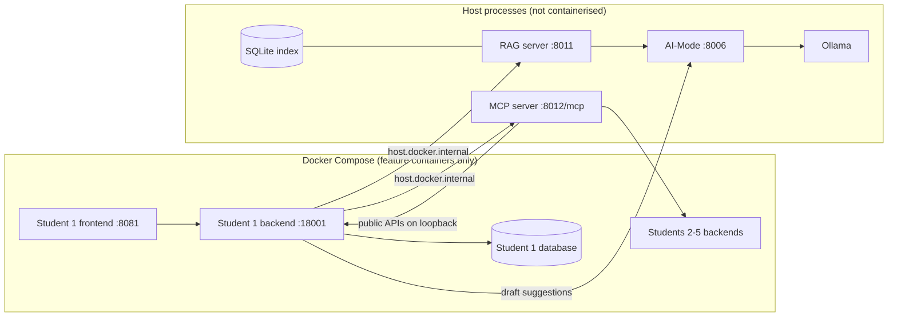
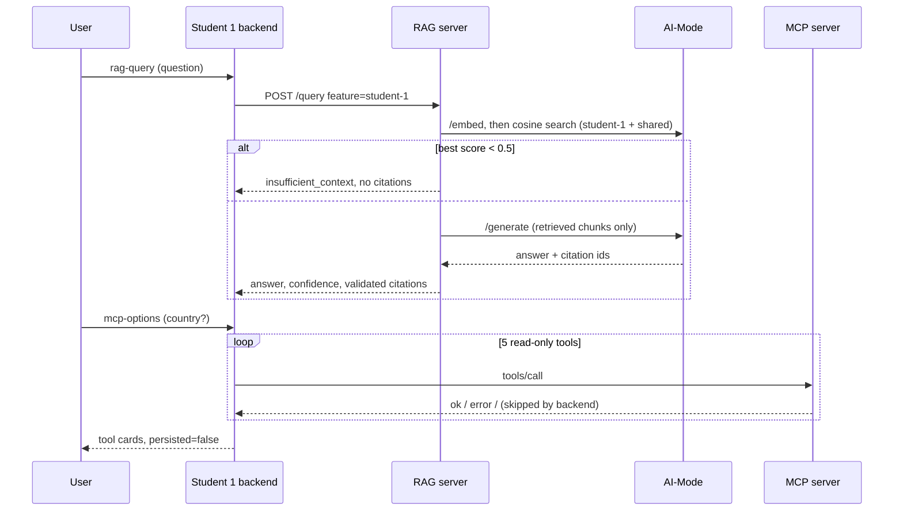

# Student 1 Release 1 report contribution

Owner: Aaditya Rai · Feature: Trip & Itinerary · Shared work: initial RAG server.
Evidence: [register](student-1-evidence-register.md) · Contributions:
[log](student-1-contribution-log.md). Target: about 700 words of the group's
3,000, plus diagrams.

## 1. Scope and responsibilities

- **Student 1 feature:** the trip page gains a knowledge-base panel (RAG) and
  a trip-options panel (MCP) through two backend routes,
  `POST /api/trips/{id}/rag-query` and `POST /api/trips/{id}/mcp-options`.
- **Shared RAG server (Aaditya):** host-run FastAPI service with an allowlisted
  source manifest, SQLite vector index, feature-scoped retrieval, grounded
  generation through AI-Mode, validated citations and server-calculated
  confidence. Also the AI-Mode `/embed` gateway and the Compose-to-host wiring.
- **Team-owned, used not claimed:** the MCP server and its tools, other
  features' integrations, and the agentic loop.

## 2. Functional requirements

1. A user asks a planning question and receives an answer with a confidence
   category and citations, or an explicit insufficient-context message.
2. A user discovers accommodation, activity, transport and budget options for
   the trip from Students 2-5 through MCP tools, without anything being saved.
3. Release 0 trip/itinerary CRUD and AI draft suggestions behave as before.

## 3. Measurable non-functional requirements

| Quality | Requirement | Result |
| --- | --- | --- |
| Security / tool boundary | The backend calls five fixed read-only tools; the server rejects unknown tools and extra arguments; options are never persisted | Verified: `persisted: false`; `trip_delete` and extra arguments rejected |
| Grounding / traceability | Every citation id must be one of the retrieved chunk ids, else `502`; below 0.5 relevance generation is skipped; confidence from score (≥0.8 high, ≥0.7 medium), thresholds calibrated against measured scores | Grounded answer at 0.832 → `high`; scores 0.43 and 0.61 → insufficient, no citations |
| Reliability | One tool failing is reported per tool and the rest still run; CRUD works with MCP/RAG disabled | Skipped tools reported with reasons; CI green with both disabled (`503 *_DISABLED`) |
| Performance (M2, 16 GB, llama3.1:8b) | Bounded timeouts: RAG 130 s, MCP 40 s per tool, AI-Mode 120 s | RAG answer 26-73 s; MCP options 0.5-1.4 s; AI suggestions 46-79 s; CRUD under 60 ms |
| Usability / accessibility | Loading status in `aria-live` regions, focus moves to results, text confidence labels, clear "nothing saved" copy | Captured in screenshots 02-05 |
| Interoperability | JSON contracts (RAG `/query`, MCP streamable HTTP); public feature APIs only | All five tools returned owner-tagged structured results |

## 4. Architecture

The shared RAG topology and query sequence are in the
[shared RAG architecture](../../architecture/release-1-shared-rag-architecture.md)
and [contract](../../architecture/release-1-rag-contract.md). The Student 1
view:

RAG calls AI-Mode, never the reverse, so model policy stays in one place and
RAG never talks to Ollama directly.

## 5. Validation summary

All Student 1 live checks passed on `main` `aec615c`: Compose topology and
container-to-host reachability, terminal RAG (grounded and two insufficient
paths) and MCP (tool list, three calls, two rejections), backend and frontend
RAG/MCP, Release 0 CRUD round trip and AI suggestions. CI with MCP/RAG
disabled passed on the #130 branch (merge pending). Agentic-loop MCP/RAG runs
are pending from the loop's owners.

## 6. Known issues and limitations

- **Local latency:** a grounded answer takes 26-73 s and AI suggestions up to
  about 80 s on a 16 GB laptop; models must be warmed before a demo. Draft
  suggestion quality from `llama3.1:8b` was sparse.
- **Host networking:** containers reach the host via `host.docker.internal`;
  native Linux needs services bound beyond loopback plus firewall rules.
- **Unauthenticated host services:** AI-Mode, RAG and MCP have no
  authentication and rely on loopback binding.
- **Static index scope:** nine curated documents; content changes need
  `ingest --rebuild`. Questions about live data (weather, prices) are refused.
- **Unavailable tools:** city-only destinations (such as "Melbourne") need a
  country for accommodation and activity searches, otherwise those are skipped.
- **RAG through MCP-enabled generation:** at the captured commit RAG grounding
  used AI-Mode's `/generate`, which offers MCP tools; [#150](https://github.com/JulianKirk/TripGenie/pull/150)
  (merged after capture) moved RAG to tool-free generation.
- **Browser caching:** a stale `app.js` can survive a redeploy; hard refresh.
- **Release 1 vs 2:** MCP is read-only option discovery and RAG is a
  question-answer panel; neither writes itinerary data automatically.
