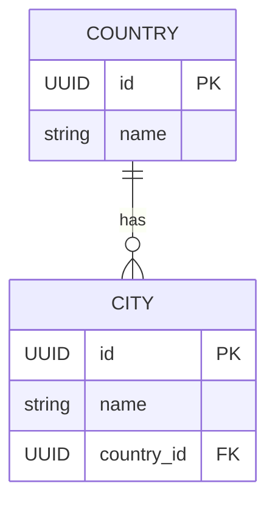

← Back to [README.md](../../README.md)

# Shared Reference Service Object Model

## Shared Entities

**Owner**: the team. Every service references these; none of them owns a copy.

These two used to live in `student-2/database/database_service/models.py`, under
a heading that said they were there "because it is currently their only
consumer". That stopped being true, so they moved here.

### Country
Reference list of countries - just a name.

| Field | Type | Notes |
|---|---|---|
| id | UUID | PK, derived from `name` - see [Ids](#ids) |
| name | str | unique, stored lower-cased and trimmed |

### City
Reference list of cities, each scoped to a Country (so "Sydney" can exist
under both Australia and Canada without colliding).

| Field | Type | Notes |
|---|---|---|
| id | UUID | PK, derived from `country.name` + `name` |
| name | str | unique with `country_id`, stored lower-cased and trimmed |
| country_id | FK → Country | `RESTRICT` - a country with cities cannot be deleted |

Street, street number, coordinates and anything else about a *particular*
address are not here. They belong to whichever service cares:
`student-2/database/database_service/models.py` keeps `LocationDetails` for
exactly that reason.

## Ids

A place's id is derived from its name rather than drawn at random:

```python
NAMESPACE = UUID("9a7c1f2e-3b4d-5e6f-8a9b-0c1d2e3f4a5b")

country_id(name)        = uuid5(NAMESPACE, f"country:{normalise(name)}")
city_id(country, name)  = uuid5(NAMESPACE, f"city:{normalise(country)}/{normalise(name)}")

normalise(name)         = name.strip().lower()
```

That is not decoration. A service that cannot call this one still has to name a
place: the accommodation database service seeds itself at startup and has no
HTTP client, yet its rows have to point at the same ids this service serves.
Four lines of `uuid5` is what that costs, versus a start-up ordering dependency
between two containers.

Two consequences:

- **Creating a place is idempotent.** `POST` the same country twice and you get
  the same row and the same id, so there is no "look it up, then create it if it
  is missing" race to lose.
- **A name cannot change while keeping its id.** If renaming a place ever
  matters, this rule is the first thing that has to go.

The rule is implemented in `../database/shared_database_service/ids.py` and
copied — deliberately, with a pointer back to here — in
`../../student-2/database/database_service/seed_data.py`.

## Persistence
Both entities are SQLAlchemy ORM models (`Base`/`Mapped`/`mapped_column`), not
plain dataclasses — the model classes are the tables. See:
- `../database/shared_database_service/ids.py` — the id rule above
- `../database/shared_database_service/models.py` — `Base`, `Country`, `City`
- `../database/shared_database_service/schemas.py` — the wire messages
- `../database/shared_database_service/database.py` — engine/session,
  `DATABASE_URL` env var (SQLite by default)
- `../database/shared_database_service/repository.py` — `CountryRepository`,
  `CityRepository`
- `../database/shared_database_service/seed_data.py` — the starter places

The tables also own the translation to and from the API's wire messages:
`Country.to_message()`, `City.to_message()`, and `get_or_create()` on both for
the look-up-or-insert the API doc promises on `POST`. A row knows how to
describe itself, so the routers are a handful of lines each and there is no
separate mapping layer.

There are no enums here, so there is no `enums.py` — the accommodation service
has one because it has enums.

No Alembic/migrations yet — `create_engine_and_session()` calls `create_all()`,
which is enough for two tables that are unlikely to grow a column; add Alembic
once schema churn becomes a real problem.

## ERD



Other services join to these across the wire, not in SQL. An accommodation's
`location_details.country_id` points here, but there is no foreign key behind
it — the row is in another service's database, and a constraint SQLite cannot
enforce is a comment pretending to be a guarantee. See
`../../student-2/docs/object-model.md`.
