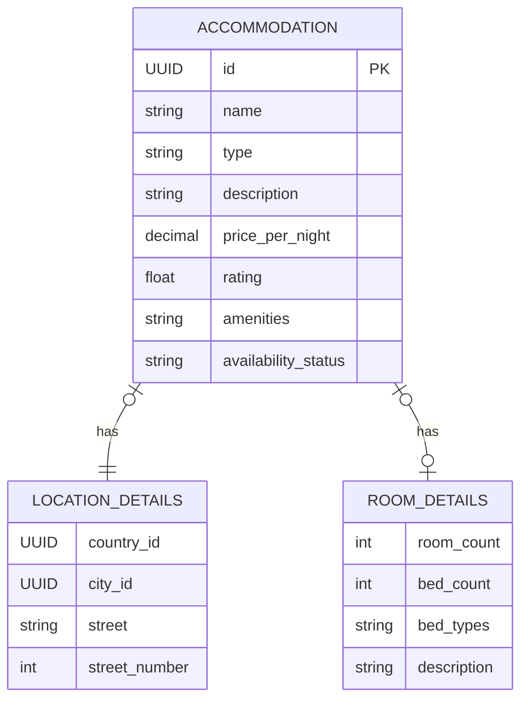

← Back to [README.md](../../README.md)

# Accommodation Service Object Model

## Shared Entities

`Country` and `City` used to live in this service's `models.py`, "because it is
currently their only consumer". That stopped being true, so they moved to the
[shared reference service](../../shared/docs/object-model.md). This service
stores their ids and nothing else about them.

## Accommodation Microservice Entities

**Owner**: Student 2 (Mark Ureta).

### Accommodation
The bookable listing (hotel, hostel, Airbnb, etc.).

| Field | Type | Notes |
|---|---|---|
| id | UUID/int | PK |
| name | str | |
| type | AccommodationType | enum: HOTEL, HOSTEL, APARTMENT, RESORT, GUESTHOUSE, CAMPING |
| description | str | |
| price_per_night | Decimal | |
| rating | float | 0–5, set by the caller |
| amenities | list[str] | plain list until amenities need filtering at scale |
| availability_status | AvailabilityStatus | enum: AVAILABLE, UNAVAILABLE, SOLD_OUT |
| location_details | LocationDetails | composed, not subclassed — see below |
| room_details | RoomDetails \| None | composed, not subclassed — see below |

### LocationDetails
Where Accommodation is, kept as a composed value rather than flat columns so
`country`/`city` can be reference rows in the shared service instead of
free-text duplicated on every row.

Street and street number stay here: they are about one address, not about a
place every service needs. That split is the whole reason `LocationDetails` did
not move with `Country` and `City`.

| Field | Type | Notes |
|---|---|---|
| country_id | UUID → shared `Country` | indexed with `city_id` -- the itinerary service filters on these |
| city_id | UUID → shared `City` | |
| street | str | street name, display only |
| street_number | int \| None | |

There is no `ForeignKey` behind those two ids. The rows they point at live in
another service's database, so SQLite cannot enforce the constraint, and one it
cannot enforce is a comment pretending to be a guarantee. Nothing in the
*database* service resolves an id to a name either — that is the backend
service's job, because the shared service is reached over HTTP and a database
service makes no outbound calls. See
[backend-service-api.md](./backend-service-api.md).

### RoomDetails
Room-specific attributes, kept as a composed value on `Accommodation` rather
than type subclasses (e.g. `Hotel`, `Campsite`) — one concrete class stays
queryable/filterable without `isinstance` branching. `None` for types where
room counts don't apply (e.g. camping).

| Field | Type | Notes |
|---|---|---|
| room_count | int | filterable, e.g. "at least 3 rooms" |
| bed_count | int | |
| bed_types | list[BedType] | enum: SINGLE, DOUBLE, QUEEN, KING, BUNK, SOFA_BED |
| description | str | free-text extra details, optional |

## Persistence
All entities above are SQLAlchemy ORM models (`Base`/`Mapped`/`mapped_column`),
not plain dataclasses — the model classes are the tables. See:
- `../database/database_service/enums.py` — `AccommodationType`,
  `AvailabilityStatus`, `BedType`, shared by the tables and the wire format
- `../database/database_service/models.py` — `Base`, `Accommodation`,
  `LocationDetails`, `RoomDetails`
- `../database/database_service/schemas.py` — the wire messages
- `../database/database_service/database.py` — engine/session, `DATABASE_URL`
  env var (SQLite by default)
- `../database/database_service/repository.py` — `AccommodationRepository`

`Base` used to live in `shared/`, but this service was its only consumer, so it
moved here and the shared copy was deleted. (The shared reference service now
has a `Base` of its own, for its own two tables.)

The tables also own the translation to and from the API's wire messages:
`Accommodation.to_message()`, `Accommodation.from_message()` and
`.update_from()`. A row knows how to describe itself, so the routers are a
handful of lines each and there is no separate mapping layer. The enums sit in
their own module because `models.py` imports `schemas.py` for the message types
— a leaf both can import keeps that a one-way dependency.

`seed_data.py` computes the shared service's ids for the places its rows sit in,
using the `uuid5` rule in
[shared/docs/object-model.md](../../shared/docs/object-model.md#ids). Seeding
runs at startup, where there is no HTTP client to ask with — four lines of
`uuid5` is what that costs, versus a start-up ordering dependency between two
containers.

`RoomDetails.bed_types` stores `list[BedType]` as a JSON array via a small
custom `TypeDecorator` (`BedTypesJSON`) — SQLAlchemy has no built-in "list of
enum" column type, so this is genuinely necessary rather than speculative.
No Alembic/migrations yet — `create_engine_and_session()` calls `create_all()`, which is enough while the
schema is still moving; add Alembic once schema churn becomes a real problem.

## ERD

`country_id` and `city_id` are not marked `FK`: they point at the shared
reference service's tables, across a service boundary rather than a join. See
[shared/docs/object-model.md](../../shared/docs/object-model.md).
