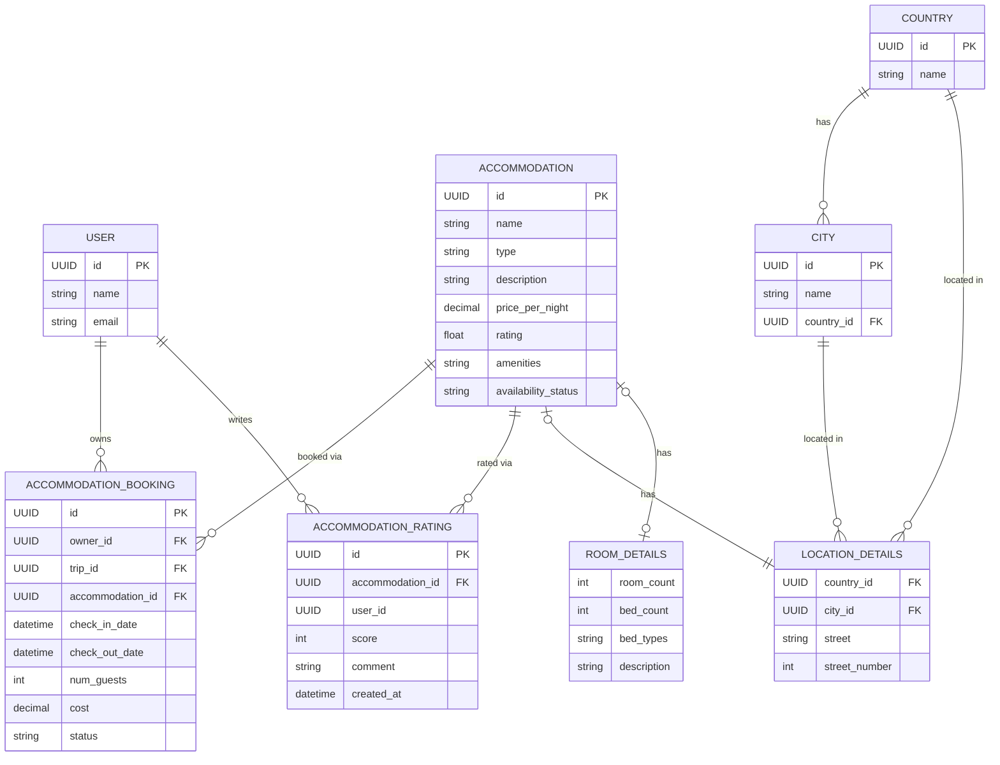

← Back to [README.md](../../README.md)

# Accommodation Service Object Model

## Shared Entities

These are entities other services also care about. They live in this service's
`models.py` because it is currently their only consumer.

### User
The person doing the booking/rating. Kept minimal — full profile/auth is
likely owned by a shared identity service. Nothing points at it with a foreign
key: ratings and bookings carry the identity service's ids directly.

| Field | Type | Notes |
|---|---|---|
| id | UUID/int | PK |
| name | str | |
| email | str | |

### Country
Reference list of countries - just a name.

| Field | Type | Notes |
|---|---|---|
| id | UUID/int | PK |
| name | str | unique |

### City
Reference list of cities, each scoped to a Country (so "Sydney" can exist
under both Australia and Canada without colliding).

| Field | Type | Notes |
|---|---|---|
| id | UUID/int | PK |
| name | str | unique with `country_id` |
| country_id | FK → Country | |

## Accommodation Microservice Entities

**Owner**: Student 2 (Mark Ureta).

### Accommodation
The bookable listing (hotel, hostel, Airbnb, etc.).

| Field | Type | Notes |
|---|---|---|
| id | UUID/int | PK |
| name | str | |
| type | AccommodationType | enum: HOTEL, HOSTEL, APARTMENT, RESORT, GUESTHOUSE, CAMPING |
| description | str | |
| price_per_night | Decimal | |
| rating | float | derived/cached avg of AccommodationUserRating |
| amenities | list[str] | plain list until amenities need filtering at scale |
| availability_status | AvailabilityStatus | enum: AVAILABLE, UNAVAILABLE, SOLD_OUT |
| location_details | LocationDetails | composed, not subclassed — see below |
| room_details | RoomDetails \| None | composed, not subclassed — see below |

### LocationDetails
Where Accommodation is, kept as a composed value rather than flat columns
so `country`/`city` can be reference tables instead of free-text duplicated
on every row.

| Field | Type | Notes |
|---|---|---|
| country_id | FK → Country | indexed with `city_id` -- the itinerary service filters on these |
| city_id | FK → City | |
| street | str | street name, display only |
| street_number | int \| None | |

### RoomDetails
Room-specific attributes, kept as a composed value on `Accommodation` rather
than type subclasses (e.g. `Hotel`, `Campsite`) — one concrete class stays
queryable/filterable without `isinstance` branching. `None` for types where
room counts don't apply (e.g. camping).

| Field | Type | Notes |
|---|---|---|
| room_count | int | filterable, e.g. "at least 3 rooms" |
| bed_count | int | |
| bed_types | list[BedType] | enum: SINGLE, DOUBLE, QUEEN, KING, BUNK, SOFA_BED |
| description | str | free-text extra details, optional |

### AccommodationBooking
A reservation made against an Accommodation for a trip.

| Field | Type | Notes |
|---|---|---|
| id | UUID/int | PK |
| owner_id | FK → User | who made the booking |
| trip_id | FK (external) | owned by Student 1's Trip service |
| accommodation_id | FK → Accommodation | |
| check_in_date | datetime | naive UTC |
| check_out_date | datetime | naive UTC; `> check_in_date` (DB check constraint) |
| num_guests | int | |
| cost | Decimal | |
| status | AccommodationBookingStatus | enum: PENDING, CONFIRMED, CANCELLED, COMPLETED |

### AccommodationUserRating
A user's rating/review of an Accommodation.

| Field | Type | Notes |
|---|---|---|
| id | UUID/int | PK |
| accommodation_id | FK → Accommodation | |
| user_id | UUID | External — owned by the identity service, so no FK |
| score | int | 1–5, enforced by a DB check constraint |
| comment | str | optional |
| created_at | datetime | |

## Persistence
All entities above are SQLAlchemy ORM models (`Base`/`Mapped`/`mapped_column`),
not plain dataclasses — the model classes are the tables. See:
- `../database/database_service/models.py` — `Base`, `User`, `Accommodation`,
  `LocationDetails`, `Country`, `City`, `RoomDetails`, `AccommodationBooking`,
  `AccommodationUserRating`, plus the accommodation-local enums
- `../database/database_service/database.py` — engine/session, `DATABASE_URL`
  env var (SQLite by default)
- `../database/database_service/repository.py` — `AccommodationRepository`,
  `CountryRepository`, `CityRepository`, `AccommodationBookingRepository`,
  `AccommodationUserRatingRepository`

`Base` and `User` used to live in `shared/`, but this service was their only
consumer, so they moved here and the shared copy was deleted. `User` is now
referenced by nothing: `AccommodationUserRating.user_id`,
`AccommodationBooking.owner_id` and `AccommodationBooking.trip_id` are all ids
owned by other services, so none of them carries a foreign key — this database
has no row to point at.

`RoomDetails.bed_types` stores `list[BedType]` as a JSON array via a small
custom `TypeDecorator` (`BedTypesJSON`) — SQLAlchemy has no built-in "list of
enum" column type, so this is genuinely necessary rather than speculative.
No Alembic/migrations yet — `create_engine_and_session()` calls `create_all()`, which is enough while the
schema is still moving; add Alembic once schema churn becomes a real problem.

## ERD

