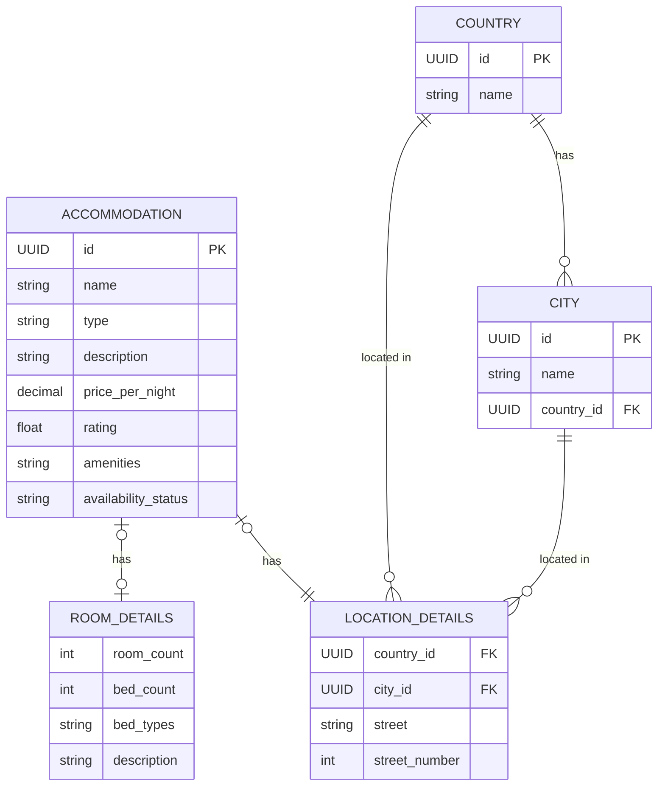

← Back to [README.md](../../README.md)

# Accommodation Service Object Model

## Shared Entities

These are entities other services also care about. They live in this service's
`models.py` because it is currently their only consumer.

### Country
Reference list of countries - just a name.

| Field | Type | Notes |
|---|---|---|
| id | UUID/int | PK |
| name | str | unique |

### City
Reference list of cities, each scoped to a Country (so "Sydney" can exist
under both Australia and Canada without colliding).

| Field | Type | Notes |
|---|---|---|
| id | UUID/int | PK |
| name | str | unique with `country_id` |
| country_id | FK → Country | |

## Accommodation Microservice Entities

**Owner**: Student 2 (Mark Ureta).

### Accommodation
The bookable listing (hotel, hostel, Airbnb, etc.).

| Field | Type | Notes |
|---|---|---|
| id | UUID/int | PK |
| name | str | |
| type | AccommodationType | enum: HOTEL, HOSTEL, APARTMENT, RESORT, GUESTHOUSE, CAMPING |
| description | str | |
| price_per_night | Decimal | |
| rating | float | 0–5, set by the caller |
| amenities | list[str] | plain list until amenities need filtering at scale |
| availability_status | AvailabilityStatus | enum: AVAILABLE, UNAVAILABLE, SOLD_OUT |
| location_details | LocationDetails | composed, not subclassed — see below |
| room_details | RoomDetails \| None | composed, not subclassed — see below |

### LocationDetails
Where Accommodation is, kept as a composed value rather than flat columns
so `country`/`city` can be reference tables instead of free-text duplicated
on every row.

| Field | Type | Notes |
|---|---|---|
| country_id | FK → Country | indexed with `city_id` -- the itinerary service filters on these |
| city_id | FK → City | |
| street | str | street name, display only |
| street_number | int \| None | |

### RoomDetails
Room-specific attributes, kept as a composed value on `Accommodation` rather
than type subclasses (e.g. `Hotel`, `Campsite`) — one concrete class stays
queryable/filterable without `isinstance` branching. `None` for types where
room counts don't apply (e.g. camping).

| Field | Type | Notes |
|---|---|---|
| room_count | int | filterable, e.g. "at least 3 rooms" |
| bed_count | int | |
| bed_types | list[BedType] | enum: SINGLE, DOUBLE, QUEEN, KING, BUNK, SOFA_BED |
| description | str | free-text extra details, optional |

## Persistence
All entities above are SQLAlchemy ORM models (`Base`/`Mapped`/`mapped_column`),
not plain dataclasses — the model classes are the tables. See:
- `../database/database_service/models.py` — `Base`, `Accommodation`,
  `LocationDetails`, `Country`, `City`, `RoomDetails`, plus the
  accommodation-local enums
- `../database/database_service/database.py` — engine/session, `DATABASE_URL`
  env var (SQLite by default)
- `../database/database_service/repository.py` — `AccommodationRepository`,
  `CountryRepository`, `CityRepository`

`Base` used to live in `shared/`, but this service was its only consumer, so it
moved here and the shared copy was deleted.

`RoomDetails.bed_types` stores `list[BedType]` as a JSON array via a small
custom `TypeDecorator` (`BedTypesJSON`) — SQLAlchemy has no built-in "list of
enum" column type, so this is genuinely necessary rather than speculative.
No Alembic/migrations yet — `create_engine_and_session()` calls `create_all()`, which is enough while the
schema is still moving; add Alembic once schema churn becomes a real problem.

## ERD

