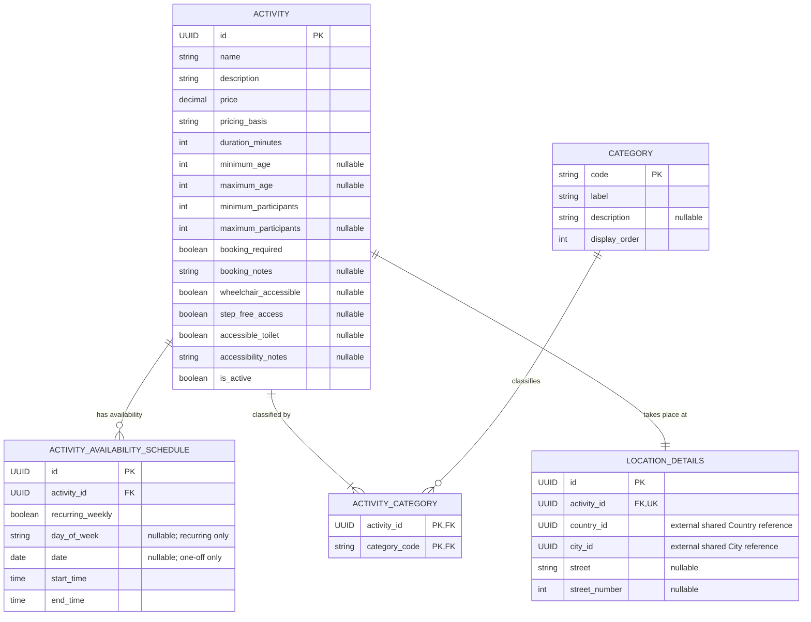

← Back to [README.md](../../README.md)

# Activities and Attractions Service Object Model

## Scope and terminology

Student 4 owns Activities and Attractions Management. The service uses one
domain entity, `Activity`, for anything a traveller can choose to do or visit.
An attraction is therefore not a separate object type: museums, landmarks,
parks and similar attractions are represented as activities and classified by
their categories.

This keeps the public contract uniform for the frontend, itinerary service and
budget service. A museum and a guided museum tour are separate `Activity`
records because they can have different descriptions, prices, durations,
participant restrictions and availability schedules.

The model deliberately excludes images, free-form tags and booking
transactions from the current scope. Categories provide classification and
filtering. TripGenie may tell a traveller that an external booking is required,
but it does not sell tickets, reserve places, process payments or maintain live
inventory.

## Activity entities

**Owner:** Student 4 (Julian Kirk).

### Activity

The stable catalogue entry displayed and selected by users.

| Field | Type | Required | Notes |
|---|---|:---:|---|
| `id` | UUID | Yes | Primary key. |
| `name` | string | Yes | Human-readable activity name. |
| `description` | string | Yes | Full description used by detail views and text search. |
| `location_details` | LocationDetails | Yes | Composed location containing shared country/city references and locally owned address details. |
| `price` | decimal | Yes | Non-negative price in AUD with exactly two decimal places. Stored as canonical decimal text in SQLite and serialized as a JSON string. |
| `pricing_basis` | PricingBasis | Yes | `PER_PERSON` when the published price is available per traveller; otherwise `FLAT_ADMISSION` for the one flat charge covering the admitted party. |
| `duration_minutes` | integer | Yes | Positive expected duration. Also determines the valid starting range inside a schedule. |
| `minimum_age` | integer \| null | No | Inclusive minimum participant age; `null` means no known minimum. |
| `maximum_age` | integer \| null | No | Inclusive maximum participant age; `null` means no known maximum. |
| `minimum_participants` | integer | Yes | Smallest valid group, at least 1. |
| `maximum_participants` | integer \| null | No | Largest valid group; `null` means no published maximum. |
| `booking_required` | boolean | Yes | Informational only: whether the traveller must arrange a booking externally. Defaults to `false`. |
| `booking_notes` | string \| null | No | Optional planning guidance such as "book at least 24 hours ahead". Never contains TripGenie booking state. |
| `wheelchair_accessible` | boolean \| null | No | `true` or `false` when confirmed; `null` when unknown. |
| `step_free_access` | boolean \| null | No | `true` or `false` when confirmed; `null` when unknown. |
| `accessible_toilet` | boolean \| null | No | `true` or `false` when confirmed; `null` when unknown. |
| `accessibility_notes` | string \| null | No | Additional accessibility information that does not fit the filterable facts. |
| `is_active` | boolean | Yes | Whether the catalogue entry may be shown and selected. Defaults to `true`. |

The nullable accessibility fields intentionally distinguish "confirmed not
available" from "not yet known". Search filters that require an accessibility
feature match only `true`; an unknown value must not be treated as accessible.

Age and participant bounds follow these invariants:

- ages, when present, are non-negative;
- `maximum_age` cannot be less than `minimum_age`;
- `minimum_participants` is at least 1; and
- `maximum_participants`, when present, cannot be less than
  `minimum_participants`.

`PricingBasis` has the values `PER_PERSON` and `FLAT_ADMISSION`. A per-person
price must be used whenever the provider publishes one. `FLAT_ADMISSION` is
used only when the provider offers the activity solely for one flat charge
covering the admitted party. For a requested `party_size`, the estimated cost
in AUD is:

```text
PER_PERSON:     price * party_size
FLAT_ADMISSION: price
```

Price filters always compare the listed `price`, not the calculated party
total. Callers that need a total, including the itinerary and budget services,
apply the formula above.

`price` is represented with Python `Decimal`, limited to two fractional digits,
and stored in SQLite as canonical text such as `"45.00"`. The database casts
that value to numeric for range filtering and sorting; application arithmetic
never uses binary floating point. Public and internal APIs serialize money as
a JSON string so the exact value survives every service boundary. Following the
repository-wide convention, the base value is in AUD. The backend may use the
shared reference service's currency and conversion-rate data to show an
approximate local value, but filtering and exchanges with the budget service
use the stored AUD value.

### LocationDetails

Where an activity takes place. This follows the existing accommodation-service
convention: shared place identifiers are stored for lookup and filtering, while
the exact address remains in the service that owns the activity.

| Field | Type | Required | Notes |
|---|---|:---:|---|
| `id` | UUID | Yes | Primary key. |
| `activity_id` | FK → Activity | Yes | Unique owner; deleting the activity cascades to its location. |
| `country_id` | UUID → shared Country | Yes | External reference used for country filtering and currency lookup. |
| `city_id` | UUID → shared City | Yes | External reference used for city filtering; the shared city is already scoped to a country. |
| `street` | string \| null | No | Street or other locally owned address text. |
| `street_number` | integer \| null | No | Optional street number. |

`country_id` and `city_id` are indexed together, but they are not SQL foreign
keys: their authoritative rows live in the shared service's separate database.
The Student 4 database service stores and filters the identifiers without
making outbound calls. The Student 4 backend resolves public country and city
names to identifiers before database queries and resolves identifiers back to
names in responses, using the shared backend service. A city name without its
country is rejected as ambiguous, matching the existing Student 2 contract.

### Category

A controlled classification used for navigation and advanced filtering.
Categories replace a separate tag system, so an activity may have several of
them: for example, a guided coastal walk could be both `OUTDOOR` and `TOUR`.

| Field | Type | Required | Notes |
|---|---|:---:|---|
| `code` | string | Yes | Stable primary key and code enum value, such as `OUTDOOR` or `TOUR`. |
| `label` | string | Yes | Human-readable dropdown label, such as `Outdoor`. |
| `description` | string \| null | No | Optional explanation for maintainers or user interfaces. |
| `display_order` | integer | Yes | Non-negative ordering for category selectors. |

Categories are a fixed, seeded reference list rather than user-created data.
Their stable codes are also declared as an enum in the service's wire schemas.
There are no category create, update or delete operations in this release. The
backend can return the ordered rows for the frontend's search dropdown without
requiring the frontend to duplicate labels or ordering.

### ActivityCategory

The many-to-many association between activities and categories.

| Field | Type | Required | Notes |
|---|---|:---:|---|
| `activity_id` | FK → Activity | Yes | Part of the composite primary key. |
| `category_code` | FK → Category.code | Yes | Part of the composite primary key. |

An activity must have at least one category. The association prevents the same
category being attached to an activity twice. Its composite primary key
`(activity_id, category_code)` efficiently retrieves an activity's categories;
an additional index on `(category_code, activity_id)` supports category-first
searches, including matching any or all selected dropdown values.

## Availability

### ActivityAvailabilitySchedule

An active `Activity` has one or more availability schedules. Every row
represents a local-time interval in which the activity can take place. Multiple
rows support different days, multiple sessions on one day and one-off events
without changing the `Activity` shape. An inactive draft may temporarily have
no schedules while it is being prepared, but it cannot become active until at
least one valid schedule exists.

| Field | Type | Required | Notes |
|---|---|:---:|---|
| `id` | UUID | Yes | Primary key. |
| `activity_id` | FK → Activity | Yes | Indexed owner of the schedule. |
| `recurring_weekly` | boolean | Yes | `true` for a weekly rule; `false` for a one-off date. Never nullable. |
| `day_of_week` | DayOfWeek \| null | Conditional | Required only when `recurring_weekly` is `true`. |
| `date` | date \| null | Conditional | Required only when `recurring_weekly` is `false`. |
| `start_time` | time | Yes | Local start of the availability interval. |
| `end_time` | time | Yes | Local end of the availability interval. |

`DayOfWeek` has the values `MONDAY`, `TUESDAY`, `WEDNESDAY`, `THURSDAY`,
`FRIDAY`, `SATURDAY` and `SUNDAY`.

The schedule validates the recurrence discriminator strictly:

- a recurring row requires `day_of_week` and forbids `date`;
- a non-recurring row requires `date` and forbids `day_of_week`;
- `end_time` must be later than `start_time` in this release;
- the interval must be at least `Activity.duration_minutes` long; and
- an activity cannot contain duplicate schedule rows.

Overnight intervals are outside the initial scope. If they become necessary,
the contract should add explicit next-day semantics rather than interpreting an
end time earlier than the start time silently.

All schedule dates and times are local to the activity's location. The model
does not store a timezone because the shared reference service currently
provides countries and cities but no timezone data. Timezone-aware conversion
can be added later without changing the meaning of the stored local schedule.

### Availability interpretation

There is no separate schedule-kind field. A schedule's interval and the
activity duration together determine its valid start times:

```text
earliest valid start = start_time
latest valid start   = end_time - duration_minutes
```

If the interval length equals `duration_minutes`, there is exactly one valid
start and the row behaves as a fixed session. If the interval is longer, the
activity may start at any time that allows its full duration to fit inside the
interval.

Examples:

| Activity | Duration | Schedule | Interpretation |
|---|---:|---|---|
| Museum admission | 120 min | Recurring Monday, 09:00–17:00 | May start from 09:00 through 15:00. |
| Guided museum tour | 60 min | Recurring Monday, 10:00–11:00 | Fixed weekly start at 10:00. |
| Guided museum tour | 60 min | Recurring Monday, 14:00–15:00 | A second fixed start for the same activity. |
| One-off festival | 240 min | 2026-10-17, 18:00–22:00 | Fixed one-off start at 18:00. |
| Self-guided hike | 240 min | Recurring Saturday, 06:00–18:00 | May start from 06:00 through 14:00. |

An inactive activity with no schedule remains a valid stored draft, but it is
not returned by public catalogue or availability queries.

## Persistence and ownership

The Student 4 database service is the sole owner of these tables and the only
service that accesses its SQLite database. The backend service reaches them
through the internal database API; the frontend and other students' services
reach them only through the public backend API.

Country, city and currency records remain owned by the shared reference
service. Student 4 stores only the shared country and city UUIDs alongside its
own address details. This is a cross-service reference rather than a database
relationship: neither service reads or joins the other's SQLite database.

The database layer will use SQLAlchemy models and the internal contract in the
[database service API](./database-service-api.md). Cross-field and cross-table
rules that SQLite cannot express cleanly as `CHECK` constraints—particularly
comparing a schedule interval with its parent activity's duration—are enforced
by the database service before a transaction is committed.

The database and backend services declare their own wire schemas rather than
importing one another's packages. This mirrors Student 2's independently
deployable service boundary. End-to-end contract tests will detect drift
between the internal database response and the backend's public representation.

## ERD



`COUNTRY`, `CITY` and `CURRENCY` do not appear as tables in this ERD because
they belong to the shared reference service's database. The annotations on
`LOCATION_DETAILS` document the cross-service references without implying that
SQLite can enforce foreign keys across the two databases.
