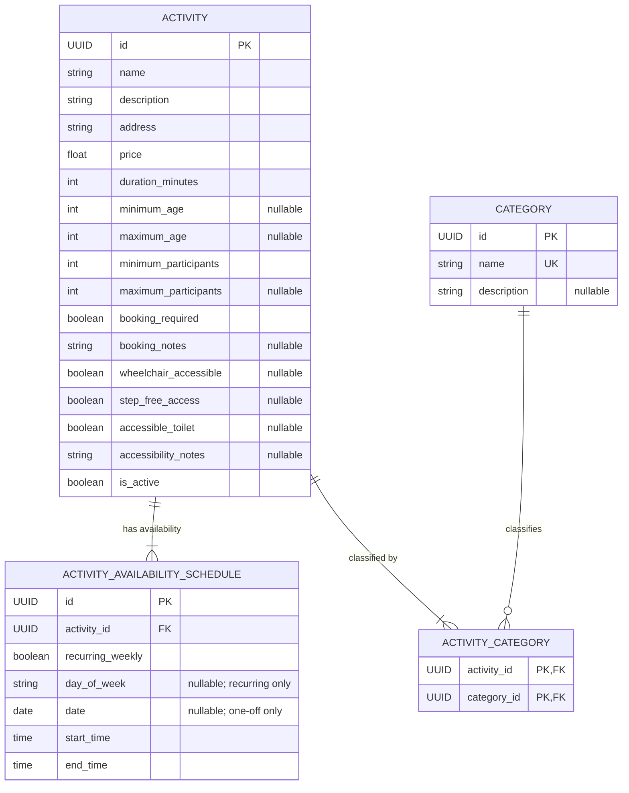

← Back to [README.md](../../README.md)

# Activities and Attractions Service Object Model

## Scope and terminology

Student 4 owns Activities and Attractions Management. The service uses one
domain entity, `Activity`, for anything a traveller can choose to do or visit.
An attraction is therefore not a separate object type: museums, landmarks,
parks and similar attractions are represented as activities and classified by
their categories.

This keeps the public contract uniform for the frontend, itinerary service and
budget service. A museum and a guided museum tour are separate `Activity`
records because they can have different descriptions, prices, durations,
participant restrictions and availability schedules.

The model deliberately excludes images, free-form tags and booking
transactions from the current scope. Categories provide classification and
filtering. TripGenie may tell a traveller that an external booking is required,
but it does not sell tickets, reserve places, process payments or maintain live
inventory.

## Activity entities

**Owner:** Student 4 (Julian Kirk).

### Activity

The stable catalogue entry displayed and selected by users.

| Field | Type | Required | Notes |
|---|---|:---:|---|
| `id` | UUID | Yes | Primary key. |
| `name` | string | Yes | Human-readable activity name. |
| `description` | string | Yes | Full description used by detail views and text search. |
| `address` | string | Yes | Free-text address until a future location service owns structured location data. |
| `price` | float | Yes | Non-negative numeric price in the activity's local currency. Currency metadata belongs to the future location service. |
| `duration_minutes` | integer | Yes | Positive expected duration. Also determines the valid starting range inside a schedule. |
| `minimum_age` | integer \| null | No | Inclusive minimum participant age; `null` means no known minimum. |
| `maximum_age` | integer \| null | No | Inclusive maximum participant age; `null` means no known maximum. |
| `minimum_participants` | integer | Yes | Smallest valid group, at least 1. |
| `maximum_participants` | integer \| null | No | Largest valid group; `null` means no published maximum. |
| `booking_required` | boolean | Yes | Informational only: whether the traveller must arrange a booking externally. Defaults to `false`. |
| `booking_notes` | string \| null | No | Optional planning guidance such as "book at least 24 hours ahead". Never contains TripGenie booking state. |
| `wheelchair_accessible` | boolean \| null | No | `true` or `false` when confirmed; `null` when unknown. |
| `step_free_access` | boolean \| null | No | `true` or `false` when confirmed; `null` when unknown. |
| `accessible_toilet` | boolean \| null | No | `true` or `false` when confirmed; `null` when unknown. |
| `accessibility_notes` | string \| null | No | Additional accessibility information that does not fit the filterable facts. |
| `is_active` | boolean | Yes | Whether the catalogue entry may be shown and selected. Defaults to `true`. |

The nullable accessibility fields intentionally distinguish "confirmed not
available" from "not yet known". Search filters that require an accessibility
feature match only `true`; an unknown value must not be treated as accessible.

Age and participant bounds follow these invariants:

- ages, when present, are non-negative;
- `maximum_age` cannot be less than `minimum_age`;
- `minimum_participants` is at least 1; and
- `maximum_participants`, when present, cannot be less than
  `minimum_participants`.

`price` is exposed as a JSON number as requested. It is interpreted in the
local currency of the activity's address. Until the location service exists,
consumers must not assume a currency symbol or combine prices from different
countries as if they share a currency.

### Category

A controlled classification used for navigation and advanced filtering.
Categories replace a separate tag system, so an activity may have several of
them: for example, a guided coastal walk could be both `OUTDOOR` and `TOUR`.

| Field | Type | Required | Notes |
|---|---|:---:|---|
| `id` | UUID | Yes | Primary key. |
| `name` | string | Yes | Unique, case-insensitive category name. |
| `description` | string \| null | No | Optional explanation for maintainers or user interfaces. |

Initial category values can be seeded with the database, but categories are
rows rather than a code enum so the catalogue can grow without a schema or API
version change.

### ActivityCategory

The many-to-many association between activities and categories.

| Field | Type | Required | Notes |
|---|---|:---:|---|
| `activity_id` | FK → Activity | Yes | Part of the composite primary key. |
| `category_id` | FK → Category | Yes | Part of the composite primary key. |

An activity must have at least one category. The association prevents the same
category being attached to an activity twice.

## Availability

### ActivityAvailabilitySchedule

An active `Activity` has one or more availability schedules. Every row
represents a local-time interval in which the activity can take place. Multiple
rows support different days, multiple sessions on one day and one-off events
without changing the `Activity` shape. An inactive draft may temporarily have
no schedules while it is being prepared, but it cannot become active until at
least one valid schedule exists.

| Field | Type | Required | Notes |
|---|---|:---:|---|
| `id` | UUID | Yes | Primary key. |
| `activity_id` | FK → Activity | Yes | Indexed owner of the schedule. |
| `recurring_weekly` | boolean | Yes | `true` for a weekly rule; `false` for a one-off date. Never nullable. |
| `day_of_week` | DayOfWeek \| null | Conditional | Required only when `recurring_weekly` is `true`. |
| `date` | date \| null | Conditional | Required only when `recurring_weekly` is `false`. |
| `start_time` | time | Yes | Local start of the availability interval. |
| `end_time` | time | Yes | Local end of the availability interval. |

`DayOfWeek` has the values `MONDAY`, `TUESDAY`, `WEDNESDAY`, `THURSDAY`,
`FRIDAY`, `SATURDAY` and `SUNDAY`.

The schedule validates the recurrence discriminator strictly:

- a recurring row requires `day_of_week` and forbids `date`;
- a non-recurring row requires `date` and forbids `day_of_week`;
- `end_time` must be later than `start_time` in this release;
- the interval must be at least `Activity.duration_minutes` long; and
- an activity cannot contain duplicate schedule rows.

Overnight intervals are outside the initial scope. If they become necessary,
the contract should add explicit next-day semantics rather than interpreting an
end time earlier than the start time silently.

All schedule dates and times are local to the activity's address. The model
does not store a timezone yet. A future location service can resolve the
address and add timezone-aware conversion without changing the meaning of the
stored local schedule.

### Availability interpretation

There is no separate schedule-kind field. A schedule's interval and the
activity duration together determine its valid start times:

```text
earliest valid start = start_time
latest valid start   = end_time - duration_minutes
```

If the interval length equals `duration_minutes`, there is exactly one valid
start and the row behaves as a fixed session. If the interval is longer, the
activity may start at any time that allows its full duration to fit inside the
interval.

Examples:

| Activity | Duration | Schedule | Interpretation |
|---|---:|---|---|
| Museum admission | 120 min | Recurring Monday, 09:00–17:00 | May start from 09:00 through 15:00. |
| Guided museum tour | 60 min | Recurring Monday, 10:00–11:00 | Fixed weekly start at 10:00. |
| Guided museum tour | 60 min | Recurring Monday, 14:00–15:00 | A second fixed start for the same activity. |
| One-off festival | 240 min | 2026-10-17, 18:00–22:00 | Fixed one-off start at 18:00. |
| Self-guided hike | 240 min | Recurring Saturday, 06:00–18:00 | May start from 06:00 through 14:00. |

An inactive activity with no schedule remains a valid stored draft, but it is
not returned by public catalogue or availability queries.

## Persistence and ownership

The Student 4 database service is the sole owner of these tables and the only
service that accesses its SQLite database. The backend service reaches them
through the internal database API; the frontend and other students' services
reach them only through the public backend API.

The database layer will use SQLAlchemy models. Cross-field and cross-table
rules that SQLite cannot express cleanly as `CHECK` constraints—particularly
comparing a schedule interval with its parent activity's duration—are enforced
by the database service before a transaction is committed.

The database and backend services declare their own wire schemas rather than
importing one another's packages. This mirrors Student 2's independently
deployable service boundary. End-to-end contract tests will detect drift
between the internal database response and the backend's public representation.

## ERD


