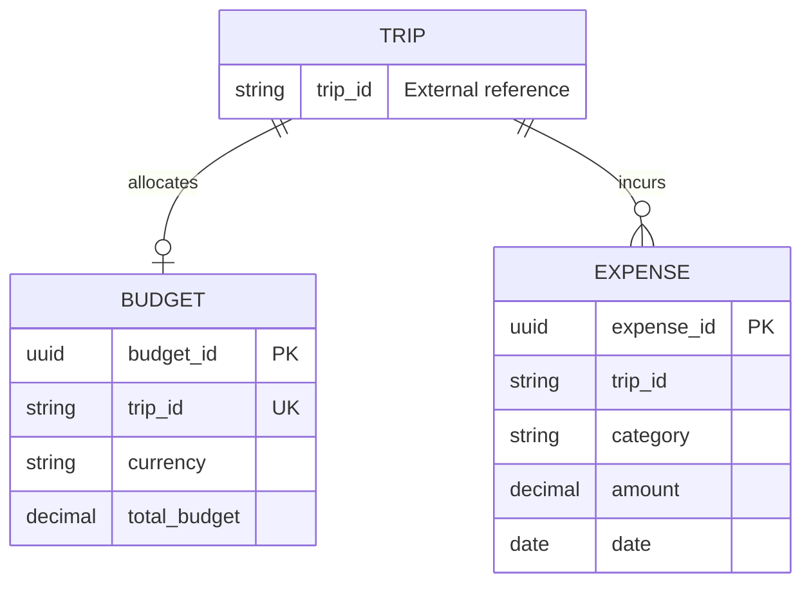

# Student 5 Database Service

This internal FastAPI service is the only process that opens the Student 5 SQLite
database. The public backend will consume its `/internal` HTTP API.

## Conceptual model

- A trip has at most one budget.
- A trip can have many expenses.
- `trip_id` is an external Student 1 reference, not a local foreign key.
- Budgets and expenses have independent lifecycles. Deleting a budget does not
  delete the trip's expense history.

## Logical model

`Budget` contains a UUID identifier, unique external trip identifier, ISO 4217
currency, total budget, five non-negative category allocations, and UTC created and
updated timestamps. Category allocations must not exceed the total budget.

`Expense` contains a UUID identifier, external trip identifier, category,
description, positive amount, ISO 4217 currency, ISO date, optional payment method
and notes, and UTC created and updated timestamps. Categories are `accommodation`,
`transport`, `activities`, `food`, `shopping`, and `other`.

## Physical model

SQLite stores UUIDs, dates, timestamps, and money as `TEXT`. Money is canonicalized
to two decimal places at the API boundary and parsed as Python `Decimal`; binary
floating point is not used for application arithmetic. SQLite `CHECK` constraints
enforce non-negative/positive values, currency shape, category membership, required
descriptions, and allocation totals.

Indexes support budget lookup by trip and expense filtering by trip/category/date.
Schema creation uses idempotent `CREATE TABLE IF NOT EXISTS` statements for a fresh
persistent volume. Ten stable UUIDv5 budgets and ten expenses are inserted with
`INSERT OR IGNORE`, making demo seeding repeatable across container restarts.

Set `STUDENT5_SEED_DATA=false` to disable demo seeding and
`STUDENT5_SQLITE_PATH` to choose the database file.